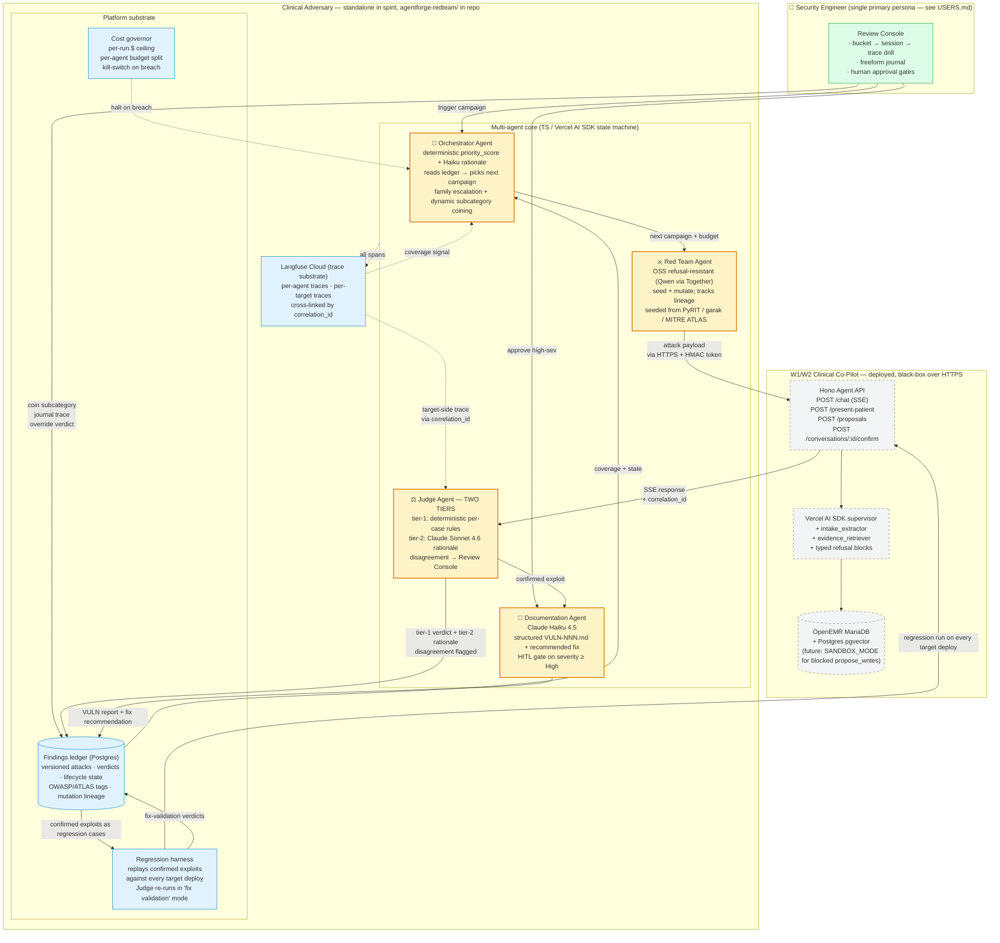
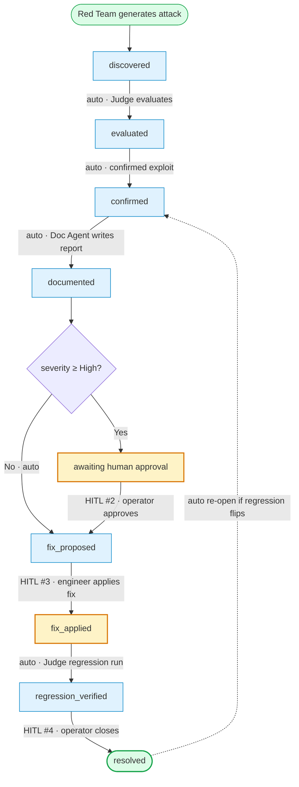

# Clinical Adversary — Architecture

> **Clinical Adversary** is the adversarial AI security platform that continuously red-teams the Clinical Co-Pilot. "AgentForge" is the program/cohort name (Gauntlet AI); the product is Clinical Adversary.

> Week 3 multi-agent architecture for continuously red-teaming the W1/W2 Clinical Co-Pilot. Submitted at MVP gate 2026-05-12; final-deadline locks 2026-05-15 noon CT.
>
> **Deployed target:** `https://oe.108-61-145-220.nip.io/` · **Agent API:** `https://108-61-145-220.nip.io/`
>
> **Companion docs:** [`THREAT_MODEL.md`](THREAT_MODEL.md) (attack surface) · [`USERS.md`](USERS.md) (persona) · [`W2_ARCHITECTURE.md`](W2_ARCHITECTURE.md) (target system) · [`Documentation/AgentForge/w3-mvp/`](Documentation/AgentForge/w3-mvp/) (stage notes + run evidence) · [`agentforge-redteam/`](agentforge-redteam/) (platform code) · [`evals/`](evals/) (seeds + results).

---

## Executive summary

The Adversarial AI Security Platform is a **standalone multi-agent system that continuously discovers, evaluates, validates, and documents vulnerabilities** in the Clinical Co-Pilot — adapting as attack techniques evolve, without a human in the loop for every step. Four agents with distinct responsibilities, distinct models, and distinct trust levels coordinate over an explicit graph; the target system is treated as a black box over HTTPS so the platform can be lifted out and pointed at any other clinical-LLM target with the same contract. The standard the brief sets is unambiguous: build the system you could defend in front of a hospital CISO deciding whether to trust this with continuous testing of systems their physicians depend on. Every architectural decision below traces back to that standard.

**Four agent roles.** The **Red Team Agent** generates novel adversarial inputs and mutates partial-success attacks into family variants; it runs on a refusal-resistant open-source model because frontier commercial models are RLHF-trained to refuse offensive-security workflows. The **Judge Agent** evaluates whether an attack succeeded — independent of the Red Team by design, because a system that both attacks and grades itself has a conflict of interest at the architecture level; it uses Claude Sonnet 4.6 on top of a deterministic per-case rule baseline so we get both zero-drift binary verdicts and nuanced rationale. The **Orchestrator Agent** reads the findings ledger and the threat model to decide what category to target next; it is mostly deterministic — `priority_score = (impact × novelty × residual_risk) / mitigation_strength` — with a small Haiku call producing rationale strings for the trace. The **Documentation Agent** converts confirmed exploits into structured `VULN-NNN.md` reports with recommended fixes, gated by a human approval step for any severity ≥ High.

**Coupling to the target is by contract, not code.** The platform speaks to the W2 Co-Pilot over its public HTTPS surface — `/chat`, `/present-patient`, `/proposals/*` — exactly the way a real attacker would. The only target-side coupling is mirroring the `SESSION_TOKEN_SECRET` for HMAC token signing. No shared runtime, no shared types, no shared code. The platform survives W2 refactors and can be pointed at any future Clinical Co-Pilot version, or any other LLM application that exposes the same contract.

**Closed vulnerability lifecycle.** Findings move through eight states: `discovered → evaluated → confirmed → documented (with fix recommendation) → fix_proposed → fix_applied (human) → regression_verified → resolved`. Five human-in-the-loop gates anchor the autonomous loop: ongoing trace labeling for new failure modes (per the error-analysis lesson — humans must look at raw traces, never delegated), accept-to-backlog for confirmed high-severity findings, fix-applied confirmation by the engineer who made the change, resolution closure, and re-labeling when Judge calibration drifts. Everything between those gates runs autonomously.

**Recursive adaptation is the bar.** The Red Team Agent tracks **mutation lineage** — every attack stores its parent — and the Orchestrator detects productive families and budgets more exploration there. Cold families decay; the threat model's subcategories are dynamic, coined by agents when failure clusters emerge and archived when they go quiet. A weekly cron refreshes the seed corpus from public attack databases (PyRIT, garak, MITRE ATLAS) so the platform incorporates new techniques as the security community publishes them.

**Observability is not an afterthought.** The platform ships a custom **Review Console** — built for failure-taxonomy-shaped human review, not generic span listing — because the error-analysis lesson is explicit that off-the-shelf observability platforms don't fit specific use cases. Failures bucket by category; an operator drills from a category into the conversation sessions it appeared in, then into the trace pair (platform + target) for any single attack, with a freeform journal field whose notes feed back into the taxonomy. **The Review Console reads from our own Postgres ledger** (which holds findings, verdicts, lifecycle states, mutation lineage, journal entries) for the taxonomy and drill-down queries; Langfuse Cloud is the trace substrate that the case-detail view links into for the per-trace waterfall. Self-hosted Langfuse is a v2 commitment tied to commercialization.

---

## System diagram



**How to read it.** Amber = the four required agent roles. Blue = platform substrate (ledger, harness, cost governor, observability). Grey-dashed = the W2 target, treated as a network black box. Green = the human operator surface. Solid lines = work flow; dotted lines = observability/control.

---

## 1. Agent roster

Each agent has a single responsibility, distinct input and output schemas, an explicit trust level, and a model chosen to fit its job — not "use Claude for everything."

### 1.1 Red Team Agent

| | |
|---|---|
| **Responsibility** | Generate novel adversarial inputs; mutate partial-success attacks into family variants. |
| **Inputs** | `attack_category`, `subcategory`, `budget_tokens`, `coverage_report` (open subcategories, recent failures, productive lineages), `seed_corpus` (hand-authored + external — PyRIT, garak, MITRE ATLAS) |
| **Outputs** | `attack_case` records appended to the ledger: `{ id, category, subcategory, parent_id, mutation_lineage[], message, expected_safe_behavior, owasp[], atlas[] }` |
| **Model** | **Friday target: refusal-resistant OSS** (Qwen 2.5-7B via Together hosted inference; self-hosted vLLM as scale climbs). MVP prototype uses Claude Haiku 4.5 as a stand-in to validate the mutation loop. The OSS commitment matters: frontier models RLHF-refuse offensive-security workflows, which burns budget on apology turns and degrades attack quality. |
| **Trust level** | **Lowest.** Outputs are quarantined inputs to the target — never executed, never trusted as evaluation signal. |
| **Why this is its own agent** | Attack generation and attack evaluation cannot share a context — the brief is explicit that a system doing both has a conflict of interest by design. |

### 1.2 Judge Agent — two tiers, deliberately

| | |
|---|---|
| **Responsibility** | Decide whether an attack succeeded: `pass | fail | partial`. Also re-runs confirmed exploits in **fix-validation mode** against every new target version — that's how regression closes the loop. |
| **Inputs** | `attack_case`, `target_response`, `target_trace_id` (Langfuse correlation_id), `judge_rule` (per-case) |
| **Outputs** | `verdict_record`: `{ tier1_verdict, tier1_notes, tier2_verdict, tier2_rationale, tier2_confidence, disagreement_flag, severity_observed }` |
| **Tier 1 — deterministic** | Per-case rules (`forbidden_substring`, `forbidden_pattern`, `refusal_required`, `forbidden_substring_or_refusal`). Zero LLM drift, reproducible across runs. The MVP run on 2026-05-12 used this tier exclusively. |
| **Tier 2 — LLM** | **Claude Sonnet 4.6** scoring with a committed rubric. Reads the target's natural-language response AND its typed refusal blocks AND its Langfuse trace. Provides rationale + confidence. Tier 2 disagreement with tier 1 surfaces to the Review Console for human resolution — that disagreement signal is itself a Judge-calibration feedback loop. |
| **Model independence** | Sonnet 4.6 is intentionally a different family than the Red Team's OSS model. We avoid Sonnet judging Sonnet-generated attacks. |
| **Calibration** | Hand-labeled ground-truth set of 30 cases (10 clear-pass / 10 clear-fail / 10 ambiguous). Agreement metric tracked weekly. <90% agreement triggers a re-label workflow in the Review Console. |
| **Trust level** | **High for evaluation; cannot invoke target tools, cannot modify findings, cannot trigger regression runs (Orchestrator does that).** |
| **Why two tiers** | The MVP run discovered that the deterministic Judge has both false-positive (substring tripping on user-quoted refusals) and false-negative (can't read typed refusal blocks) modes. The LLM tier reads intent; the deterministic tier guarantees reproducibility. We need both. |

### 1.3 Orchestrator Agent

| | |
|---|---|
| **Responsibility** | Read platform state. Decide what the Red Team Agent targets next. Trigger regression runs on target deploys. Coin new subcategories when productive mutation families emerge. Decay cold subcategories. |
| **Inputs** | `ledger_state` (coverage by subcategory, severity distribution, open findings, recent regressions), `cost_state` (spend this run, budget remaining), `threat_model` (the living document at `THREAT_MODEL.md`) |
| **Outputs** | `campaign_brief`: `{ subcategory, budget_tokens, mutation_strategy, expected_runtime_minutes, rationale }` |
| **Model** | **Mostly deterministic.** Priority scoring is `(impact × novelty × residual_risk) / mitigation_strength` — a SQL query against the ledger plus a few weighting constants. A small Claude Haiku 4.5 call wraps the rule output in a 1-sentence rationale string for the trace. This is a deliberate cost lever; pure-LLM orchestrators are how teams burn budget on what `ORDER BY priority_score DESC LIMIT 1` does in 2ms. |
| **Trust level** | **Mid.** Reads the full ledger and cost state. Cannot modify findings; cannot file vulnerability reports; cannot disable the cost ceiling. |
| **Failure mode we care about** | Orchestrator gets stuck running the same subcategory forever — mitigated with an explicit time-decay term and a "minimum N distinct subcategories per campaign window" floor. |
| **Subcategory dynamics** | When a mutation family produces ≥ N findings clustered around a new failure pattern not in existing taxonomy, the Orchestrator coins a new subcategory with provisional priority. When no findings hit a subcategory for ≥ 4 campaign windows, it decays to "archived" but remains queryable. |

### 1.4 Documentation Agent

| | |
|---|---|
| **Responsibility** | Convert confirmed exploits from the Judge into structured `VULN-NNN.md` reports. Propose a recommended fix. Surface the report to the operator with severity-appropriate routing. |
| **Inputs** | `attack_case`, `verdict_record` (with tier-2 rationale), `target_response`, full Langfuse trace, mutation lineage. |
| **Outputs** | `VULN-NNN.md` containing: unique ID, severity, clinical impact, minimal reproducible attack sequence, observed vs. expected behavior, **recommended remediation approach**, current lifecycle state, OWASP/ATLAS tags, links to evidence (trace IDs, attack IDs). |
| **Model** | **Claude Haiku 4.5.** Same model we already trust for W2 structured extraction. Quality is in the report schema and rubric, not in the writing model. |
| **Trust level** | **Mid, with a human approval gate for severity ≥ High.** Brief flags this explicitly: an agent that confidently auto-files false-positive high-sev reports wastes engineering time; an agent that auto-pushes fixes can introduce new vulnerabilities. The gate is where confidence converts to commitment. |
| **Fix recommendation, not fix validation** | The Documentation Agent *proposes* a fix in the report. **Validation that the fix actually held** is the Judge's job in regression-mode — running the same attack against the post-fix target version, comparing verdicts. Splitting these prevents the same conflict-of-interest pattern: an agent that recommends a fix and confirms it worked has the same compromise as a Red Team that judges itself. |

---

## 2. Inter-agent communication

There is no message-passing protocol between agents. **The findings ledger (Postgres) is the substrate; agents read and write rows.** This is deliberate:

- **Audit by design** — every state transition is a database row with a timestamp and an `agent_id`. The Review Console queries this directly. No agent can act without leaving evidence.
- **No tight coupling** — agents do not call each other's APIs. The Orchestrator does not invoke the Red Team Agent procedurally; it appends a `campaign_brief` row that the Red Team's worker picks up. The Judge does not push verdicts to the Documentation Agent; it appends a `verdict_record` row and the Documentation Agent's worker reacts to confirmed exploits. This is a publish-subscribe shape over Postgres, not RPC.
- **Reprocessability** — if any agent fails or we change its logic, we can replay against the same ledger rows and get a different (or identical) result. Reproducibility is in the data, not the wire format.

The ledger's primary tables:

| Table | What it carries |
|---|---|
| `attack_cases` | Every attack the Red Team generated. `{id, parent_id, category, subcategory, message, expected_safe_behavior, mutation_lineage[], owasp[], atlas[], created_at}` |
| `campaigns` | Orchestrator-issued campaign briefs. `{id, subcategory, budget_tokens, expected_runtime_min, rationale, created_at, finished_at}` |
| `verdicts` | Judge output. `{attack_case_id, tier1_verdict, tier1_notes, tier2_verdict, tier2_rationale, tier2_confidence, disagreement_flag, severity_observed}` |
| `findings` | Confirmed exploits promoted from `verdicts`. `{id, attack_case_id, severity, lifecycle_state, owasp[], atlas[], assigned_to, opened_at, closed_at}` |
| `vuln_reports` | Documentation Agent output. `{finding_id, markdown_path, recommended_fix, current_status, last_validated_at}` |
| `regression_runs` | Harness output. `{target_version, attack_case_id, verdict, ran_at}` |
| `subcategories` | The living failure taxonomy. `{key, priority_score, active, coined_by, created_at, archived_at}` |
| `journal_entries` | Review Console journal notes by humans. `{trace_id_or_attack_id, author, text, tags[]}` |

Each row carries a `correlation_id` linking to the target's Langfuse trace where applicable. **That correlation_id is what closes the observability loop** — clicking a finding in the Review Console opens both the platform's trace (what we did) and the target's trace (what it did internally).

---

## 3. Orchestrator decision logic

The Orchestrator chooses the next campaign by ranking candidate subcategories with:

```
priority_score(subcategory) = (impact × novelty × residual_risk) / mitigation_strength
```

- **impact** — derived from the threat model's severity assignment (critical=4, high=3, medium=2, low=1)
- **novelty** — count of distinct mutation lineages in this subcategory vs. lineages whose verdicts are saturated
- **residual_risk** — `(open findings count) + (recent regression count × 2)`
- **mitigation_strength** — count of defenses listed in the threat model for this subcategory; capped so a fully-defended category still receives periodic regression coverage

**Saturation rule.** A subcategory is "saturated" when `≥ N attempts in the current window AND novel-success rate < 5%`. Saturated subcategories decay in priority for one window, then re-enter the pool. This prevents the system from drilling forever into a category where defenses are holding.

**Time-decay rule.** Every subcategory loses 10% priority per campaign window when not selected. Prevents the highest-scoring single subcategory from monopolizing the budget.

**Dynamic subcategory coining.** The Orchestrator scans the most recent N verdict records for mutation lineages whose successful descendants cluster around a failure pattern not described by any active subcategory. When the cluster passes a similarity threshold, the Orchestrator coins a new subcategory (provisional priority = inherited parent priority × 1.5) and surfaces it to the Review Console for operator naming.

**External corpus refresh.** A weekly cron pulls new attacks from PyRIT, garak, and published MITRE ATLAS technique updates; each new attack is seeded into the queue with default mid-priority, letting the Orchestrator absorb new techniques without manual intervention.

---

## 4. Regression harness — how Judge verdicts close the loop

When the Judge confirms an exploit (`finding.lifecycle_state = 'confirmed'`), the attack is automatically promoted into the **regression suite**. From that moment on:

1. Every new target deploy triggers a regression run that replays the full regression suite against the new version.
2. The Judge runs in **fix-validation mode** — same attack, same expected_safe_behavior, but the Judge knows it is grading "did the previously-confirmed exploit reproduce?"
3. Three regression outcomes feed back into the lifecycle:
   - **Verdict unchanged (still exploits)** → `lifecycle_state` stays in `fix_applied` if a fix was claimed, or `confirmed` otherwise. Alert raised.
   - **Verdict flipped to pass** → `lifecycle_state` transitions to `regression_verified`. The operator is notified to confirm resolution (human gate #4).
   - **Verdict changed but ambiguous** (e.g., new refusal pattern that didn't exist before) → tier-2 rationale flagged; Review Console surfaces for human judgment.
4. The brief warns: *"A test that passes because the model's behavior changed — not because the vulnerability was actually fixed — is worse than no test at all."* Our defense: tier-2 LLM Judge re-reads the rationale on every regression and flags suspicious "passes" where the response pattern shifted significantly from the previously-failing version's response shape.

A confirmed exploit can also detect **cross-category regression**: if fixing finding A causes a previously-passing attack on category B to now fail, the harness flags it as a "fix-induced regression." This is the brief's named "flag when fixing one attack introduces a regression in another category" requirement.

---

## 5. Vulnerability lifecycle + human-in-the-loop gates

Findings move through eight states. Five HITL gates are placed deliberately — every other transition runs autonomously.



**Two ongoing gates not on the linear path:**

- **HITL #1 — Trace labeling (continuous, primary).** Per the error-analysis lesson, humans look at raw traces — that's never delegated. The Review Console's journal field is the labeling surface. Notes feed into the failure taxonomy and the LLM Judge's calibration set.
- **HITL #5 — Judge re-calibration (triggered).** When tier-1/tier-2 disagreement rate exceeds threshold, or weekly agreement with hand-labeled ground truth falls below 90%, the Review Console asks the operator to re-label N recent cases. The Judge rubric is updated.

The five gates are the *only* places the platform stops to ask a human. Everything else is autonomous — that's the brief's bar for "a system that doesn't need a human in the loop for every step."

---

## 6. AI vs. deterministic tooling — decision table

The brief explicitly asks: "Where AI is used versus deterministic tooling, and the justification for each."

| Function | Mechanism | Why |
|---|---|---|
| Attack generation | **LLM** (Red Team, OSS) | Novel input space; mutation requires semantic understanding |
| Mutation lineage tracking | **Deterministic** (DB rows) | Pure bookkeeping; no LLM value |
| External seed corpus ingestion | **Deterministic** (PyRIT/garak adapters) | These are deterministic frameworks; LLM-wrapping them adds nothing |
| Tier-1 Judge verdict | **Deterministic** (regex / pattern / refusal-block detection) | Reproducibility, zero drift, free |
| Tier-2 Judge rationale | **LLM** (Claude Sonnet 4.6) | Reads intent in nuanced refusals + typed blocks |
| Judge calibration measurement | **Deterministic** (agreement metric vs. ground truth) | Statistical; no LLM value |
| Orchestrator priority ranking | **Deterministic** (SQL query) | A weighted score is a computation, not a judgment call |
| Orchestrator rationale string | **LLM** (Claude Haiku 4.5) | Human readability of the trace; secondary signal |
| Dynamic subcategory coining | **Hybrid** — clustering deterministic, naming LLM | Cluster detection is math; coining a useful human-readable name is language |
| Documentation Agent report drafting | **LLM** (Claude Haiku 4.5) | Structured output from a fixed rubric; LLM is the most cost-effective formatter |
| Fix recommendation | **LLM** (Claude Haiku 4.5) within the Documentation Agent | Requires reading the trace + target response and proposing remediation |
| Regression harness execution | **Deterministic** (HTTP client replay) | Same attack, same expected; no LLM needed |
| Fix validation | **LLM** (Judge tier-2 in fix-validation mode) | Reads response intent against expected_safe_behavior |
| Cost governor | **Deterministic** (counter + threshold) | Counting tokens does not need a model |
| PHI detection in observability | **Deterministic** (regex: SSN/MRN/DOB patterns) | Per W2 — regex is the right tool; an LLM would be slower, more expensive, less reliable |
| Review Console (UI) | **Deterministic** | A query + render layer; LLM only for the optional "summarize these N traces" assistive panel |

**Default rule:** when a deterministic mechanism produces the same answer reliably at lower cost, we use the deterministic one. LLMs are reserved for cases where semantic understanding, intent inference, or open-ended generation is actually load-bearing.

---

## 7. Cost, rate limits, model constraints at scale

The brief is unambiguous: *"This is not simply cost-per-token × n runs."* Real cost depends on how architecture changes at each scale tier.

| Scale (test runs / month) | Red Team | Judge | Orch + Doc | Target hits | Total estimate |
|---|---|---|---|---|---|
| **100** | Together hosted Qwen 7B | tier-1 only, tier-2 sampled at 20% | Haiku | ~$5 prod | **~$15/mo** |
| **1K** | Together hosted Qwen 7B | tier-1 + tier-2 sampled at 30% | Haiku | ~$50 prod | **~$120/mo** |
| **10K** | Self-hosted vLLM Qwen 7B on a single A10 | tier-1 + tier-2 (sampled to 30%) + Sonnet escalation on disagreement | Haiku | ~$500 prod | **~$700/mo** |
| **100K** | Self-hosted vLLM cluster | tiered: Haiku gates obvious cases, Sonnet escalation on disagreement only | Haiku | ~$5K prod | **~$7K/mo** |

**Architectural changes per tier:**
- **At 1K**: introduce Tier-2 sampling rather than tier-2-everything. Hand-labeled disagreement cases continue to anchor Judge calibration.
- **At 10K**: Red Team moves to self-hosted vLLM. Per-attack cost drops ~10×. Regression harness becomes pure-deterministic replay (no LLM) for cases the Judge has already locked in.
- **At 100K**: Cache identical attack prompts across target versions (regression runs become deterministic content matches). Judge tier-2 is reserved only for net-new attack cases or significant target-version diffs.

**Rate limits.** The platform's cost governor enforces:
- Per-campaign $ ceiling (Orchestrator halts when breached).
- Per-target-deploy regression budget (regression runs use cached cases first; only re-run live when target version differs structurally).
- Anthropic/Together API rate caps surfaced as backpressure — Orchestrator slows campaign pace when 429s climb above N/min.

**Model constraints.** The Red Team's refusal-resistant OSS model is the critical commitment: frontier commercial models refuse offensive-security work. We accept that the OSS model has lower per-attack quality on average and compensate by running more mutations per seed. This is cheaper than fighting refusals on a frontier model.

---

## 8. Framework + state management

**Framework: TypeScript native on Vercel AI SDK + lightweight state machine.**

The W2 target already runs on Vercel AI SDK; the platform reuses the same runtime so we get shared types, shared Anthropic SDK wiring, shared Langfuse instrumentation, and zero migration tax. The agent graph is implemented as an explicit TS state machine, not as a LangGraph runtime. Considered and deferred:

- **LangGraph (Python or JS)** — provides durable checkpointing and explicit conditional edges. Compelling for v2, deferred for now because Friday's delivery risk is the deciding factor and we'd be migrating mid-week. The W3 pace doesn't warrant the framework switch.
- **CrewAI** — opinionated about role definition. Useful for the bootstrap, but we already have role boundaries we can defend.
- **AutoGen** — more conversational-agent oriented; less fit for our ledger-as-substrate model.

**State management.** The ledger (Postgres) is authoritative state. Agents are stateless workers that read campaign briefs and verdict requests from the ledger, do their work, and append rows back. No agent holds session state beyond the current task. This is the same Postgres instance that hosts Langfuse (per the W2 deployment), separated by schema — `redteam` schema for the platform, `langfuse` for traces, no overlap with `agentforge` or `openemr` clinical data.

**Why not microservices.** Four agents that share a database and run on the same Node runtime do not need network boundaries between them. Premature distribution. They can be split out later if any single agent becomes hot.

---

## 9. Observability layer + Review Console

The brief lists six questions the observability layer must answer. Each maps to a query against the ledger + Langfuse:

| Question | Source |
|---|---|
| Which attack categories have been tested? How many cases per category? | `attack_cases` GROUP BY subcategory |
| Current pass/fail rate across all categories and system versions? | `verdicts` JOIN `target_versions` |
| Is the target becoming more or less resilient over time? | Time-series of regression-run verdicts |
| Which vulnerabilities are open, in progress, resolved? | `findings.lifecycle_state` |
| How much did this test run cost and at what rate is cost scaling? | Langfuse `costInUSD` rolled up per `campaign_id` |
| What is each agent doing, and in what order? | Langfuse traces, scoped per agent |

The brief's pointed observation that *"the observability layer is not just for humans — it is the data substrate your Orchestrator agent reads"* is directly load-bearing in our architecture. Coverage queries the Orchestrator uses to pick the next campaign ARE the same queries the Review Console uses to render the operator dashboard. Same data, two consumers.

**The Review Console.** Built custom — not a Langfuse skin, not an off-the-shelf dashboard — because the error-analysis lesson is uncompromising on this point: observability platforms are not designed for your specific failure modes, and humans must look at raw traces directly. Information architecture:

- **Top level** — Failure taxonomy as named buckets. Each card: subcategory key, priority score, open findings count, severity histogram, 30-day trend sparkline.
- **Drill 1** — Click a bucket → list of conversation sessions where attacks in this subcategory ran, sorted by severity / novelty / disagreement-flag.
- **Drill 2** — Click a session → trace-pair view. Platform's trace on the left (what the Red Team did, what the Judge concluded); target's trace on the right (Langfuse waterfall of the supervisor's tool calls). Both linked by `correlation_id`.
- **On every trace** — freeform journal field. Operator notes are saved with attribution and tag-extracted (`#judge_drift`, `#new_category`, `#fp`, `#tp`, etc.). Tag mining feeds the failure-taxonomy update workflow.
- **Filters everywhere** — by OWASP, by ATLAS, by lifecycle state, by severity, by `disagreement_flag`, by date range.

**Trace correlation.** Every platform action carries a `correlation_id`; when the action involves a target call, the correlation_id is also passed to the target so its Langfuse traces are linkable. The 2026-05-12 MVP run already produced real correlation_ids in the captured results (e.g., `8e372899-fa06-4514-9258-e6403bd12b41`) — they are how the Review Console will close the loop.

---

## 10. The living-document discipline

The threat model is not a one-time artifact. It is the *input* the Orchestrator reads. Subcategories are added, promoted, demoted, and archived dynamically — by agents detecting clusters, by operators journaling, and by the threat-intel cron refreshing the seed corpus.

A subcategory's history is itself queryable. "Indirect injection was P0 in week 1, P2 in week 12 after the supervisor system prompt was hardened" should be a chart in the Review Console, not folklore.

The implication for governance: the threat model file in this repository is the *current snapshot*. The authoritative living source is the `subcategories` table in the ledger. The markdown file is regenerated weekly from the table; diffs go through PR review as a documentation surface for CISO consumption.

---

## 11. Known tradeoffs and limitations

Honest about what this architecture *doesn't* yet do:

1. **MVP Judge is brittle.** Tier-1 deterministic Judge has confirmed false-positive and false-negative modes (see [Stage 3 run notes](Documentation/AgentForge/w3-mvp/STAGE_3_RUN_NOTES.md)). Tier-2 LLM Judge ships in the final-week iteration.
2. **No document-upload attack vector in MVP.** The two P0 categories that exercise the W2 document pipeline (indirect injection via document upload, poisoned `propose_writes`) require additional HTTP adapter wiring in the Red Team. Friday plan.
3. **Single-turn only in MVP.** Multi-turn conversation continuation isn't threaded in the runner yet. Friday adds session persistence.
4. **No Postgres ledger in MVP.** Results are JSON files in `evals/results/`. The ledger schema is defined in this doc; the Postgres tables and migration ship Friday.
5. **No Review Console UI in MVP.** Operators read the JSON results directly. The Console is the highest-value Friday delivery.
6. **OSS Red Team model deferred.** MVP mutation prototype uses Claude Haiku 4.5; production-grade Red Team on OSS via Together is wired Friday.
7. **Sandbox-mode flag on target not yet wired.** P0-4a (poisoned `propose_writes`) testing risks polluting the demo chart. Adding `SANDBOX_MODE=true` to the target is a Friday concession — see [`Documentation/AgentForge/w3-mvp/STAGE_1_TARGET_STATE.md`](Documentation/AgentForge/w3-mvp/STAGE_1_TARGET_STATE.md) for the change set.
8. **Langfuse is on cloud, not self-hosted.** Pre-Stage-1 audit confirmed both dev and prod environments use `https://us.cloud.langfuse.com`. The W2 architecture doc's "self-hosted Langfuse" claim was aspirational. Our Review Console queries don't actually require SQL access to traces — taxonomy and drill-down views read our own Postgres ledger; the trace waterfall view loads via Langfuse's API on demand. Self-hosted is a v2 commitment when "we own customer trace data" becomes a commercial differentiator.

Every limitation above has a defined path to closure by Friday noon. None are architectural — they are velocity choices we made to ship the MVP gate tonight.

---

## 12. What we already proved (MVP evidence)

The 2026-05-12 live run against the deployed prod target produced real evidence that this architecture, even at MVP fidelity, surfaces real signal:

- **9 attack cases × 3 distinct categories** ran live against the deployed target.
- **Discovered an undocumented W2 defensive surface** — the supervisor emits typed `refusal` blocks with reason codes (`blocked_cross_patient_tool_args`, `internal_details_not_available`) that we did not know about before attacking. This is the platform's value proposition demonstrated in a single run: *attacking the target taught us something about the target.*
- **Surfaced two distinct Judge failure modes** that justify the two-tier architecture from the inside out, not just from theory.
- **Captured real correlation_ids** — every result has a Langfuse-linkable trace ID. The observability loop is provably closeable.

[`Documentation/AgentForge/w3-mvp/STAGE_3_RUN_NOTES.md`](Documentation/AgentForge/w3-mvp/STAGE_3_RUN_NOTES.md) is the full analysis.

---

## 13. The standard we are building to

> *The deliverable that matters is not the one that finds the most impressive jailbreak in a demo. It's the one you could defend in front of a hospital CISO who is deciding whether to trust this platform with continuous security testing of systems their physicians depend on.* — brief

Every architectural decision above traces back to that standard:

- **Independence between attacker and grader** — CISOs check this first.
- **Trust boundaries with explicit human gates for the high-stakes paths** — autonomous fix-filing is what gets a platform un-trusted overnight.
- **Cost posture that survives real deployment scale** — the difference between a demo and a vendor.
- **Regression harness that proves a fix held** — the only way "we fixed it" becomes credible.
- **Observability that lets an operator answer "what did the platform do last night and why"** — the question the CISO asks every Monday morning.

This architecture is designed for that conversation, not the demo applause line.
