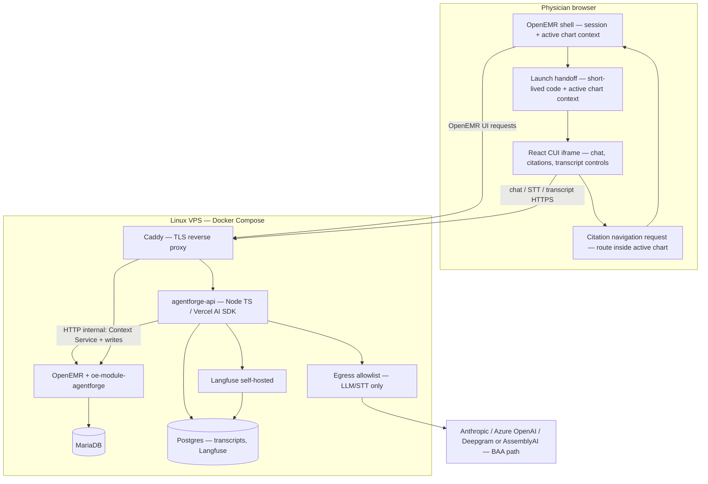
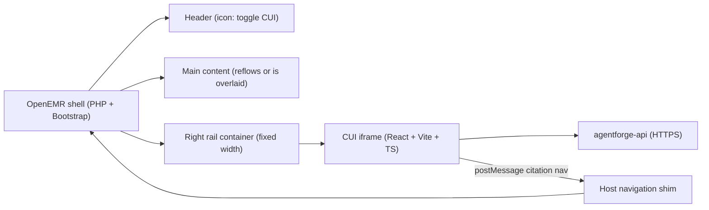

# AgentForge Stage 5 — Clinical Co-Pilot Architecture

> **What this is:** The AI integration plan for our OpenEMR fork. It ties together [`AUDIT.md`](AUDIT.md) (what OpenEMR forces us to respect) and [`USERS.md`](USERS.md) (who we build for and which use cases are in scope).  
> **V1 use cases:** UC-A pre-room briefing, UC-B in-room transcript + confirmed writes, UC-C post-room thread — see [`USERS.md` §4](USERS.md).

> **Working document:** This file may be revised up to **MVP submission** (Gauntlet deadline). Keep the instructor table + executive summary aligned with whatever ships.

> **MVP submission bundle (checklist):** Repo deliverables [`AUDIT.md`](AUDIT.md), [`USERS.md`](USERS.md), this [`ARCHITECTURE.md`](ARCHITECTURE.md) **plus** (1) **live URL** — OpenEMR (and agent stack when ready) on a **Linux VPS** + Docker per [Stage 2](Documentation/AgentForge/process/05-stage2-deployment-decision.md) (Gauntlet MVP host: **Vultr**; any comparable VPS works), (2) **Loom** — you on camera walking the architecture decisions, (3) **social post** — e.g. X / LinkedIn per case study (tag **@GauntletAI** where required). **Priority for tonight:** working **HTTPS deployment** and a URL graders can open.

---

## For instructors — decisions in one place

| Decision | Choice | Why it’s justified |
| --- | --- | --- |
| **Hosting** | **Linux VPS** + Docker Compose (MVP deployed on **Vultr**) | Matches our **single-VM + Compose** plan ([Stage 2 decision](Documentation/AgentForge/process/05-stage2-deployment-decision.md)). OpenEMR is a long-lived PHP + MariaDB stack; a single VM with Compose is what upstream expects. A cohort peer shipped a working demo this way — low surprise, workable ops. *Course/synthetic data:* a standard VPS footprint is appropriate. *Future production under strict infrastructure BAA:* evaluate managed/regulated hosting separately — not a Gauntlet MVP blocker. |
| **CUI (Conversational UI)** | **React** (e.g. Vite + TypeScript) | Team comfort and speed; isolates the co-pilot in an **iframe SPA** so we are not rewriting OpenEMR’s legacy Angular. The iframe mounts in a toggleable **right rail** launched from a header icon; if the host shell would scroll horizontally, the rail overlays instead of forcing a broken layout. Same language family as the **Agent API** (TypeScript) for shared types and simpler reasoning. |
| **Agent backend** | **Node 20 + TypeScript + Vercel AI SDK** | Bounded **read → propose → confirm → write** flow — not multi-agent “planning.” Typed tools (Zod), provider swap without rewrites. |
| **Visit capture (STT + transcript)** | **`agentforge-api` streaming relay** → default **Deepgram** (AssemblyAI acceptable); transcript in **Postgres**; **tap start/stop** or **hold-to-talk** | UC-B threads **chart context + physician dictation**; proposals appear as visible messages → confirm → module writes. **No ambient scope**, **no audio retention** ([`USERS.md` §3.2](USERS.md)); BAA egress like LLMs ([`Compliance-5`](AUDIT.md#compliance-5-no-outbound-network-egress-controls-the-llm-call-would-be-the-first-phi-bearing-outbound)). |
| **Chart reads / writes in OpenEMR** | **PHP custom module** (`oe-module-agentforge`) | OpenEMR’s **supported extension path** is PHP: `globals.php` session, GACL, existing services, audit hooks ([`Architecture-1`](AUDIT.md#architecture-1-openemr-is-a-hybrid-legacymodern-system-with-interfaceglobalsphp-as-the-shared-runtime-bridge), [`Architecture-4`](AUDIT.md#architecture-4-custom-modules-plus-event-hooks-are-the-most-plausible-in-repo-integration-path-for-a-v1-embedded-read-only-co-pilot)). We are **not** avoiding PHP for integration—we use it **where OpenEMR lives**. The **Agent Context Service** stays bounded (UUID in/out, explicit columns) so we do not inherit naive N+1 read patterns ([`Performance-7`](AUDIT.md#performance-7-n1-query-patterns-and-select--survive-in-services)). The **CUI has no standalone permissions** — bounded chart reads and writes run only through the module under that user’s established OpenEMR session/GACL (no parallel privilege plane for chat). |
| **Safety** | **Verification before display** + **active-chart binding** | Case study + audit: claims must cite chart sources; staff API paths need **session/chart binding** ([`Security-3`](AUDIT.md#security-3-fhir-patient-context-reads-and-staff-acl-reads-follow-different-enforcement-paths)). Citations expose actionable links where the **source pack** supports navigation; MVP wires limited host navigation first, then expands surfaces. |
| **Observability** | **Self-hosted Langfuse** (same Compose stack) | Agent traces often include prompts, tool payloads, and model output—**PHI-adjacent** once real charts are in play. **Self-hosted Langfuse** on **the same VPS** keeps that telemetry **inside our boundary** instead of shipping it to another vendor that would need its own BAA and retention story ([`Compliance-2`](AUDIT.md#compliance-2-external-llm-use-requires-a-phi-boundary-decision-before-any-real-chart-data-leaves-openemr)). It still gives turn-level tracing, latency, tool failures, and token/cost visibility—the case study asks for real observability, not “installed and ignored.” |

**No pushback on a conventional VPS vendor or React** for this project: they align with the fork, the audit, and practical delivery. The only caveat above is honest scope separation — **demo vs. enterprise HIPAA hosting** — not a reason to change the plan now.

---

## Executive summary (~1 page)

We are building an **embedded co-pilot** for **Dr. Maya Reynolds** (adult primary care, returning patients, non-emergent visits — [`USERS.md` §2](USERS.md)). Three moments: **before the room** (briefing), **in the room** (physician-only dictation, narrow structured writes **after explicit confirm**), **after the room** (same thread, Q&A, no silent writes).

**Shape:** Two software pieces on **one Linux VPS**, **Docker Compose**:

1. **OpenEMR** (existing image) + a small **custom module** `oe-module-agentforge` — PHP hooks, session/chart context, **Agent Context Service** (bounded chart reads/writes server-side), and a **static mount or proxy** for the React CUI build.
2. **agentforge-api** — TypeScript service: LLM, tools, verification, transcripts, STT relay, talking to OpenEMR only over HTTP to the module. In UC-B, agent turns combine **chart tools + rolling physician transcript** before proposing writes.

**Caddy** (or nginx) on **the VPS** terminates TLS and routes traffic to OpenEMR and the agent API. **Only the agent container** (via a small egress path) calls **BAA-class** LLM/STT APIs, with an **allowlisted** egress policy ([`Compliance-5`](AUDIT.md#compliance-5-no-outbound-network-egress-controls-the-llm-call-would-be-the-first-phi-bearing-outbound)).

**React CUI** implements the iframe experience: chat, citations, confirm buttons, and visit recording controls (**tap start/stop** or **hold-to-talk**). It talks to `agentforge-api` over HTTPS after a **postMessage + short-lived launch code** handshake — **no tokens in URLs** ([`Security-11`](AUDIT.md#security-11-embedded-ui-iframe-and-oauth-token-exposure)).

**Host UX:** The OpenEMR module injects one chat icon into the global header plus a fixed-width right rail container. The icon toggles rail visibility while keeping the CUI iframe mounted, so chat state and transcript controls survive hide/show without reloading or re-prompting. The main OpenEMR content reflows narrower by default; if a fixed-width shell screen would create horizontal scroll, the rail elevates and overlays the shell. With no chart open, the rail shows an empty/onboarding state and makes no chart reads until a patient context is bound.

**Why not “just FHIR” for every read?** REST/FHIR is clean long-term, but many round-trips add latency ([`Performance-3`](AUDIT.md#performance-3-restfhir-is-cleaner-as-a-boundary-but-adds-per-resource-overhead-and-uneven-pagination-behavior)). We still use official APIs where they are simplest; the **Context Service** collapses the bounded V1 bundle into a few fast, auditable calls.

**Verification** is mandatory: structured answers with **citations** tied to **source packs** from tools; deterministic checks drop uncited claims and surface conflicts (e.g. med list vs prescriptions — [`DataQuality-2`](AUDIT.md#dataquality-2-adult-pcp-chart-facts-come-from-multiple-source-families-with-different-identifiers-statuses-and-freshness-semantics)). **Vitals and lab numbers** are filled by **deterministic parsers**, not LLM prose, to limit numeric hallucination.

**Writes (UC-B only, after confirm):** chief complaint, vitals (incl. pain, height, weight), tobacco status, allergy add/update per [`USERS.md` §3.2](USERS.md). The agent **never** touches the DB directly; the **module** executes writes with the physician’s session and ACL.

**Compliance posture:** Demo = synthetic data + case-study “act as if” BAA for providers. Real PHI later = documented BAA, retention, logging defaults fixed ([`Security-4`](AUDIT.md#security-4-current-logging-surfaces-can-retain-phi-rich-request-sql-and-api-payload-details)), **`log_from='agent'`** ([`Compliance-6`](AUDIT.md#compliance-6-log-tamper-evidence-is-partial-and-optional-there-is-no-first-class-agent-actor)), and a revisit of the accepted **`admin/super`** access risk before any real-PHI deployment ([`Security-10`](AUDIT.md#security-10-gacl-semantics-superuser-bypass-and-fail-open-caller-bugs)).

**Tradeoffs we accept:** In-repo module is **GPLv3** ([`Compliance-4`](AUDIT.md#compliance-4-gplv3-constrains-release-shape-for-in-repomodule-integration)). Internal Context Service is faster than pure FHIR for V1 but is **debt** if we ever extract a separately licensed product (add a FHIR facade later).

---

## System diagram

**Rule:** The browser never holds LLM API keys. Only **agentforge-api** calls the models.

---

## The three parts (mental model)

| Part | Tech | Role |
| --- | --- | --- |
| **A. OpenEMR + module** | PHP in `interface/modules/custom_modules/oe-module-agentforge/` | Authenticated shell: menu hooks, header chat-icon hook, right-rail container shim, `panel.php` that loads the React CUI bundle, **Agent Context Service** endpoints, **write** endpoints, launch-code mint/redeem, OpenEMR audit rows (`log_from='agent'`). |
| **B. CUI (Conversational UI)** | Vite + React + TypeScript | UI in iframe: messages, sources, confirm/deny, visit recording controls (**tap start/stop** or **hold-to-talk**). Renders **structured** answer JSON (not raw HTML from the model), preserves chat/UI state across header toggles, and shows a no-chart empty state when no patient is bound. |
| **C. Agent API** | Node 20 + Hono + Vercel AI SDK | Orchestration, tools, verification, Postgres transcript store, STT streaming relay, Langfuse traces. |

---

## PHP + Node: integration seams

Clinical integration stays in **PHP** (module, session, GACL); LLM orchestration stays in **Node** (`agentforge-api`). Two runtimes are intentional — the risk is **boundary hygiene**, not the split itself.

| Risk | Mitigation |
| --- | --- |
| **Handshake / context** — CUI or API calls chart paths without a validated OpenEMR session or chart binding | **postMessage + short-lived launch code**; enforce active-chart binding on every chart read/write ([`Security-11`](AUDIT.md#security-11-embedded-ui-iframe-and-oauth-token-exposure)) |
| **Deploy drift** — works on laptop, breaks on VPS | One **Docker Compose** graph; align **env/secrets** and internal hostnames for OpenEMR ↔ `agentforge-api` |
| **Debugging** — failure could be module, agent, or browser | **Correlation / request IDs** across module and agent logs for the same user action |
| **API contract drift** — payload shape changes on one side only | Small **typed HTTP contract** (e.g. Zod + shared TS types or OpenAPI); release module + agent together when the contract changes |

---

## Host UX integration

The daily interaction is a **single chat icon** in the OpenEMR header, placed near search/profile controls. Clicking it toggles a **fixed-width right rail**; the rail contains the CUI iframe, and the CUI owns chat, citations, confirm/deny, speech-to-text, transcript controls, and physician-only recording state. The mic control supports both **tap start/stop** and **hold-to-talk**.

The rail tries to shrink the OpenEMR content area first. If the current screen has fixed-width content that would create horizontal scroll, the rail rises above the shell with a higher `z-index` and overlays the right side instead. Mobile portrait and a full-page CUI surface are out of scope for MVP.

The iframe stays mounted when the rail is hidden so the active thread, transcript controls, and local UI state do not reset. A browser reload can still recover persisted transcript history from `agentforge-api` storage. Patient-switch behavior remains a deliberate MVP integration decision: default to resetting the CUI thread on patient change to preserve active-chart binding semantics, then revisit if clinicians need cross-chart continuity.

With no chart selected, the icon still opens the rail, but the CUI renders an empty/onboarding state and does not issue chart reads. A no-chart day view is deferred below.

Citations may request **in-chart navigation** through the parent OpenEMR shell; details and MVP limits live in the Verification section.

---

## Security rules we do not relax

- **Active-chart binding:** every read/write checks **requested patient UUID == chart session UUID** ([`Security-3`](AUDIT.md#security-3-fhir-patient-context-reads-and-staff-acl-reads-follow-different-enforcement-paths), [`DataQuality-7`](AUDIT.md#dataquality-7-id-multiplicity-and-inconsistent-soft-delete-orphan-rows-are-a-possible-state)).
- **Admin/super may use the co-pilot.** Active-chart binding and the explicit-confirm write gate still apply at the module layer, but `admin/super` bypasses GACL ([`Security-10`](AUDIT.md#security-10-gacl-semantics-superuser-bypass-and-fail-open-caller-bugs)), so role-scoped ACL guarantees do not hold for that role. Accepted risk for demo/synthetic data; revisit before any real-PHI deployment.
- **Writes:** proposal → **explicit confirm** → module executes → user sees accept/reject ([`USERS.md` §3.2](USERS.md)).
- **Deploy-time hygiene** (from audit): CORS allowlist, safer API error responses, tighten cookies/logging for any real-PHI environment ([`Security-6`](AUDIT.md#security-6-cors-reflects-request-origin-while-emitting-credentialed-responses), [`Security-8`](AUDIT.md#security-8-api-500-responses-leak-raw-exception-messages), [`Security-7`](AUDIT.md#security-7-core-session-cookie-is-not-httponly-and-is-not-secure-by-default)).

---

## Chart access: “Context Service” (short)

Bounded POST endpoints under the module, e.g. identity, encounters, problems, allergies, medications, vitals, labs, note **metadata** (full text only on demand), social history. Each returns **source packs** (table/resource id, uuid, dates, retrieval path) so verification can cite.

**Writes** (module only, after confirm): chief complaint / encounter reason, vitals, `history_data` tobacco, allergy row per existing services — see [`AUDIT.md` §Architecture-3](AUDIT.md#architecture-3-restfhir-apis-provide-the-cleanest-read-boundary-but-identifier-and-resource-coverage-are-uneven) and [`USERS.md` §7](USERS.md) for scope limits.

---

## Verification (two steps, plain English)

1. **Citations:** If the model says something clinical, it must point at a **source pack row** we actually retrieved this turn. No citation → claim is removed or downgraded.
2. **Sanity / conflict:** Small rule set — e.g. conflicting active vs inactive meds, impossible vitals, cross-patient id in a tool call → block or flag.

Negative statements (“no allergies on file”) only count if the **empty allergy query** succeeded — not “model didn’t see any.”

**Citation navigation (MVP):** When a displayed citation has a source pack with a supported navigation hint, the CUI sends a `postMessage` (`NAV_REQUEST`) to the OpenEMR parent shell. The gate-3 task list prioritizes **`encounter`** deep-links first (`encounter_top.php` / `goToEncounter` when available). Hints with `kind: chart_section` carry `params.section` (e.g. `allergies`, `medical_problem`, `medications`) and the host maps those to the same patient-file URLs the dashboard uses (e.g. `stats_full.php?…&category=…`, `labdata.php`, `history.php`, document list). Unknown kinds still fall back to chart summary with bounded CUI copy (`NAV_LIMITED`). The host routes via OpenEMR tab APIs (`goToEncounter` / `navigateTab`, `loadCurrentPatient`, or `top.RTop.location` as fallback)—not a full `window.top` navigation—so the tabs chrome and rail stay mounted. Navigation stays inside the authenticated OpenEMR session and must compare the active chart binding (panel `data-patient-uuid` ↔ expected id) before routing.

---

## Speech, eval, observability (brief)

- **STT:** Streaming provider under BAA (default **Deepgram**, **AssemblyAI** acceptable under the same pattern); **no audio file** retained; physician dictation only; capture supports **tap start/stop** or **hold-to-talk** ([`USERS.md` §3.2](USERS.md)).
- **Eval:** **Synthea-imported** longitudinal charts + **hand-curated** golden cases ([`DataQuality-5`](AUDIT.md#dataquality-5-eval-ground-truth-requires-hybrid-synthetic-plus-curated-augmentation)). Deterministic checks: required citations, forbidden outputs, refusal paths, prompt-injection in notes.
- **Observability — Langfuse (self-hosted):** Vercel AI SDK can emit traces compatible with Langfuse; running Langfuse **on the same VPS** as the agent keeps eval/tracing aligned with the audit’s emphasis on **not turning observability into a second PHI leak** (contrast with sending full traces to a SaaS that is not in our BAA footprint). We use **redacted-by-default** trace bodies where needed; we still record **what ran, in what order, durations, tool failures, tokens, and cost** so the case-study observability questions are answerable from our own stack.

---

## VPS deployment (practical)

1. **Instance** — Ubuntu LTS, 8 GB RAM class minimum for OpenEMR + DB + agent + Langfuse comfortably (scale up if needed).
2. **Firewall** — provider cloud firewall plus **UFW** on the host: allow **80/443** and **SSH** from trusted IPs; **never** expose **3306** publicly.
3. **Docker + Compose** — same graph as Stage 2: `openemr`, `db`, `agentforge-api`, `postgres`, `langfuse`, `caddy`, optional egress helper.
4. **DNS / hostname** — **A record** (or nip.io/sslip hostname) to **the VPS public IPv4**; **Caddy obtains Let’s Encrypt certs** once a hostname is stable.
5. **Secrets** — API keys via Docker secrets **or CI/deploy-injected env**, not committed to Git.

Rollback: disable OpenEMR module **or** `docker compose` to previous image tags; transcripts live in Postgres.

---

## Cost snapshot (order of magnitude)

| Scale (concurrent-ish physicians) | Rough LLM+STT / day | Note |
| --- | --- | --- |
| 100 | ~\$50–\$60 | Single VPS + backups |
| 1K | ~\$500+ | Replicas, managed Postgres |
| 10K / 100K | Much higher | Regional cells, caching policy `Performance-5`, smaller models for intent-only turns |

Refresh with **real** token traces during Early Submission. Per-physician-day envelope in the long doc was ~\$0.50 tool cost at list prices — treat as planning only until measured.

---

## Milestones (aligned with Gauntlet)

The instructor table describes the **target V1 architecture**. The Sunday MVP prioritizes deployment, module shell, React CUI, launch handshake, and the Context Service read path; visit capture, confirmed writes, and broader citation navigation are staged through Early/Final, with citation navigation starting on one or two chart surfaces.

| Gate | Focus |
| --- | --- |
| **MVP** | Linux VPS + Compose + HTTPS; module shell + React CUI + launch handshake; Context Service read path; security baseline items we accepted above |
| **Early** | UC-A briefing + verification + Langfuse + eval harness + Synthea/curated data |
| **Final** | UC-B confirm writes + UC-C thread + adversarial evals + demo video |

---

## Deferred / out of V1

Anything not in [`USERS.md` §7.1 “V1 does not include”](USERS.md) stays out until `USERS.md` changes — e.g. immunizations, orders, note drafting, ambient recording, allergy delete.

**No-chart day view (pre-day schedule briefing):** The CUI icon is available with no patient selected, but day-view content (today’s schedule, prep summaries across patients) is **post-MVP**. MVP renders an empty state and does not issue reads. Adding the day view requires a new bounded read scope (calendar/appointments cross-patient) outside the current active-chart binding; revisit with `USERS.md` before promoting to V1.

**Debt:** Context Service is not a pure public FHIR facade; pinned OpenEMR version must track security advisories; OpenEMR PHI at rest is unchanged ([`Security-5`](AUDIT.md#security-5-phi-columns-are-stored-in-cleartext-at-rest-encryption-is-wired-to-secrets-not-to-clinical-data)) — **VPS** **disk encryption** + ops hygiene for anything beyond demo.

---

## Traceability — capability ↔ use case

| Capability | UC-A | UC-B | UC-C |
| --- | :---: | :---: | :---: |
| Pre-room briefing / what changed | ✓ | | |
| CUI + launch handshake | ✓ | ✓ | ✓ |
| Chart reads + citations | ✓ | ✓ | ✓ |
| Physician-only visit capture + STT | | ✓ | ✓ |
| Write proposals + explicit confirm | | ✓ | |
| Post-room Q&A (no auto-writes) | | ✓ | ✓ |
| Verification gate | ✓ | ✓ | ✓ |
| Audit / active-chart binding | ✓ | ✓ | ✓ |

---

## Glossary

- **Agent Context Service** — Module endpoints that return **bounded** chart slices with **source-pack** metadata.
- **Source pack** — Stable pointer to where a fact came from (for citations and verification).
- **Active-chart binding** — Tool/server checks that the patient UUID matches the open chart.
- **Langfuse (self-hosted)** — Observability for agent runs (turn traces, tool steps, latency, tokens, cost). Running it on **our VPS** avoids treating a third-party trace SaaS as another PHI processor under [`Compliance-2`](AUDIT.md#compliance-2-external-llm-use-requires-a-phi-boundary-decision-before-any-real-chart-data-leaves-openemr).

---

## References

[`AUDIT.md`](AUDIT.md) · [`USERS.md`](USERS.md) · [Stage 2 deployment](Documentation/AgentForge/process/05-stage2-deployment-decision.md) · [VPS live deployment (Gauntlet)](Documentation/AgentForge/process/09-vps-live-deployment.md) · [Case study PDF](Documentation/AgentForge/references/Week%201%20-%20AgentForge.pdf)
