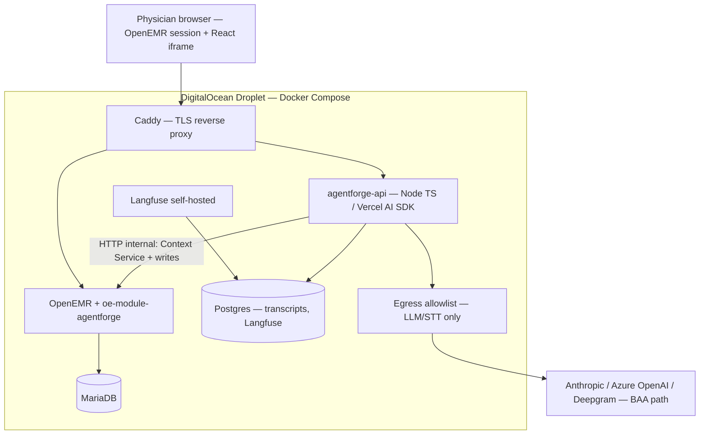

# AgentForge Stage 5 — Clinical Co-Pilot Architecture

> **What this is:** The AI integration plan for our OpenEMR fork. It ties together [`AUDIT.md`](AUDIT.md) (what OpenEMR forces us to respect) and [`USERS.md`](USERS.md) (who we build for and which use cases are in scope).  
> **V1 use cases:** UC-A pre-room briefing, UC-B in-room transcript + confirmed writes, UC-C post-room thread — see [`USERS.md` §4](USERS.md).

> **Working document:** This file may be revised up to **MVP submission** (Gauntlet deadline). Keep the instructor table + executive summary aligned with whatever ships.

> **MVP submission bundle (checklist):** Repo deliverables [`AUDIT.md`](AUDIT.md), [`USERS.md`](USERS.md), this [`ARCHITECTURE.md`](ARCHITECTURE.md) **plus** (1) **live URL** — OpenEMR (and agent stack when ready) on **DigitalOcean** + Docker per [Stage 2](Documentation/AgentForge/process/05-stage2-deployment-decision.md), (2) **Loom** — you on camera walking the architecture decisions, (3) **social post** — e.g. X / LinkedIn per case study (tag **@GauntletAI** where required). **Priority for tonight:** working **HTTPS deployment** and a URL graders can open.

---

## For instructors — decisions in one place

| Decision | Choice | Why it’s justified |
| --- | --- | --- |
| **Hosting** | **DigitalOcean Droplet** + Docker Compose | Matches our **VPS + Compose** plan ([Stage 2 decision](Documentation/AgentForge/process/05-stage2-deployment-decision.md)). OpenEMR is a long-lived PHP + MariaDB stack; a single VM with Compose is what upstream expects. A cohort peer shipped a working demo this way — low surprise, workable ops. *Course/synthetic data:* DO is appropriate. *Future production under strict infrastructure BAA:* evaluate managed/regulated hosting separately — not a Gauntlet MVP blocker. |
| **Panel UI** | **React** (e.g. Vite + TypeScript) | Team comfort and speed; isolates the co-pilot in an **iframe SPA** so we are not rewriting OpenEMR’s legacy Angular. Same language family as the **Agent API** (TypeScript) for shared types and simpler reasoning. |
| **Agent backend** | **Node 20 + TypeScript + Vercel AI SDK** | Bounded **read → propose → confirm → write** flow — not multi-agent “planning.” Typed tools (Zod), provider swap without rewrites. |
| **Chart reads / writes in OpenEMR** | **PHP custom module** (`oe-module-agentforge`) | OpenEMR’s **supported extension path** is PHP: `globals.php` session, GACL, existing services, audit hooks ([`Architecture-1`](AUDIT.md#architecture-1-openemr-is-a-hybrid-legacymodern-system-with-interfaceglobalsphp-as-the-shared-runtime-bridge), [`Architecture-4`](AUDIT.md#architecture-4-custom-modules-plus-event-hooks-are-the-most-plausible-in-repo-integration-path-for-a-v1-embedded-read-only-co-pilot)). We are **not** avoiding PHP for integration—we use it **where OpenEMR lives**. The **Agent Context Service** stays bounded (UUID in/out, explicit columns) so we do not inherit naive N+1 read patterns ([`Performance-7`](AUDIT.md#performance-7-n1-query-patterns-and-select--survive-in-services)). |
| **Safety** | **Verification before display** + **active-chart binding** | Case study + audit: claims must cite chart sources; staff API paths need **session/chart binding** ([`Security-3`](AUDIT.md#security-3-fhir-patient-context-reads-and-staff-acl-reads-follow-different-enforcement-paths)). |
| **Observability** | **Self-hosted Langfuse** (same Compose stack) | Agent traces often include prompts, tool payloads, and model output—**PHI-adjacent** once real charts are in play. **Self-hosted Langfuse** on the DigitalOcean droplet keeps that telemetry **inside our boundary** instead of shipping it to another vendor that would need its own BAA and retention story ([`Compliance-2`](AUDIT.md#compliance-2-external-llm-use-requires-a-phi-boundary-decision-before-any-real-chart-data-leaves-openemr)). It still gives turn-level tracing, latency, tool failures, and token/cost visibility—the case study asks for real observability, not “installed and ignored.” |

**No pushback on DigitalOcean or React** for this project: they align with the fork, the audit, and practical delivery. The only caveat above is honest scope separation — **demo vs. enterprise HIPAA hosting** — not a reason to change the plan now.

---

## Executive summary (~1 page)

We are building an **embedded co-pilot** for **Dr. Maya Reynolds** (adult primary care, returning patients, non-emergent visits — [`USERS.md` §2](USERS.md)). Three moments: **before the room** (briefing), **in the room** (physician-only dictation, narrow structured writes **after explicit confirm**), **after the room** (same thread, Q&A, no silent writes).

**Shape:** Two software pieces on **one DigitalOcean Droplet**, **Docker Compose**:

1. **OpenEMR** (existing image) + a small **custom module** `oe-module-agentforge` — PHP hooks, session/chart context, **Agent Context Service** (bounded chart reads/writes server-side), and a **static mount or proxy** for the React panel build.
2. **agentforge-api** — TypeScript service: LLM, tools, verification, transcripts, STT relay, talking to OpenEMR only over HTTP to the module.

**Caddy** (or nginx) on the droplet terminates TLS and routes traffic to OpenEMR and the agent API. **Only the agent container** (via a small egress path) calls **BAA-class** LLM/STT APIs, with an **allowlisted** egress policy ([`Compliance-5`](AUDIT.md#compliance-5-no-outbound-network-egress-controls-the-llm-call-would-be-the-first-phi-bearing-outbound)).

**React** implements the iframe UI: chat, citations, confirm buttons, push-to-talk. It talks to `agentforge-api` over HTTPS after a **postMessage + short-lived launch code** handshake — **no tokens in URLs** ([`Security-11`](AUDIT.md#security-11-embedded-ui-iframe-and-oauth-token-exposure)).

**Why not “just FHIR” for every read?** REST/FHIR is clean long-term, but many round-trips add latency ([`Performance-3`](AUDIT.md#performance-3-restfhir-is-cleaner-as-a-boundary-but-adds-per-resource-overhead-and-uneven-pagination-behavior)). We still use official APIs where they are simplest; the **Context Service** collapses the bounded V1 bundle into a few fast, auditable calls.

**Verification** is mandatory: structured answers with **citations** tied to **source packs** from tools; deterministic checks drop uncited claims and surface conflicts (e.g. med list vs prescriptions — [`DataQuality-2`](AUDIT.md#dataquality-2-adult-pcp-chart-facts-come-from-multiple-source-families-with-different-identifiers-statuses-and-freshness-semantics)). **Vitals and lab numbers** are filled by **deterministic parsers**, not LLM prose, to limit numeric hallucination.

**Writes (UC-B only, after confirm):** chief complaint, vitals (incl. pain, height, weight), tobacco status, allergy add/update per [`USERS.md` §3.2](USERS.md). The agent **never** touches the DB directly; the **module** executes writes with the physician’s session and ACL.

**Compliance posture:** Demo = synthetic data + case-study “act as if” BAA for providers. Real PHI later = documented BAA, retention, logging defaults fixed ([`Security-4`](AUDIT.md#security-4-current-logging-surfaces-can-retain-phi-rich-request-sql-and-api-payload-details)), **`log_from='agent'`** ([`Compliance-6`](AUDIT.md#compliance-6-log-tamper-evidence-is-partial-and-optional-there-is-no-first-class-agent-actor)), no chat from **`admin/super`** ([`Security-10`](AUDIT.md#security-10-gacl-semantics-superuser-bypass-and-fail-open-caller-bugs)).

**Tradeoffs we accept:** In-repo module is **GPLv3** ([`Compliance-4`](AUDIT.md#compliance-4-gplv3-constrains-release-shape-for-in-repomodule-integration)). Internal Context Service is faster than pure FHIR for V1 but is **debt** if we ever extract a separately licensed product (add a FHIR facade later).

---

## System diagram

**Rule:** The browser never holds LLM API keys. Only **agentforge-api** calls the models.

---

## The three parts (mental model)

| Part | Tech | Role |
| --- | --- | --- |
| **A. OpenEMR + module** | PHP in `interface/modules/custom_modules/oe-module-agentforge/` | Authenticated shell: menu hooks, `panel.php` that loads the React bundle, **Agent Context Service** endpoints, **write** endpoints, launch-code mint/redeem, OpenEMR audit rows (`log_from='agent'`). |
| **B. React panel** | Vite + React + TypeScript | UI in iframe: messages, sources, confirm/deny, push-to-talk. Renders **structured** answer JSON (not raw HTML from the model). |
| **C. Agent API** | Node 20 + Hono + Vercel AI SDK | Orchestration, tools, verification, Postgres transcript store, STT streaming relay, Langfuse traces. |

---

## Security rules we do not relax

- **Active-chart binding:** every read/write checks **requested patient UUID == chart session UUID** ([`Security-3`](AUDIT.md#security-3-fhir-patient-context-reads-and-staff-acl-reads-follow-different-enforcement-paths), [`DataQuality-7`](AUDIT.md#dataquality-7-id-multiplicity-and-inconsistent-soft-delete-orphan-rows-are-a-possible-state)).
- **No co-pilot for `admin/super`.**
- **Writes:** proposal → **explicit confirm** → module executes → user sees accept/reject ([`USERS.md` §3.2](USERS.md)).
- **Deploy-time hygiene** (from audit): CORS allowlist, safer API error responses, tighten cookies/logging for any real-PHI environment ([`Security-6`](AUDIT.md#security-6-cors-reflects-request-origin-while-emitting-credentialed-responses), [`Security-8`](AUDIT.md#security-8-api-500-responses-leak-raw-exception-messages), [`Security-7`](AUDIT.md#security-7-core-session-cookie-is-not-httponly-and-is-not-secure-by-default)).

---

## Chart access: “Context Service” (short)

Bounded POST endpoints under the module, e.g. identity, encounters, problems, allergies, medications, vitals, labs, note **metadata** (full text only on demand), social history. Each returns **source packs** (table/resource id, uuid, dates, retrieval path) so verification can cite.

**Writes** (module only, after confirm): chief complaint / encounter reason, vitals, `history_data` tobacco, allergy row per existing services — see [`AUDIT.md` §Architecture-3](AUDIT.md#architecture-3-restfhir-apis-provide-the-cleanest-read-boundary-but-identifier-and-resource-coverage-are-uneven) and [`USERS.md` §7](USERS.md) for scope limits.

---

## Verification (two steps, plain English)

1. **Citations:** If the model says something clinical, it must point at a **source pack row** we actually retrieved this turn. No citation → claim is removed or downgraded.
2. **Sanity / conflict:** Small rule set — e.g. conflicting active vs inactive meds, impossible vitals, cross-patient id in a tool call → block or flag.

Negative statements (“no allergies on file”) only count if the **empty allergy query** succeeded — not “model didn’t see any.”

---

## Speech, eval, observability (brief)

- **STT:** Streaming provider under BAA (e.g. Deepgram); **no audio file** retained; physician push-to-talk only ([`USERS.md` §3.2](USERS.md)).
- **Eval:** **Synthea-imported** longitudinal charts + **hand-curated** golden cases ([`DataQuality-5`](AUDIT.md#dataquality-5-eval-ground-truth-requires-hybrid-synthetic-plus-curated-augmentation)). Deterministic checks: required citations, forbidden outputs, refusal paths, prompt-injection in notes.
- **Observability — Langfuse (self-hosted):** Vercel AI SDK can emit traces compatible with Langfuse; running Langfuse **on the same droplet** as the agent keeps eval/tracing aligned with the audit’s emphasis on **not turning observability into a second PHI leak** (contrast with sending full traces to a SaaS that is not in our BAA footprint). We use **redacted-by-default** trace bodies where needed; we still record **what ran, in what order, durations, tool failures, tokens, and cost** so the case-study observability questions are answerable from our own stack.

---

## DigitalOcean deployment (practical)

1. **Droplet** — Ubuntu LTS, 8 GB RAM class minimum for OpenEMR + DB + agent + Langfuse comfortably (scale up if needed).
2. **Firewall (DO Cloud Firewall + optional UFW)** — allow **80/443** and **SSH** from trusted IPs; **never** expose **3306** publicly.
3. **Docker + Compose** — same graph as Stage 2: `openemr`, `db`, `agentforge-api`, `postgres`, `langfuse`, `caddy`, optional egress helper.
4. **DNS** — A record to droplet; Caddy obtains Let’s Encrypt certs.
5. **Secrets** — API keys via Docker secrets or DO-managed env, not committed to Git.

Rollback: disable OpenEMR module **or** `docker compose` to previous image tags; transcripts live in Postgres.

---

## Cost snapshot (order of magnitude)

| Scale (concurrent-ish physicians) | Rough LLM+STT / day | Note |
| --- | --- | --- |
| 100 | ~\$50–\$60 | Single droplet + backups |
| 1K | ~\$500+ | Replicas, managed Postgres |
| 10K / 100K | Much higher | Regional cells, caching policy `Performance-5`, smaller models for intent-only turns |

Refresh with **real** token traces during Early Submission. Per-physician-day envelope in the long doc was ~\$0.50 tool cost at list prices — treat as planning only until measured.

---

## Milestones (aligned with Gauntlet)

| Gate | Focus |
| --- | --- |
| **MVP** | DO droplet + Compose + HTTPS; module shell + React panel + launch handshake; Context Service read path; security baseline items we accepted above |
| **Early** | UC-A briefing + verification + Langfuse + eval harness + Synthea/curated data |
| **Final** | UC-B confirm writes + UC-C thread + adversarial evals + demo video |

---

## Deferred / out of V1

Anything not in [`USERS.md` §7.1 “V1 does not include”](USERS.md) stays out until `USERS.md` changes — e.g. immunizations, orders, note drafting, ambient recording, allergy delete.

**Debt:** Context Service is not a pure public FHIR facade; pinned OpenEMR version must track security advisories; OpenEMR PHI at rest is unchanged ([`Security-5`](AUDIT.md#security-5-phi-columns-are-stored-in-cleartext-at-rest-encryption-is-wired-to-secrets-not-to-clinical-data)) — droplet **disk encryption** + ops hygiene for anything beyond demo.

---

## Traceability — capability ↔ use case

| Capability | UC-A | UC-B | UC-C |
| --- | :---: | :---: | :---: |
| Pre-room briefing / what changed | ✓ | | |
| React panel + launch handshake | ✓ | ✓ | ✓ |
| Chart reads + citations | ✓ | ✓ | ✓ |
| Visit transcript + STT | | ✓ | ✓ |
| Write proposals + explicit confirm | | ✓ | |
| Post-room Q&A (no auto-writes) | | ✓ | ✓ |
| Verification gate | ✓ | ✓ | ✓ |
| Audit / active-chart binding | ✓ | ✓ | ✓ |

---

## Glossary

- **Agent Context Service** — Module endpoints that return **bounded** chart slices with **source-pack** metadata.
- **Source pack** — Stable pointer to where a fact came from (for citations and verification).
- **Active-chart binding** — Tool/server checks that the patient UUID matches the open chart.
- **Langfuse (self-hosted)** — Observability for agent runs (turn traces, tool steps, latency, tokens, cost). Running it on our droplet avoids treating a third-party trace SaaS as another PHI processor under [`Compliance-2`](AUDIT.md#compliance-2-external-llm-use-requires-a-phi-boundary-decision-before-any-real-chart-data-leaves-openemr).

---

## References

[`AUDIT.md`](AUDIT.md) · [`USERS.md`](USERS.md) · [Stage 2 deployment](Documentation/AgentForge/process/05-stage2-deployment-decision.md) · [Case study PDF](Documentation/AgentForge/references/Week%201%20-%20AgentForge.pdf)
