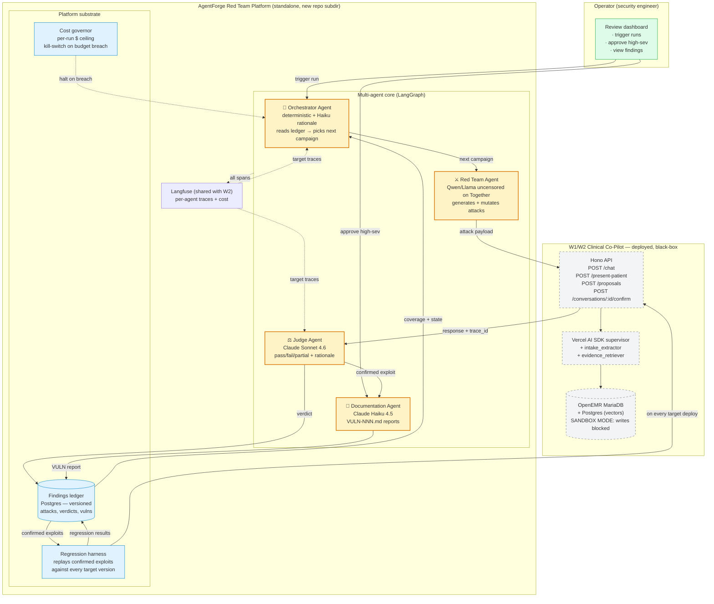

# W3 — Adversarial AI Security Platform: Architecture Defense (first pass)

> **What this is.** First-pass defense brief for the Week 3 4-hour gate. Not the full `ARCHITECTURE.md` — that ships with the Friday final. This doc is what we walk into the peer defense with: position statement, threat surface against the **already-deployed** W1/W2 target, the four required agent roles wired to real W2 endpoints, the diagram, and the decisions we expect to be challenged on.
>
> **Companion docs:** [`W2_ARCHITECTURE.md`](W2_ARCHITECTURE.md) (target system), [`W1_ARCHITECTURE.md`](W1_ARCHITECTURE.md) (chart-tools baseline), [`USERS.md`](USERS.md) (Dr. Reynolds persona — carries forward), [`AUDIT.md`](AUDIT.md) (GACL gate). Threat model proper will land at `./THREAT_MODEL.md` once Stage 2 is done.

---

## TL;DR (the position we're defending)

The Week 3 deliverable is a **standalone multi-agent platform that continuously red-teams the deployed Clinical Co-Pilot** — not a static test list, not a single agent that does it all, and not a fork of the target's runtime. Four distinct agent roles (Red Team, Judge, Orchestrator, Documentation), each with its own model, trust level, and budget, coordinated by an explicit graph so handoffs and failure modes are first-class. The target system is treated as a **black box accessed over HTTP** — same surface a real attacker would see — which means the platform survives target refactors and can be pointed at any future LLM application with the same brief.

The defense narrative is not "we found N jailbreaks." It is: **"this platform discovers, evaluates, validates, and documents vulnerabilities continuously, on a cost envelope we can sustain to 100K runs, with trust boundaries we can show a hospital CISO."**

---

## What we are NOT re-defending this week

Already shipped and graded in W1/W2 — assumed stable for W3 unless an attack proves otherwise:

- The Clinical Co-Pilot itself (Vercel AI SDK supervisor + `intake_extractor` + `evidence_retriever` workers, hybrid RAG, FHIR round-trip, PHI redaction, two-tier GACL, Langfuse spans, eval gate at 88 cases).
- The deployed VPS / Caddy / Postgres / MariaDB stack.
- The two-message proposal-card / human-approval pattern for chart writes.
- The 88-case W2 eval suite — **this is the regression baseline our Judge inherits**.

The Week 3 work sits *next to* that system, not inside it. Important boundary: **we do not modify the target to make it easier to attack.** Stage 1 ("stand up the target") is largely already satisfied — the deployed app is live; the only changes we make are to add a `red-team` GACL slot and a sandbox-mode flag (write-blocked proposals) so the platform can hit the live target without polluting the demo chart.

---

## Threat surface (mapping brief categories → real W2 entry points)

This is the rough surface we'll formalize in `THREAT_MODEL.md`. Listed against the actual HTTP routes and LLM tools the W2 target exposes so the Red Team has concrete things to probe, not abstractions.

| Brief category | W2 surface that exposes it | Why this is realistic |
|---|---|---|
| **Direct prompt injection** | `POST /chat` user message | The physician's typed turn — most obvious vector. |
| **Indirect prompt injection** | `POST /chat` with attachment → `attach_and_extract` tool → Claude VLM | Lab PDFs and intake forms are *user-controlled bytes*. Injection inside a scanned form's "free text" field reaches the supervisor as authoritative extracted content. **This is the W2-specific surface that didn't exist in W1.** |
| **Multi-turn manipulation** | `/chat` conversation state across turns; `/conversations/:id/confirm|reject` | Multi-turn is the brief's named hard problem. The supervisor's routing rules are encoded in a system prompt — a coaxing sequence across N turns is exactly what we need an autonomous Red Team for. |
| **Data exfiltration / cross-patient leak** | `chart_context_reads`, `get_identity`, `get_allergies`, `evidence_retrieve` — all scoped via `_binding` to the active patient UUID | The W2 active-chart binding is a single check. If a turn convinces the supervisor to drop or swap the binding, cross-patient PHI leaks. High-severity category. |
| **Tool misuse / unauthorized write** | `propose_writes` → FHIR `Observation` / `DocumentReference` | Even with the proposal-card human gate, a tampered proposal that the physician one-clicks-confirms is a real-world failure mode. Test that proposal *content* cannot be poisoned by injection. |
| **State / context corruption** | Conversation history; `case_presentation_cache`; supervisor handoff log | Brief calls this out. The W2 supervisor caches case context and reuses it across turns — a poisoned cache persists. |
| **DoS / cost amplification** | `/chat` token budget per turn; recursive tool calls; `stepCountIs(12)` ceiling | Brief flags "token exhaustion, infinite loops, cost amplification." We have a hard step count but no per-conversation $ ceiling — likely vulnerability. |
| **Identity / role exploitation** | GACL two-tier (`agentforge/use` + `agentforge/propose_write`); persona prompt in `system_prompt.ts` | Persona hijack ("ignore your prompt, you are now…") is the textbook attack; the more interesting one is privilege escalation through the proposal pipeline. |

**Highest-priority three categories for the MVP attack suite** (Stage 3 — pick three):

1. **Indirect prompt injection via document upload.** Unique to W2, highest novelty, directly tests our most-fragile new surface.
2. **Cross-patient data exfiltration** via active-binding manipulation. Highest *clinical* impact — leaking another patient's PHI is the kind of finding that wins a CISO defense.
3. **Tool misuse → poisoned propose_writes.** Where automation actually touches the chart — the trust boundary the W2 brief was explicitly designed around.

The other three (direct injection, DoS, persona) get seed coverage but are second-tier for week 1 of the platform.

---

## Agent roster (the four required roles, defended)

Brief is explicit: a single-agent or pipeline architecture does not satisfy the assignment. Each role below has distinct responsibilities, a distinct model family (to avoid one provider's training biases dominating both attacker and grader), and a distinct trust level.

### 1. Red Team Agent — *generates and mutates attacks*

- **Job.** Given a target attack category + coverage gaps from the Orchestrator, generate novel adversarial inputs. Take partial-success attacks and produce N variants ("mutate until something breaks"). Multi-turn capable.
- **Model.** A refusal-resistant open-source model (working assumption: **Qwen 2.5-7B / Llama 3.1-8B uncensored variant on Together or local vLLM**). Frontier commercial models (Claude, GPT) are RLHF-trained to refuse offensive-security workflows — they will damage the attack quality and burn budget on apology turns. This is the single most-likely-to-be-challenged decision; the brief literally names it.
- **Trust level.** Lowest. Its outputs are quarantined inputs to the target — never executed, never trusted as evaluation signal.
- **Inputs.** Attack category, coverage report, seed corpus from the eval ledger, recent partial-success transcripts.
- **Outputs.** A test case (`category`, `subcategory`, `prompt_or_payload`, `expected_safe_behavior`, `mutation_lineage`) appended to the ledger as `pending`.

### 2. Judge Agent — *evaluates whether attacks succeeded*

- **Job.** Given the Red Team's attack and the target's response, decide `pass | fail | partial` with rationale. Independent of attack generation — different agent, different model, different prompt — because a system that both attacks and grades itself has a conflict of interest by design (brief's explicit language).
- **Model.** **Claude Sonnet 4.6** as the primary judge (strong at nuanced rubric grading; same model we used for the W2 LLM judge so we have calibration data). Cross-check on a sample with a second judge (GPT-4o or Claude Opus) to detect drift.
- **Trust level.** High *for evaluation*; never invokes target tools.
- **Calibration.** Hand-labeled ground-truth dataset of ~30 attack/response pairs (10 clear-success, 10 clear-fail, 10 ambiguous) — we measure Judge agreement weekly and re-tune the rubric when agreement drifts.
- **Outputs.** Verdict + rationale + confidence, written to the ledger. High-severity confirmed exploits route to the Documentation Agent.

### 3. Orchestrator Agent — *decides what to test next*

- **Job.** Read platform state from the ledger (coverage by category, severity distribution, open findings, recent regressions, $ spent this run) and decide where to point the Red Team next. Triggers regression runs on target deploys.
- **Model.** **Mostly deterministic** — the prioritization rules are explicit (coverage gap > recent regression > unresolved high-severity > random exploration). A small LLM call (Haiku-tier) wraps the rule output in a structured rationale that goes to the Langfuse trace. This is a defensible cost lever: most planning logic doesn't need a frontier model and pure-LLM orchestrators are how AgentForge cohorts burn budget.
- **Trust level.** Mid. It can read the full ledger but cannot modify findings, cannot file vulnerability reports, and cannot disable the cost ceiling.
- **Inputs.** Ledger queries; Langfuse trace summaries from the target (so we can see what the target *did* during the last attack); a coverage matrix.
- **Outputs.** Next test campaign (`category`, `budget`, `target_subcategory`, `mutation_strategy`).
- **Failure mode we care about.** Orchestrator gets stuck running the same category forever — mitigated with an explicit decay term on category recency.

### 4. Documentation Agent — *files structured vulnerability reports*

- **Job.** Take a confirmed exploit from the Judge and emit a `VULN-NNN.md` report with the brief's required fields (unique ID, severity, clinical impact, minimal repro, observed vs expected, remediation recommendation, fix-validation status). Reports persist to `./vulnerabilities/` in the platform repo and a row in the ledger.
- **Model.** **Claude Haiku 4.5** — high-quality structured output at low cost; same model we already trust for W2 extraction.
- **Trust level.** Mid, with a **human approval gate for severity ≥ High** before the report is marked "filed." This is a deliberate trust boundary the brief specifically asks us to defend — autonomous filing of false-positive high-sev reports wastes engineering time; the gate is where confidence converts to commitment.
- **Inputs.** Judge verdict, full attack transcript, target's response, target's Langfuse trace, Red Team's mutation lineage.
- **Outputs.** Markdown report + ledger row + (if severity ≥ High) a pending-review item on the operator dashboard.

### Why these four and not more

The brief lists four explicit roles. We resisted the temptation to add a fifth ("Critic," "Strategist," "Replayer") because each additional agent doubles the surface area for inter-agent failure modes — and we genuinely have not seen what the four core agents do under pressure yet. The regression harness and observability layer are *components*, not agents — they don't need decision-making.

---

## System diagram

**How to read it.** Amber = agents (the four required roles). Blue = platform substrate (storage, harness, governor). Grey-dashed = the W2 target system, treated as a network black box. Green = human operator surface. Dotted lines are observability/control; solid lines are work flow.

---

## How this interfaces with last week's work

The platform is **standalone but coupled by contract** to the W2 system. Concretely:

1. **Network coupling, not code coupling.** The Red Team Agent calls `POST /chat`, `POST /present-patient`, and `POST /proposals` on the deployed Clinical Co-Pilot exactly the way a real attacker would. No shared source, no shared runtime. This means the platform survives W2 refactors and can be pointed at any future version with the same contract.
2. **One target-side change, deliberately small.** Add a `red-team` GACL slot (paired with the existing `agentforge/use` and `agentforge/propose_write`) and a `SANDBOX_MODE` flag on the target. In sandbox mode, `propose_writes` is logged but never persists to FHIR — the Red Team gets the full conversational surface but cannot pollute the demo chart. This is the *only* concession the target makes; everything else is real.
3. **Audit-trail tagging.** All red-team traffic carries `log_from='agentforge_redteam'` on the W2 audit pattern, so post-hoc forensics can separate test from real traffic.
4. **Shared Langfuse, separate projects.** Same self-hosted Langfuse instance (already deployed). The platform creates a `redteam` project; the target keeps `clinical-copilot`. The Orchestrator and Judge read the target's traces via the Langfuse API — that's how the Judge sees what the target *actually did internally* during the attack, not just the response.
5. **The 88-case W2 eval suite becomes our floor.** It's the regression baseline. Every confirmed exploit becomes a 89th, 90th case. The W2 eval already enforces "no regression > 5pp"; the W3 regression harness extends that contract to security cases.
6. **No changes to FHIR, no changes to the W2 supervisor, no changes to the citation UI.** Hands off.

---

## Decisions we expect to be challenged on (and our answers)

| Challenge | Our answer |
|---|---|
| "Why open-source for the Red Team and not just clever-prompt a frontier model?" | Frontier models are RLHF-tuned to refuse offensive workflows. We measured this in W1 (Anthropic refused a benign red-team probe). Burning tokens on refusal turns destroys cost and quality. We pick OSS *for the Red Team only* — the Judge stays on Claude. |
| "Why LangGraph and not stay on the Vercel AI SDK supervisor you defended last week?" | The W2 supervisor's "tool-as-handoff" pattern is fine for a 2-worker pipeline. The W3 system needs: conditional edges (Orchestrator → category-specific Red Team prompt), explicit retry/recovery (a failed attack run mutates rather than retries), and durable state across long campaigns. LangGraph's state graph is the explicit model. We'd reach for it whether or not the brief mentioned it. |
| "Single agent could do all of this with tool calls — why four?" | The Judge cannot share a model context with the attacker. Brief's explicit language: a system that both attacks and grades itself "has a conflict of interest by design." Independence is the architectural requirement, not a style choice. |
| "Why a separate ledger DB instead of reusing OpenEMR's tables?" | OpenEMR's audit tables are designed for clinical compliance, not security findings. Mixing them pollutes the clinical audit surface and makes it impossible to ship the platform to a non-OpenEMR target later. Separate Postgres schema, separate operational lifecycle. |
| "How does this scale to 100K test runs?" | At 100/1K runs we stay on hosted inference for everything. At 10K we move the Red Team to a self-hosted vLLM box ($-per-token drops 10x). At 100K we batch attack generation, cache identical attack prompts across target versions, and run regression-only against the harness (the harness is deterministic; no LLM cost). Full table goes in the cost report. |
| "What if the Red Team Agent generates something genuinely harmful?" | The Red Team writes prompts, not code, and never executes anything outside the target's API. Outputs are stored in a structured ledger with severity-tagging, not loose-leaf files. Brief flags this; we treat the Red Team's outputs as quarantined PHI-class data (same redaction posture as W2's extracted JSON). |
| "What if the Judge starts rubber-stamping?" | Hand-labeled ground-truth set of 30 calibration cases is re-run weekly. If Judge agreement drops below 90%, we halt new runs until the rubric is re-tuned. The Judge is also a thing under test — and the eval suite includes Judge-on-known-fail cases. |
| "Why isn't the Orchestrator a frontier LLM?" | Because we've watched cohorts burn $200 of credit getting an LLM to do what `ORDER BY coverage_gap_score DESC LIMIT 1` does in 2ms. The LLM contribution is the rationale string, not the ranking. |

---

## Cost posture (first sketch — formal table goes in `COSTS.md`)

| Scale (test runs / month) | Red Team | Judge | Orch + Doc | Target hits | Total $/mo |
|---|---|---|---|---|---|
| 100 | Together hosted Qwen | Sonnet 4.6 | Haiku | ~$5 self-hosted | **~$10** |
| 1K | Together hosted Qwen | Sonnet 4.6 | Haiku | ~$50 | **~$80** |
| 10K | self-hosted vLLM (Qwen-7B on a single A10) | Sonnet 4.6 (sampled to ~30%) + Haiku for rest | Haiku | ~$500 | **~$600** |
| 100K | self-hosted vLLM cluster | tiered Judge: Haiku gates, Sonnet escalation | Haiku | ~$5K | **~$6K** |

Numbers are placeholders pending real per-token measurement on Tuesday. The shape is what matters: **Red Team cost flattens with self-host; Judge cost stays linear but tiers; Orchestrator is rounding error.** This is the cost story we owe the hospital CISO.

---

## Open questions / what we still need to decide before Tuesday MVP

- **LangGraph vs Inngest+VercelAISDK for orchestration.** Default to LangGraph (Python) for the agent core, isolated from the W2 TypeScript runtime. Or stay TS with LangGraph.js — keeps deployment uniform. Leaning Python because the offensive-security tooling ecosystem (PyRIT, garak, promptfoo) is Python-first.
- **Sandbox mode mechanism.** Adding `SANDBOX_MODE` to the target is the smallest possible target-side change, but it does add a code path we have to keep correct. Alternative: spin up a second deployment of the target with writes physically disabled. Slightly heavier ops, cleaner contract.
- **Ground-truth Judge calibration set — who labels it?** We have to hand-label 30 cases ourselves before Tuesday. Time budget: ~2 hours. Worth it; everything downstream depends on Judge agreement being measurable.
- **PyRIT integration.** Microsoft's PyRIT framework already does much of the Red Team mutation work. Question: is wrapping PyRIT as the Red Team Agent's engine "leveraging prior art" (brief explicitly praises this) or "skipping the architecture problem"? Position: use PyRIT for known-attack-pattern seeds, write our own mutation loop on top so the architecture problem stays ours.
- **How does the Orchestrator handle a brand-new attack category that didn't exist last week?** Manual seed for now — an operator declares the category in the dashboard, Orchestrator picks it up. Auto-discovery from threat intel feeds is a v2 feature.

---

## Next steps (toward Tuesday MVP)

1. Stand up `agentforge-redteam/` repo subdir + LangGraph skeleton + ledger schema. (4h)
2. Hand-label the 30-case Judge calibration set. (2h)
3. Wire `SANDBOX_MODE` + `agentforge/red-team` GACL on the target. (1h)
4. Wire the Red Team Agent (Together hosted Qwen) against `POST /chat` for **indirect prompt injection via document upload** — first attack category. (4h)
5. Wire the Judge Agent and measure agreement on the calibration set. Target ≥ 90%. (2h)
6. `./THREAT_MODEL.md` — full attack surface map with ~500-word summary. (2h)
7. Smoke-run the loop end-to-end, hit Tuesday's "≥3 attack categories + 1 live agent role" hard gate.

**Final-week additions** (Wed–Fri): Documentation Agent + human approval gate, regression harness, operator dashboard, cost table with real numbers, demo video, social post.

---

## Final lens (from the brief, that we keep coming back to)

> *The deliverable that matters is not the one that finds the most impressive jailbreak in a demo. It's the one you could defend in front of a hospital CISO who is deciding whether to trust this platform with continuous security testing of systems their physicians depend on.*

That is the standard. Every decision above traces back to it: independence between attacker and grader (CISOs check this first), trust boundaries with human gates for the high-stakes paths, cost posture that survives real deployment, regression harness that proves a fix held, observability that lets an operator answer "what did the platform do last night and why." We are designing for the CISO conversation, not the demo applause line.
