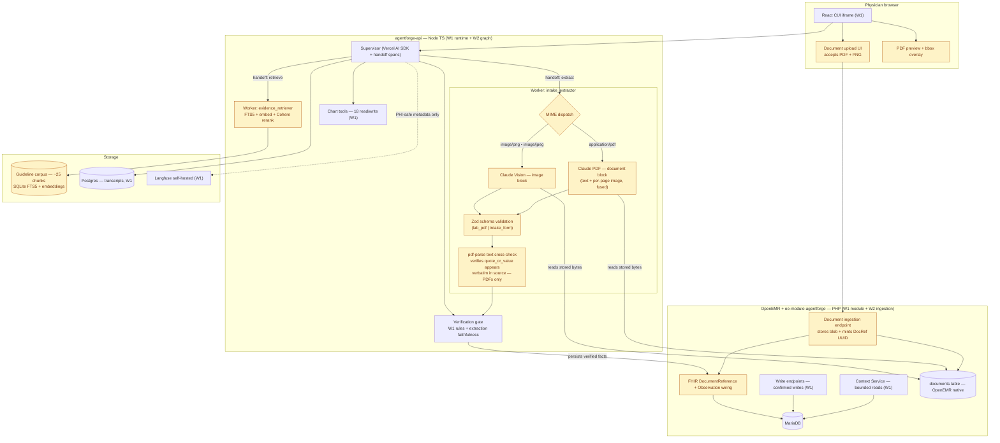

# W2 Architecture Defense — prep artifact + post-meeting lockdown

**Date:** 2026-05-04 · **Meeting:** Architecture Defense, 45 min, ~4 peers · **Final due:** 2026-05-10 12:00 PM CT

> Living document. Originally a walk-through for the 3 PM breakout; updated post-defense to lock in the extraction approach after a live probe of the Anthropic API against our W2 sample documents. Section 4 captures the probe evidence and the resulting extractor architecture; sections 1–3 and the system diagram have been updated to match. The next deliverable seeded from this doc is `W2_ARCHITECTURE.md` (per the brief's submission requirements).

---

## 1. The Week 2 ask, against our W1 baseline


| Capability               | W1 state (already shipped)                                                                                              | W2 delta                                                                                               |
| ------------------------ | ----------------------------------------------------------------------------------------------------------------------- | ------------------------------------------------------------------------------------------------------ |
| **Multimodal ingestion** | None                                                                                                                    | Lab PDF + intake form (each accepted as PDF or PNG) → strict-schema JSON via Claude PDF / Vision, with `pdf-parse` text cross-check on PDFs as a deterministic verifier |
| **Multi-agent**          | Single hand-rolled loop (Vercel AI SDK, `stepCountIs(12)`)                                                              | Supervisor + 2 workers (`intake_extractor`, `evidence_retriever`), logged handoffs                     |
| **RAG**                  | None                                                                                                                    | Sparse (FTS5) + dense embed + Cohere rerank, ~25 chunks                                                |
| **Citation contract**    | `{table, id, uuid, date, params}`                                                                                       | `{source_type, source_id, page_or_section, field_or_chunk_id, quote_or_value}` + bbox                  |
| **Eval count**           | 39 deterministic, boolean, `XOR` rule                                                                                   | 50, boolean, mapped to 5 named categories                                                              |
| **Eval gate**            | GitHub Actions PR-blocking ([.github/workflows/agentforge-eval.yml](../../../../../.github/workflows/agentforge-eval.yml)) | + local **Git Hook** (pre-commit/pre-push) running same suite                                          |
| **FHIR doc round-trip**  | `FHIRDocumentReference` + `FhirDocumentReferenceRestController` exist, **not wired**                                    | Wire upload → `documents` → DocumentReference → derived facts as Observations linked via `derivedFrom` |
| **Observability**        | Langfuse self-hosted, redact-at-wire, cost via generation metadata                                                      | Same, extended for VLM token spend + retrieval hits + extraction confidence                            |


**One-line framing:** W1 read structured charts. W2 reads the messy stuff (PDFs, forms) into the same chart, behind a multi-agent supervisor, gated by a regression-blocking eval.

---

## 2. System diagram — W1 in gray, W2 deltas highlighted




**Defense lens:** every W2 box (yellow) attaches to a W1 surface that already exists. No green-field subsystems. No new runtimes.

---

## 3. Document schemas (strict, with citation contract baked in)

Schemas are Zod (matches existing tool registration in [agentforge/api/src/tools/](../../../../../agentforge/api/src/tools/)). Both extraction outputs include the W2 citation shape per field, plus extraction metadata for verification.

### Shared citation primitive

```ts
const SourceCitationSchema = z.object({
  source_type: z.enum(["lab_pdf", "intake_form", "guideline_chunk", "openemr_record"]),
  source_id: z.string(),                         // DocumentReference UUID, chunk_id, or OpenEMR row uuid
  page_or_section: z.string(),                   // "page:2", "Chief Concern", "USPSTF §3.1"
  field_or_chunk_id: z.string(),                 // form field name, table cell coords, chunk id
  quote_or_value: z.string(),                    // verbatim text or value as it appeared
  bbox: z.tuple([z.number(), z.number(), z.number(), z.number()]).optional(), // [x0,y0,x1,y1] normalized for PDF overlay
  confidence: z.number().min(0).max(1).optional(), // VLM self-reported, surfaced in verification
});
```

### `lab_pdf` extraction schema

```ts
const LabResultSchema = z.object({
  test_name: z.string(),
  loinc: z.string().nullable(),                  // best-effort, not required
  value: z.union([z.number(), z.string()]),     // string for non-numeric (e.g. "Negative")
  unit: z.string().nullable(),
  reference_range_low: z.number().nullable(),
  reference_range_high: z.number().nullable(),
  reference_range_text: z.string().nullable(),  // verbatim if VLM can't split
  collection_date: z.string(),                   // ISO 8601
  abnormal_flag: z.enum(["normal", "low", "high", "critical_low", "critical_high", "abnormal", "unknown"]),
  citation: SourceCitationSchema,                // mandatory per result
});

const LabPdfExtractionSchema = z.object({
  document_type: z.literal("lab_pdf"),
  patient_uuid: z.string().uuid(),
  source_document_id: z.string(),                // DocumentReference UUID created at upload
  ordering_provider: z.string().nullable(),
  performing_lab: z.string().nullable(),
  results: z.array(LabResultSchema),
  extraction_metadata: z.object({
    pages_processed: z.number().int().positive(),
    overall_confidence: z.enum(["high", "medium", "low"]),
    fields_uncertain: z.array(z.string()),       // names of fields VLM flagged uncertain
  }),
});
```

### `intake_form` extraction schema

```ts
const IntakeFormSchema = z.object({
  document_type: z.literal("intake_form"),
  patient_uuid: z.string().uuid(),
  source_document_id: z.string(),
  demographics: z.object({
    name: z.string().nullable(),
    dob: z.string().nullable(),
    sex: z.enum(["male", "female", "other", "unknown"]).nullable(),
    contact_phone: z.string().nullable(),
    citation: SourceCitationSchema,
  }),
  chief_concern: z.object({
    text: z.string(),
    onset: z.string().nullable(),
    citation: SourceCitationSchema,
  }),
  current_medications: z.array(z.object({
    name: z.string(),
    dose: z.string().nullable(),
    frequency: z.string().nullable(),
    citation: SourceCitationSchema,
  })),
  allergies: z.array(z.object({
    substance: z.string(),
    reaction: z.string().nullable(),
    severity: z.enum(["mild", "moderate", "severe", "unknown"]).nullable(),
    citation: SourceCitationSchema,
  })),
  family_history: z.array(z.object({
    relation: z.string(),
    condition: z.string(),
    citation: SourceCitationSchema,
  })),
  extraction_metadata: z.object({
    pages_processed: z.number().int().positive(),
    overall_confidence: z.enum(["high", "medium", "low"]),
    fields_uncertain: z.array(z.string()),
    fields_unsupported: z.array(z.string()),     // requested fields not visible in source — explicit "I didn't see this"
  }),
});
```

**Defense points:**

- Citation is *per field* (or per result), not per document — graders can click any number and see what page/quote it came from.
- `fields_uncertain` + `fields_unsupported` make hallucination visible; the verification gate downgrades or drops uncertain claims.
- `source_document_id` is the FHIR DocumentReference UUID assigned at upload — every derived fact links back to one canonical source.

---

## 4. Extraction architecture (locked in post-defense, validated by live probe)

After the breakout, peers raised whether Claude vision would be sufficient for our document set, with PDFPlumber and a local Python OCR pipeline floated as alternatives. We resolved this by running a live probe of the Anthropic API against three of the W2 sample documents — one digital PDF and two PNGs — and reviewing the actual outputs.

### Probe results

Run with `claude-haiku-4-5` (W1 deployed default). Script: [agentforge/api/scripts/w2-vlm-probe.mjs](../../../../../agentforge/api/scripts/w2-vlm-probe.mjs).

| Source                                | Path                  | Latency | Tokens (in/out) | Cost (Haiku 4.5) | JSON parsed | Extraction quality |
| ------------------------------------- | --------------------- | ------- | --------------- | ---------------- | ----------- | ------------------ |
| `p01-chen-lipid-panel.pdf` (1 page, table-heavy) | Claude PDF document block | 5.6 s   | 4284 / 700      | $0.0078          | ✓           | All 5 lipid results extracted (Total chol, HDL, LDL, Trig, Non-HDL) with values, units, abnormal flags, and reference ranges. Every `quote_or_value` matched source verbatim ("232 H", "48 L", etc.). |
| `p03-reyes-intake.png` (form scan)    | Claude Vision image block  | ~7 s    | ~1800 / ~450    | ~$0.0042         | ✓           | 3 medications with dose+frequency, allergy with severity, 2 family-history rows. Verbatim quotes for each. |
| `p03-reyes-hba1c.png` (lab as PNG)    | Claude Vision image block  | 6.2 s   | 1821 / 467      | $0.0042          | ✓           | HbA1c 8.2% (high), fasting glucose 152 mg/dL (high), eGFR 88 mL/min (normal) — all correct, all cited. |
| **Total**                             |                            |         |                 | **$0.0172**      | 3/3         | Zero hallucinations on visual inspection.                                                |

**Conclusion:** Haiku 4.5 reads our document set cleanly. Anthropic PDF support fuses page-text-extraction and per-page-image internally, so we get table comprehension + signature/stamp visibility + verbatim quotes in one call. PNG path is the same SDK, different content block.

### Extractor architecture

```
┌─────────────────────────────────────────────────────────────┐
│  intake_extractor worker                                    │
│                                                             │
│  upload payload  ─────►  MIME dispatch                      │
│                            │                                │
│                            ├── application/pdf  ────►  Claude PDF (document block)
│                            │                                │
│                            └── image/png|jpeg   ────►  Claude Vision (image block)
│                                                             │
│  → strict-schema JSON (lab_pdf | intake_form)               │
│  → Zod parse (sets `schema_valid` rubric outcome)           │
│  → pdf-parse cross-check (PDFs only):                       │
│       for each fact, assert `quote_or_value` appears in     │
│       raw text from pdf-parse; flag mismatches as           │
│       `unverified` and let the verification gate downgrade  │
│  → emit ExtractionResult to verification gate               │
└─────────────────────────────────────────────────────────────┘
```

**Why a cross-check on PDFs but not PNGs:** PDFs (digital or scanned) yield deterministic text via `pdf-parse`; we use it as a free hallucination tripwire. PNGs have no native text layer, so we lean on Claude's `confidence` per field plus deterministic range checks (e.g., HDL between 10 and 200 mg/dL; impossible values flagged) plus the `safe_refusal` rubric for unreadable images.

### Implementation notes

- **Dependency:** add `pdf-parse` (Node, ~50 KB) as a dev/runtime dependency in `agentforge/api/package.json`. Stays in TypeScript — no Python runtime added.
- **SDK call:** the probe uses raw `fetch` against `https://api.anthropic.com/v1/messages` with `anthropic-version: 2023-06-01`. We may switch to `@anthropic-ai/sdk` for better typing, but `@ai-sdk/anthropic` (already in our stack) does not currently expose the `document` content block cleanly — direct SDK is simpler.
- **Model:** Haiku 4.5 is sufficient for both lab and intake extraction at p1. If a future intake form proves harder (handwriting, low-resolution phone photo), we can per-call upgrade to Sonnet 4.6 only for the failing case — same SDK, same code path.
- **Cost envelope:** ~$0.005-$0.01 per extraction. 50 dev extractions ≈ $0.50. 1000 production extractions ≈ $10. Negligible vs. our W1 dev spend ($3.34 across 550 turns).
- **Source storage:** raw bytes and the SHA-256 hash of the file are persisted into OpenEMR's `documents` table at the upload endpoint (PHP); the extractor reads bytes back via the DocumentReference UUID, never holding state.

### What this means for the eval rubric

The `factually_consistent` category gains a new sub-rule: for any extracted fact that *should* have a verbatim text source (i.e., PDF-derived), `quote_or_value` must appear in the raw `pdf-parse` output of the source document. If it does not, the fact is downgraded to `unverified` and the rubric fails for that case. PNG-derived facts use a confidence floor instead.

---

## 5. RAG design


| Layer       | Choice                                                               | Why                                                             |
| ----------- | -------------------------------------------------------------------- | --------------------------------------------------------------- |
| **Corpus**  | 3 primary-care guidelines (USPSTF screening, JNC8 BP, ADA glycemic)  | Aligns with existing UC personas; ~25 chunks total              |
| **Storage** | SQLite (existing in container) FTS5 + sidecar embeddings file        | No new infra; brief says "small"                                |
| **Sparse**  | SQLite FTS5 BM25                                                     | Built into SQLite; zero install                                 |
| **Dense**   | `text-embedding-3-small` (or local `bge-small`) cached at index time | Cheap, fast, deterministic                                      |
| **Rerank**  | Cohere Rerank API                                                    | Brief explicitly names this; small token cost on 25-chunk top-k |
| **Top-k**   | Retrieve 10 sparse + 10 dense, dedupe, rerank to top 3-5             | Rerank carries the precision burden                             |
| **Returns** | Snippet text + chunk_id + section heading + source URL               | Feeds directly into `SourceCitationSchema`                      |


**Stretch we're skipping:** ColQwen2, multi-vector indexing, query rewriting. Brief lists these as stretch — explicitly out.

---

## 6. Eval rubric mapping (39 → 50, with W2's 5 named categories)

### W1 check types → W2 categories


| W1 check type                                 | W2 category            | Gap?     |
| --------------------------------------------- | ---------------------- | -------- |
| `no_write_without_confirm`                    | `safe_refusal`         | rebucket |
| `unsupported_write_target_rejected`           | `safe_refusal`         | rebucket |
| `cross_patient_blocked`                       | `safe_refusal`         | rebucket |
| `internal_disclosure_blocked`                 | `safe_refusal`         | rebucket |
| `all_domains_unavailable_refused`             | `safe_refusal`         | rebucket |
| `provider_timeout_typed_error`                | `safe_refusal`         | rebucket |
| `vitals_parser_uncertain_not_guess`           | `factually_consistent` | rebucket |
| `negative_claim_requires_empty_query`         | `factually_consistent` | rebucket |
| `conflicting_medication_records_warned`       | `factually_consistent` | rebucket |
| `constraint_boundary_describes_vs_recommends` | `factually_consistent` | rebucket |
| **(new)** Zod-parse on extraction output      | `schema_valid`         | **NEW**  |
| **(new)** every clinical claim has citation   | `citation_present`     | **NEW**  |
| **(new)** trace scan against PHI deny-list    | `no_phi_in_logs`       | **NEW**  |


Three new check types to build. Existing 39 cases get re-tagged into the W2 categories — no rule logic changes.

### 50-case composition


| Category               | Count  | Coverage                                                                                  |
| ---------------------- | ------ | ----------------------------------------------------------------------------------------- |
| `schema_valid`         | 10     | 5 lab_pdf + 5 intake_form; mix of well-formed, partial, and adversarial (extra fields)    |
| `citation_present`     | 10     | extraction outputs missing citation; chat answers asserting clinical facts without source |
| `factually_consistent` | 12     | existing 4 + extraction faithfulness + retrieval-grounding-vs-LLM-paraphrase              |
| `safe_refusal`         | 10     | existing 6 + 4 doc-related (wrong patient match, blank PDF, garbage scan, wrong doc_type) |
| `no_phi_in_logs`       | 8      | PHI smuggled into prompts, tool inputs, retrieved chunks, extraction text                 |
| **Total**              | **50** |                                                                                           |


### CI gate logic

- **Baseline file** at `agentforge/api/eval/baseline.json` pinning per-category pass rates.
- **Hook fails** if any of the 5 categories regresses by **>5 percentage points** OR drops below **95% absolute** pass rate.
- **Both surfaces** enforce the rule: pre-commit Git Hook runs full suite locally; GitHub Actions runs same suite on PR.
- **Self-test:** Saturday rehearsal — we deliberately inject our own regression and confirm the gate fires before grading day.

---

## 7. Top 3 risks + mitigations


| Risk                                                                                                                                                                | Mitigation                                                                                                                                                                                                                                   |
| ------------------------------------------------------------------------------------------------------------------------------------------------------------------- | -------------------------------------------------------------------------------------------------------------------------------------------------------------------------------------------------------------------------------------------- |
| **PHI leaks into Langfuse via VLM intermediate outputs.** Today we redact at the wire — but raw document bytes (PDF or PNG), extracted text from `pdf-parse`, and the structured-extraction JSON are all full-bore PHI on the way through the `intake_extractor` worker. | Trace bodies for ingestion turns log only PHI-safe metadata (file MIME, page count, model, latency, tokens, schema-valid bool, abnormal-fact count, cross-check pass/fail). Raw extracted JSON and `pdf-parse` text stay in Postgres only — never in Langfuse spans. New eval category `no_phi_in_logs` directly tests this. |
| **PR-blocking Git Hook is two artifacts, not one.** Brief uses "Git Hook" precisely; existing CI is necessary but not sufficient.                                   | Add `prek` pre-commit/pre-push hook running `npm run eval` (subset on commit, full on push). CI continues to enforce on PR. Both consult same `baseline.json`.                                                                               |
| **FHIR round-trip duplicates.** Re-uploading the same PDF must update, not duplicate.                                                                               | Idempotency key `(patient_uuid, sha256(file_bytes))` on DocumentReference; derived FHIR Observations carry `derivedFrom` reference; ingestion is idempotent on (patient, content hash, field path).                                          |


Honorable mention: **supervisor inspectability**. Each handoff is a Langfuse span with structured metadata — `{from: "supervisor", to: "intake_extractor", reason: "...", input_summary: "..."}` — so any peer can read the routing trail. If pushed on "is this really multi-agent?", the answer is *each worker has its own system prompt, its own tool budget, its own typed output schema; the supervisor's only job is routing and final synthesis.*

---

## 8. Explicit narrowing — what we're NOT building

Pitfalls list rewards saying no. We are deliberately skipping:

- ❌ Third document type (referral fax / med list) — explicit pitfall: "trying to support five before two work reliably"
- ❌ ColQwen2 / multi-vector indexing — listed as stretch
- ❌ Critic agent — listed as extension, not core
- ❌ Lab trend chart widget — extension
- ❌ LangGraph or OpenAI Agents SDK migration — risk-adjusted return is negative; Vercel AI SDK + handoff spans satisfies "inspectable orchestration framework"
- ❌ Streaming UI — already chose batch verification in W1, no reason to revisit
- ❌ Separate dedicated VLM (Gemini Vision, GPT-4o vision) — Claude reads PDFs natively, keeps single-provider cost story

The defense for each: brief's closing line — *"the best submissions will feel narrower than the original spec and stronger because of it."*

---

## 9. Breakout walk-through (historical record of the meeting)

Preserved as the record of how the meeting was walked. The breakout shifted onto extraction tooling early (peer pushback on Claude vs. PDFPlumber vs. local Python) — that thread is now resolved in section 4 above.

Original walk-order:


| #   | Slot                           | Talking point                                                                                    |
| --- | ------------------------------ | ------------------------------------------------------------------------------------------------ |
| 1   | W1 → W2 framing table          | "We already shipped X, Y, Z. Here's what's net-new."                                             |
| 2   | System diagram                 | Walk yellow boxes only. Every yellow box attaches to an existing W1 surface.                     |
| 3   | Schemas (lab_pdf, intake_form) | Show citation primitive first, then how it nests per-field.                                      |
| 4   | RAG design                     | One-paragraph: corpus, FTS5 + dense + Cohere rerank, top-3 to answer model.                      |
| 5   | Eval rubric mapping            | "Existing 39 rebucket. Three new check types. 50 = 10/10/12/10/8."                               |
| 6   | CI gate                        | "Hook + CI, same baseline, 5pp regression OR drop below 95%. Saturday self-injection rehearsal." |
| 7   | Top 3 risks + mitigations      | PHI in VLM, hook≠CI, FHIR dedupe.                                                                |
| 8   | Explicit narrowing             | Read the not-doing list; invite challenge.                                                       |
| 9   | Open Q&A                       | Buffer for peer pushback.                                                                        |


**If short on time, drop sections in this order:** 8, 4, 1. Keep 2, 3, 5, 6, 7 — those are the highest-stakes defense surfaces.

**If a peer asks "why not LangGraph":** Vercel AI SDK runtime is already in production, handoffs are first-class via tool calls, every span is in Langfuse with correlation IDs. LangGraph mid-week is a high-risk pivot that loses our observability wiring. Brief permits "another inspectable orchestration framework" — we satisfy the inspectability requirement.

**If a peer asks "is your supervisor really making routing decisions":** Yes. The supervisor system prompt has explicit branching rules: *if a document is attached this turn, hand off to intake_extractor; if the question references "guideline" / "evidence" / "should I", hand off to evidence_retriever; otherwise answer from chart tools alone.* Every routing decision is logged with the rationale.

**If a peer asks "what's your hardest problem":** PHI in VLM intermediate outputs. We have wire-level redaction, but extracted PDF text is high-PHI by definition. The discipline is: traces log only PHI-safe metadata; full extracted JSON lives in Postgres only.

---

## 10. After the breakout — Mon evening kickoff

Status as of post-defense lockdown:

- ✅ **Extraction approach validated by live probe** — three of the W2 sample documents (lab PDF, intake PNG, lab PNG) extract cleanly through Claude Haiku 4.5 with verbatim citations and zero observed hallucinations. Total probe spend $0.0172. See section 4 for evidence.
- ✅ **Probe script committed at [agentforge/api/scripts/w2-vlm-probe.mjs](../../../../../agentforge/api/scripts/w2-vlm-probe.mjs)** — re-runnable; can serve as the seed for the `intake_extractor` worker proper.
- 🔲 **Zod schemas** — copy from section 3 of this doc to `agentforge/api/src/schemas/extraction.ts`.
- 🔲 **Document upload endpoint** scaffolded under [oe-module-agentforge/public/](../../../../../interface/modules/custom_modules/oe-module-agentforge/public/) — accepts PDF + PNG, writes to `documents` table, computes SHA-256, mints DocumentReference UUID.
- 🔲 **`pdf-parse` dev dependency** added to `agentforge/api/package.json` for the cross-check verifier.
- 🔲 **No new synthetic forms needed for MVP demo** — the four cohort patient cases (`p01-chen`, `p02-whitaker`, `p03-reyes`, `p04-kowalski`) are already in `Documentation/AgentForge/assets/W2-documents/` and cover all four type-combinations (lab/intake × PDF/PNG).

Tuesday's MVP gate: `attach_and_extract` working end-to-end with first extraction visible in the rail, against the four cohort sample patients.

`W2_ARCHITECTURE.md` (the brief's required submission deliverable) is the next document to author — this prep artifact seeds it directly (sections 1–4 transfer almost verbatim; sections 5–8 become its own structure).