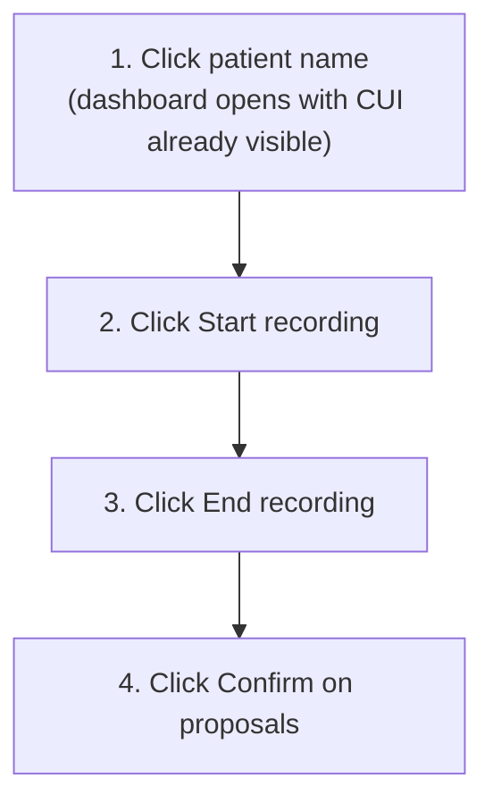

# Physician Journey — AgentForge Clinical Co-Pilot

> **Status:** Draft. This is the "happy trail" for a physician using AgentForge across a single visit. It describes the **target** low-touch experience unless a step is explicitly labeled *today*. Expect to iterate.

This document narrates one full encounter from the physician's point of view in three phases — **pre-room**, **in-room**, and **post-room** — and centers a vertical Mermaid diagram you can read top to bottom. Implementation depth lives in [`PRD.md`](./PRD.md), [`ARCHITECTURE.md`](./ARCHITECTURE.md), and [`Documentation/AgentForge/`](./Documentation/AgentForge/); this file is the human story.

## Guiding principles

- **Clicking the patient is the journey's only navigation.** The medical record dashboard and the Clinical UI (CUI) panel come up together as one view — the panel is part of the chart, not a follow-up that mounts beside it — already bound to that patient and visit.
- **Two buttons own the room.** Start recording and end recording are the entire in-room interaction surface for the clinician.
- **Confirm, don't compose.** Post-room work is a short list of proposed writes the physician confirms. No hunting through forms, no retyping.
- **Click budget = 4.** Patient name, start recording, end recording, confirm. Anything beyond that is a regression of this journey.

### Target-state callout: implicit encounter context

The physician should **not** have to create or save an OpenEMR encounter manually before AgentForge can write encounter-scoped data. The target is that the encounter context is established as a side effect of opening the chart and starting the visit.

- *Today:* OpenEMR's session encounter must be saved before encounter-scoped writes (chief complaint, vitals) bind cleanly. The current workaround is documented in the Gate 4 journal: [`Documentation/AgentForge/process/journal/week-1/0430-T2004-gate4-encounter-binding-and-json-wall.md`](./Documentation/AgentForge/process/journal/week-1/0430-T2004-gate4-encounter-binding-and-json-wall.md).
- *Target:* The encounter exists or is provisioned implicitly when the visit begins; the clinician never sees "save encounter then refresh."
- *Note:* This file describes product intent. Realizing it requires updates to the PRD's V1 write enum, the OpenEMR module, and the agent's encounter rules — those changes are out of scope for this draft.

## The four physician clicks

1. **Click the patient's name.** The medical record dashboard opens with the CUI panel already visible and bound to the patient and visit — one load, not two.
2. **Click Start recording** when entering the room. Ambient capture begins; the assistant listens passively.
3. **Click End recording** when the visit wraps. The assistant compiles cited proposals.
4. **Click Confirm** on each proposal the physician accepts. Writes land in the chart.

Everything else — context loading, transcripts, citation handling, proposal drafting — happens around the physician, not at them.

## Journey diagram (top to bottom)

```mermaid
flowchart TB
    classDef phase stroke-width:2px
    classDef click font-weight:bold

    subgraph PreRoom [Pre-room]
        direction TB
        startVisit([Physician opens EMR workspace])
        clickPatient["Click patient name on schedule"]:::click
        dashboardLoad["Medical record dashboard opens<br/>chart and CUI panel load together,<br/>already bound to patient and visit"]
        contextLoad["Read-only chart context loads<br/>problems, meds, vitals, recent notes"]
        casePresent["Case presentation summary surfaces in CUI"]
        readyRoom["Physician is briefed before entering the room"]
    end

    subgraph InRoom [In-room]
        direction TB
        clickStart["Click Start recording"]:::click
        ambientCapture["Ambient audio captured in browser"]
        liveTurns["Transcript turns stream to the assistant"]
        passiveAssist["Assistant listens, cites context, drafts proposals silently"]
        clickEnd["Click End recording"]:::click
    end

    subgraph PostRoom [Post-room]
        direction TB
        proposalsSurface["Proposals surface as confirm cards<br/>chief complaint, vitals, tobacco, allergy"]
        review["Physician reviews each proposal with citations"]
        clickConfirm["Click Confirm on accepted proposals"]:::click
        writeChart["AgentForge writes to OpenEMR<br/>log_from = agent"]
        chartReflect["Chart reflects confirmed entries"]
        visitDone([Visit complete])
    end

    startVisit --> clickPatient --> dashboardLoad --> contextLoad --> casePresent --> readyRoom
    readyRoom --> clickStart
    clickStart --> ambientCapture --> liveTurns --> passiveAssist --> clickEnd
    clickEnd --> proposalsSurface --> review --> clickConfirm --> writeChart --> chartReflect --> visitDone

    dashboardLoad -. "target: implicit encounter context (no manual create)" .-> writeChart

    class PreRoom,InRoom,PostRoom phase
```

The three subgraphs match the three phases of the visit. The dashed edge marks the target-state link called out above: the encounter is in scope from the moment the dashboard loads (chart + CUI together), so post-room writes do not require manual setup.

## Click budget at a glance



If a future change introduces a fifth required click, treat it as a design defect against this journey.

## Where to go next

- Spec and invariants: [`PRD.md`](./PRD.md), with stop-the-line tests in [`Documentation/AgentForge/implementation/clinical-copilot-task-list.md`](./Documentation/AgentForge/implementation/clinical-copilot-task-list.md).
- Architecture: [`ARCHITECTURE.md`](./ARCHITECTURE.md).
- Process trail and decisions: [`Documentation/AgentForge/README.md`](./Documentation/AgentForge/README.md).
- Open product questions including encounter provisioning: [`Documentation/AgentForge/implementation/open-questions.md`](./Documentation/AgentForge/implementation/open-questions.md).

*Draft — iterate as the product and the journey converge.*
