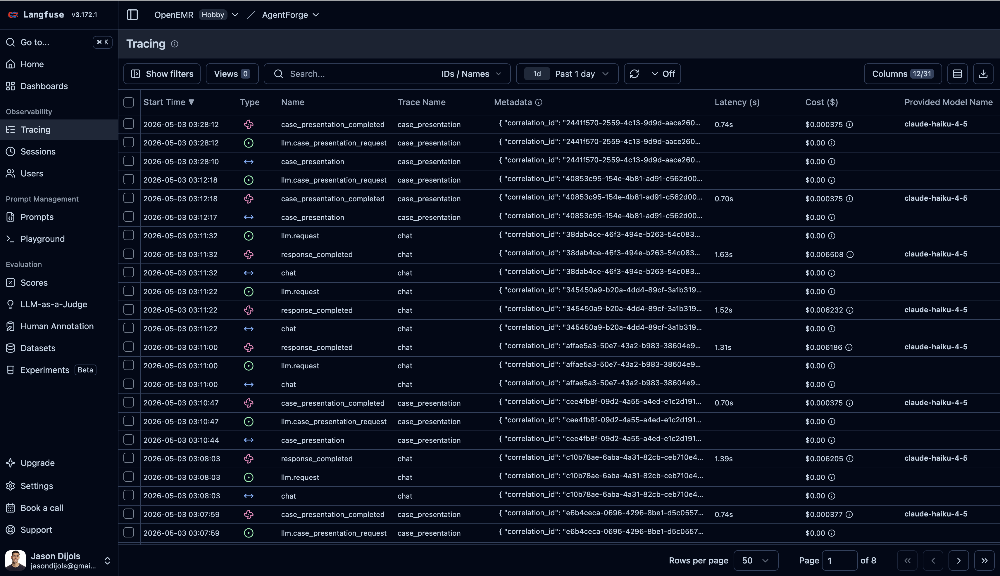

# Clinical Copilot — Observability

> Built on OpenEMR. Developed during the Gauntlet AI AgentForge program.

## Summary

Every chat turn in the Clinical Copilot produces a single Langfuse trace, keyed by the request's `correlation_id`. Inside that trace are spans for every tool call (with input, output, and latency), instantaneous events for every verification gate and security guard, an LLM generation entry tagged with the canonical model name, input and output token counts, and a dollar cost computed from the actual usage. Every byte that leaves this process for Langfuse passes through a deny-list PHI redactor first.

The brief asks observability to answer four questions from logs at any time: *what did the agent do, in what order, did any tools fail and why, and how many tokens were consumed at what cost?* All four are answerable from a single Langfuse trace against the live URL. Observability is wired in, used in production, and is the primary debugging tool for prod issues — not a checkbox.

The W2 brief specifically asks each encounter to log **tool sequence, latency by step, token usage, cost estimate, retrieval hits, extraction confidence, and eval outcome** with **no raw PHI**. The §"W2 additions" section below documents the W2 fields layered on top of the W1 trace shape: handoff events between supervisor and workers, retrieval-hits metadata on the `evidence_retriever` span, extraction-confidence metadata on the `intake_extractor` span, the per-turn `eval_outcome` event, and the W2 content-block summarizer that replaces document/image bodies with `{type, size_bytes, mime}` summaries before any Langfuse span fires.

This document walks through the trace shape, anchors each piece to its implementing code, explains the PHI redactor's deliberate over-redaction trade-off, and is honest about the cost-rate heuristic and other limitations the system carries today.

---

## Why observability

The brief is unusually direct on this point:

> *You cannot improve what you cannot see. Implement observability from the start — not as an afterthought… The requirement is that observability is real, wired in from the beginning, and used — not just installed.*

This translates into three properties the system has to demonstrate:

1. **Per-request traceability** — given a `correlation_id`, you can reconstruct what the agent did, in what order, with what latency, and at what cost.
2. **Failure transparency** — when a tool errors, the trace records the error with enough context to debug; when verification strips a claim, the trace says which gate fired.
3. **PHI safety** — observability data leaves the process boundary; therefore the data must be redacted before it leaves. Otherwise observability is itself a HIPAA risk.

We chose Langfuse for the sink because (a) it speaks the LLM-trace shape natively (traces, spans, generations with token usage and cost), (b) the cloud version computes USD cost from a model-price database keyed by the model name, so we don't have to maintain rate tables in our code path, and (c) it has a passable UI for the kind of forensic reconstruction a clinical incident review requires.

Production currently sends to Langfuse Cloud (`https://us.cloud.langfuse.com`). Per [ARCHITECTURE.md](ARCHITECTURE.md) Compliance-2, real-PHI deployments would default back to the self-hosted Langfuse v2 service shipped in `docker-compose.override.yml` ([G6-07](Documentation/AgentForge/process/milestones/week-1/15-gate6-complete.md)); the self-hosted compose service stays in the repo for that swap, currently unused.

---

## The four brief questions, answered

### Q1: *What did the agent do on a specific request, and in what order?*

A single Langfuse trace, keyed by `correlation_id`, contains every step in chronological order. The trace itself is opened at [agentforge/api/src/observability/index.ts:86-99](agentforge/api/src/observability/index.ts:86) (`traceTurn`), and three step types are nested inside:

- **Spans** for tool calls, opened with a start time and ended with output + an end time. See [agentforge/api/src/observability/index.ts:101-141](agentforge/api/src/observability/index.ts:101) and the call sites in every tool — for example [agentforge/api/src/tools/get_allergies.ts:23](agentforge/api/src/tools/get_allergies.ts:23) and the four spans across [agentforge/api/src/tools/propose_writes.ts:105, 150, 201, 243](agentforge/api/src/tools/propose_writes.ts:105) (one per V1 write target).
- **Events** for instantaneous markers: verification categories (`verification.uncited_claim_removed`, `verification.med_status_conflict_warning`, etc. — see [agentforge/api/src/agent/verification.ts:30-32](agentforge/api/src/agent/verification.ts:30)), security guards, and cache hits. See [agentforge/api/src/observability/index.ts:143-156](agentforge/api/src/observability/index.ts:143).
- **Generations** for the LLM call, with model name, token usage, cost, and start/end times. See [agentforge/api/src/observability/index.ts:158-217](agentforge/api/src/observability/index.ts:158).

The chronological reconstruction is automatic — Langfuse orders by start time within the trace. To answer "what did the agent do on request `abc-123`", you load that trace ID in the UI and read top-to-bottom.

### Q2: *How long did each step take?*

Tool spans capture latency by construction. The pattern is paired `start` + `end`:

```ts
const span = await obs.recordToolCall({ correlationId, toolName: 'get_allergies', meta: {...} });
try {
  const result = await doWork();
  await span.end({ meta: { row_count: result.rows.length } });
} catch (e) {
  await span.end({ error: e });
  throw;
}
```

The span ID is opaque to the caller; the API contract is just "you must `await span.end()` on every code path." Every tool wraps work in `try/finally` (or `try/catch + rethrow`) so latency captures even on failure. See [agentforge/api/src/tools/get_allergies.ts:23-44](agentforge/api/src/tools/get_allergies.ts:23) for the canonical pattern.

LLM generation latency is captured by passing `start_time_ms` (`Date.now()` taken immediately before `generateText`) through the meta payload to the observability layer, which converts it to a `Date` and passes it as `startTime` on the Langfuse generation. See the orchestrator at [agentforge/api/src/agent/orchestrator.ts:644-690](agentforge/api/src/agent/orchestrator.ts:644) and the start-time threading at [agentforge/api/src/observability/index.ts:183-196](agentforge/api/src/observability/index.ts:183). Langfuse computes the elapsed time on its side; we don't re-derive it.

### Q3: *Did any tools fail, and if so, why?*

Tool failures are captured two ways. First, as part of the span end:

```ts
} catch (e) {
  await span.end({ error: e });
  throw;
}
```

When `error` is set on `span.end`, the observability layer marks the span as `level: ERROR` and copies a truncated `String(e)` into `statusMessage` (see [agentforge/api/src/observability/index.ts:119-122](agentforge/api/src/observability/index.ts:119)). The Langfuse UI surfaces failed spans visually (red border, error icon).

Second, structured outcomes go on the span's `meta` even when they aren't exceptions. For example, `propose_writes.ts` includes proposal id, write target, and rejection reason in the end-meta so that a "rejected unsupported target" outcome is visible in the trace without having to throw. See [agentforge/api/src/tools/propose_writes.ts:124, 169, 218, 277](agentforge/api/src/tools/propose_writes.ts:124).

The combination — exceptions as ERROR-level spans, outcome metadata as success-level spans — means a debugger reading a trace can tell at a glance which tool went wrong and whether it was an exception, an explicit refusal, or an empty result.

### Q4: *How many tokens were consumed, at what cost?*

LLM generations carry the token counts and cost USD as Langfuse-native fields. The orchestrator computes both at [agentforge/api/src/agent/orchestrator.ts:662-690](agentforge/api/src/agent/orchestrator.ts:662):

```ts
const usage = result.totalUsage;
const costUsd = estimateUsdForProviderTokens(env.LLM_PROVIDER, usage?.inputTokens, usage?.outputTokens) ?? null;
```

Then passes `input_tokens`, `output_tokens`, `cost_usd` as part of the meta payload to `recordLlmCall`. The observability layer extracts those values and attaches them to the Langfuse generation as `usage` (with `unit: 'TOKENS'`) and `totalCost` ([agentforge/api/src/observability/index.ts:197-207](agentforge/api/src/observability/index.ts:197)).

The Langfuse Cloud UI then renders aggregate cost across traces, so questions like *"total spend yesterday"* or *"average cost per UC-A turn"* answer in two clicks.

**Caveat:** the in-process cost estimator at [agentforge/api/src/agent/cost_estimate.ts](agentforge/api/src/agent/cost_estimate.ts) uses heuristic rates per provider key, not per canonical model. As of 2026-05-02 the Anthropic key is dialed to Haiku 4.5's `$1 / $5` (the V1 default model). The OpenAI Azure key still carries a generic GPT-4-class default (`$5 / $15`) because the operator-supplied deployment id has no canonical model mapping in the table. Langfuse Cloud is always the authoritative cost source — it uses its own model-price database keyed by the canonical model name we pass via `getProviderModelId`, so the dashboard cost is right regardless of the in-process heuristic. If the operator rotates Anthropic to Sonnet or Opus, the in-process rate becomes wrong again until the table is updated; the Langfuse-side number does not.

---

## What one chat turn looks like in Langfuse

A typical UC-A "auto-brief" turn produces a trace with this shape:

```
Trace: turn (correlation_id = 8a7c…)
├── span: get_identity                  [12ms, success, row_count=1]
├── span: get_problems                  [18ms, success, row_count=4]
├── span: get_medications               [22ms, success, row_count=6]
├── span: get_allergies                 [11ms, success, row_count=2]
├── span: get_vitals_recent             [15ms, success, row_count=3]
├── event: verification.uncited_claim_removed  (one stripped block)
├── event: verification.med_status_conflict_warning  (one warning attached)
├── event: verification.uncited_claim_removed_summary
└── generation: response_completed      [model=claude-haiku-4-5, in=4127, out=518, cost=$0.0067]
```

A UC-B "confirmed write" turn additionally has propose / confirm / write spans:

```
├── span: propose_chief_complaint       [success, proposal_id=p-9c2…, write_target=chief_complaint]
├── span: confirm_proposal              [success]
├── span: openemr_write                 [success, log_from='agent']
```

A refused turn (cross-patient or unauthorized request) shows the refusal as a verification event and a refusal block in the response payload:

```
├── event: verification.cross_patient_block
└── generation: response_completed      [no usage, refusal block returned]
```

The trace is the primary debugging tool when something goes wrong in production. A clinician reports "the agent gave me a weird answer for patient X at 2:14pm" — we pull that correlation ID from the conversation log and load the trace.

### Live Langfuse view

The screenshot below is the Tracing list view for the OpenEMR / AgentForge project on Langfuse Cloud. Each row is one of the trace entries described above — `case_presentation` and `chat` traces, with their `llm.request` / `response_completed` generations expanded inline, the `correlation_id` in the metadata column, latency in seconds, and per-trace USD cost computed from the canonical model name (`claude-haiku-4-5`).



This is the surface a grader, an SRE, or an incident reviewer lands on when they have a `correlation_id` and need to reconstruct a turn. The four brief questions answered above (what / when / failures / cost) are all answerable from this list plus a click into any single trace.

---

## W2 additions (multi-agent + RAG + eval outcome)

The W2 brief expands the per-encounter logging requirement to seven fields: tool sequence, latency by step, token usage, cost estimate, **retrieval hits**, **extraction confidence**, and **eval outcome** — with no raw PHI. The W1 trace shape covers the first four directly; the next three were added in W2 alongside the supervisor + 2 workers refactor and the hybrid RAG pipeline. This section documents how each W2 field is logged and where to find it.

### Handoff events (supervisor → worker)

Every time the supervisor delegates to a worker (`intake_extractor` or `evidence_retriever`), a Langfuse event fires with structured routing metadata:

```
event: handoff.intake_extractor
  metadata:
    from:           "supervisor"
    to:             "intake_extractor"
    reason:         "document_attached_lab_pdf"
    input_summary:  { mime: "application/pdf", size_bytes: 184320 }
    decided_at:     "2026-05-10T14:22:08.137Z"
```

Source: [agentforge/api/src/agent/handoff.ts](agentforge/api/src/agent/handoff.ts) and orchestrator wiring at [agentforge/api/src/agent/orchestrator.ts](agentforge/api/src/agent/orchestrator.ts). The supervisor's system prompt encodes branching rules ([system_prompt.ts](agentforge/api/src/agent/system_prompt.ts)) that map 1:1 to the `reason` values, so a trace reader can correlate "the supervisor chose intake_extractor because reason X" with "the system prompt rule for X says Y." This is the brief's *"don't let the supervisor become a black box"* defense.

Per [W2_ARCHITECTURE.md §7](W2_ARCHITECTURE.md), the handoff event is what makes the Vercel-AI-SDK supervisor an *"inspectable orchestration framework"* — every routing decision is a typed event a human can read in the trace, with no LangGraph-style migration required.

### Retrieval hits (evidence_retriever span metadata)

When the supervisor delegates to `evidence_retriever`, the worker's span carries hybrid-RAG retrieval metadata:

```
span: evidence_retriever
  metadata:
    query_summary:        "<rewritten query, PHI-redacted>"
    sparse_hits:          12          # FTS5 results before fusion
    dense_hits:           12          # bge-small results before fusion
    fused_hits:           18          # after sparse+dense union
    reranked_hits:        5           # after Cohere Rerank, top-k passed to LLM
    rerank_provider:      "cohere"
    rerank_model:         "rerank-3.5"
    corpus_version:       "<git sha or pin>"
    latency_ms_breakdown: { sparse: 8, dense: 14, rerank: 142, total: 188 }
```

Source: [agentforge/api/src/workers/evidence_retriever.ts](agentforge/api/src/workers/evidence_retriever.ts) and [agentforge/api/src/tools/evidence_retrieve.ts](agentforge/api/src/tools/evidence_retrieve.ts). `query_summary` runs through the PHI redactor before egress; raw query text never leaves the process when the user message contains chart data. Hit-count fields are integers (PHI-safe by construction). The brief's *"retrieval hits"* requirement is satisfied here — a grader can ask "did this turn actually use the corpus, and how many candidates did the reranker have to choose from?" and answer it from the trace alone.

### Extraction confidence (intake_extractor span metadata)

When the supervisor delegates to `intake_extractor`, the worker's span carries per-extraction confidence and the deterministic cross-check outcome:

```
span: intake_extractor
  metadata:
    doc_type:           "lab_pdf"
    pages_processed:    2
    fields_extracted:   12
    overall_confidence: 0.94          # mean over per-field confidences from the VLM
    cross_check_status: "verified"    # pdf-parse substring match against every quote_or_value
    facts_dropped:      0             # facts the cross-check rejected before persistence
    schema_valid:       true          # Zod parse over §6 schemas
    source_docref_uuid: "<uuid>"      # OpenEMR DocumentReference UUID for the source bytes
```

Source: [agentforge/api/src/workers/intake_extractor.ts](agentforge/api/src/workers/intake_extractor.ts) and [agentforge/api/src/tools/attach_and_extract.ts](agentforge/api/src/tools/attach_and_extract.ts). The PHI-class fields (raw extracted JSON, `quote_or_value` text, `bbox` coordinates) live in Postgres only — never in the Langfuse span, per [W2_ARCHITECTURE.md §11](W2_ARCHITECTURE.md) decision row. The W2 content-block summarizer at [agentforge/api/src/observability/redact.ts](agentforge/api/src/observability/redact.ts) replaces any `document`/`image` content block with a `{type, size_bytes, mime}` summary before the meta payload reaches Langfuse — so even when the supervisor's input message includes the document bytes, the trace stays PHI-safe.

This is also where the brief's *"extraction confidence"* logging requirement lives. The `overall_confidence` value is the VLM's self-reported per-field confidence aggregated to the document level; `cross_check_status` is the orthogonal deterministic gate (`pdf-parse` substring match against every `quote_or_value`) that catches VLM hallucination before facts persist. A grader who sees `overall_confidence: 0.95, cross_check_status: 'rejected'` knows the model thought it was right, the deterministic check disagreed, and `facts_dropped > 0` was the correct outcome.

### Eval outcome event (per-turn)

Each chat turn fires an `eval_outcome` event summarizing how the turn would score against the latest committed eval baseline. The payload is PHI-safe and structured:

```
event: eval_outcome
  metadata:
    baseline_version:        "w2-consolidated-2026-05-07"
    rubric_categories_hit:   ["safe_refusal", "citation_present"]
    expected_pass:           true
    deterministic_outcome:   "pass"
    judge_invoked:           false   # judge runs only in `EVAL_RUN_JUDGE=1` eval suite mode
    judge_score:             null
    correlation_id:          "<uuid>"
```

Source: [agentforge/api/src/observability/eval_outcome.ts](agentforge/api/src/observability/eval_outcome.ts). The event ties live production turns back to the eval suite shape — a clinician's incident report ("the agent gave me a weird answer at 2:14 PM") can be cross-referenced to the rubric category that *should* have fired and whether it did. The brief's *"eval outcome"* logging requirement is satisfied here.

The `/agentforge/api/health/eval-status` HTTP endpoint exposes a PHI-safe summary of the latest committed eval run (run_id, cases, failures, gate_breaches, baseline_version, per-category pass rates) for the protected-spine **EvalGateBadge** in the CUI footer. See [agentforge/api/src/app.ts:181](agentforge/api/src/app.ts:181). The PHI-redaction path is similarly exposed at `/health/phi-redaction` ([app.ts:195](agentforge/api/src/app.ts:195)).

### W2 content-block summarizer (PHI safety for document/image blocks)

The W1 wire-level redactor (deny-list patterns + key-name masking) is insufficient when raw document bytes and per-page image data are first-class W2 inputs. The W2 redactor adds a content-block summarizer ([agentforge/api/src/observability/redact.ts](agentforge/api/src/observability/redact.ts)) that walks Anthropic-SDK content arrays before they leave the process and replaces every `document` and `image` block with a `{type, size_bytes, mime}` summary. The `no_phi_in_logs` rubric category in the eval gate ([eval/runner.ts](agentforge/api/eval/runner.ts)) regression-tests this surface every commit — 9 cases under the W2 baseline, each lighting up a distinct deny-list pattern (SSN, DOB-ISO, DOB-US, phone, email) plus the document/image-block summarization path.

---

## PHI redactor

Implementation in [agentforge/api/src/observability/redact.ts](agentforge/api/src/observability/redact.ts).

The redactor sits between every observability call and the Langfuse client. Every meta payload (tool input, tool output, event metadata, LLM generation metadata) is passed through `redactPhi()` before being sent. The wiring is at the point of every send — see [agentforge/api/src/observability/index.ts:109, 117, 151, 166](agentforge/api/src/observability/index.ts:109).

The redactor is a deny-list with two components:

1. **Pattern-based string redaction** — for each value-shape regex (DOB, US phone, SSN, email, MRN-like identifier, street address, URL token params, bearer tokens, ALL-CAPS name pairs), the value is replaced with `[REDACTED]`. See [agentforge/api/src/observability/redact.ts:30-80](agentforge/api/src/observability/redact.ts:30).
2. **Key-based whole-value masking** — when an object property name matches a PHI hint (`patient_name`, `dob`, `ssn`, `address`, `phone`, `mrn`, etc.), the entire value is masked outright, regardless of shape. See [agentforge/api/src/observability/redact.ts:83-113](agentforge/api/src/observability/redact.ts:83).

Recursion through nested JSON is at [agentforge/api/src/observability/redact.ts:153-192](agentforge/api/src/observability/redact.ts:153). Strings get pattern-redacted; arrays recurse element-wise; plain objects either mask the whole value (key hint hit) or recurse; anything else (numbers, booleans, null) passes through unchanged. Objects with non-default prototypes (Errors, Maps, custom classes) are coerced to a string and then redacted — we never accidentally serialize an unexpected internal shape.

### Deliberate over-redaction

The redactor errs on the side of false positives. The most visible example is the `ALLCAPS_NAME_PAIR_PATTERN` at [agentforge/api/src/observability/redact.ts:68](agentforge/api/src/observability/redact.ts:68):

```ts
const ALLCAPS_NAME_PAIR_PATTERN = /\b[A-Z]{3,}(?:[\s,]+[A-Z]{3,}){1,3}\b/gu;
```

Two or more consecutive ALL-CAPS words of three-plus characters get redacted. This catches *"JOHN DOE"* in chart prompts (the system prompt sometimes uses upper-case names for emphasis), but it also catches *"ACTIVE PROBLEMS"* and *"FAMILY HISTORY"* — section headings the model may produce in its output. Those headings are not PHI, so over-redacting them is a fidelity cost; we accept it because the safety property (no real names ever leak) is more valuable than the debugging convenience of seeing those headings in the trace.

Another deliberate non-redaction: clinical vocabulary. *"lisinopril"*, *"hypertension"*, *"BP 120/80"* are not identifiers. Citation UUIDs from `source_pack.uuid` are also passed through — they're necessary for trace-to-source linkage and are not patient-identifying.

The redactor's docblock at [agentforge/api/src/observability/redact.ts:1-26](agentforge/api/src/observability/redact.ts:1) enumerates both lists explicitly, so a future reviewer can compare the policy against HIPAA Safe Harbor categories without re-reading the code.

### What the redactor does NOT catch

- **Free-text PHI inside clinical narratives.** If the model writes *"the patient mentioned her sister Janet died of breast cancer at 47"* and that text leaves the process unredacted at the *string* level, only the names that match the patterns above get masked. *"Janet"* by itself (no ALL-CAPS, no label, no DOB nearby) survives.
- **Non-US phone numbers and addresses.** Patterns are US-format-specific.
- **Dates that aren't DOBs.** A regex for *"2026-04-15"* doesn't know whether that's a date of birth or an appointment time. We redact all date-shaped values; this is in the over-redact direction and is intentional, but it does mean appointment dates get masked too, which can hurt debugging.
- **PHI inside binary fields.** If a tool returned a base64-encoded scanned document, the redactor wouldn't decode it before passing through.

These gaps mean the redactor is a defense-in-depth layer, not a guarantee. The first line of defense is keeping PHI out of meta payloads in the first place — every tool's `recordToolCall` invocation passes structured metadata (row counts, IDs, outcomes) rather than raw chart content.

---

## Failure isolation

Observability never crashes a chat turn. Every Langfuse call is wrapped in `try/catch` with a warn-level log fallback ([agentforge/api/src/observability/index.ts:94-96, 124-130, 134-140, 153-155, 210-216, 225-227](agentforge/api/src/observability/index.ts:94)). If Langfuse is unreachable, the chat turn proceeds; we just lose that turn's trace.

When the env keys are placeholder values (`replace-me`) or `NODE_ENV=test`, the observability layer returns no-ops (`NOOP_SPAN`) and the Langfuse client is never instantiated. See [agentforge/api/src/observability/index.ts:43-62, 80-83](agentforge/api/src/observability/index.ts:43). Tests don't accumulate background batch flushes pointing at a fixture URL; production with bad keys doesn't crash on startup.

Graceful shutdown is wired at the process level. The HTTP server listens for `SIGTERM` and `SIGINT` ([agentforge/api/src/index.ts:26-35](agentforge/api/src/index.ts:26)) and calls `observability.shutdown()` before exit, which in turn calls Langfuse's `shutdownAsync()` to flush pending batches. Without this, the last few seconds of traces before a deploy or restart get dropped silently.

---

## What we don't observe

### 1. The model's reasoning between tool calls

Langfuse traces show inputs and outputs of each step. They do not show the model's chain-of-thought between tool calls — that's internal to the LLM provider and not exposed by the Vercel AI SDK in a structured way. If the model decided to call `get_problems` *because* the user mentioned chest pain, that decision is implicit in the trace ordering, not explicit. For interpretability work this is a real gap; we accept it because chain-of-thought traces are the highest-PHI surface (they include the model's verbatim restatements of patient data) and exposing them in a separate sink is a project of its own.

### 2. Sub-tool granularity

Each tool span captures the tool call as a single unit. Inside a tool we may make multiple SQL queries, format strings, run validators — none of those show up as separate spans. If a tool gets slow, the trace tells you *which* tool, not *which line of which tool*. Drilling further down requires standard backend tracing (which we don't have a sink for) or local profiling.

### 3. OpenEMR-side latency

Tool spans wrap the call from the agent API to the OpenEMR Context Service. The PHP-side query latency, MariaDB query plan, GACL checks — none of those are part of the trace. If an OpenEMR query is slow, the agent-side trace shows "tool took 800ms" but not "of which 750ms was the SQL." OpenEMR's own logs cover that surface.

### 4. UI-side rendering

The CUI (chat UI) is loaded inside the OpenEMR module rail. Render time, paint timings, network roundtrip from the user's browser — not in Langfuse. We rely on browser dev tools and a small console-side log scoped to the rail iframe.

### 5. Aggregate dashboard queries

We have per-trace forensic answers but no curated dashboards yet. *"P95 latency by tool over the last 24 hours"*, *"refusal rate by category over the last week"*, *"cost per UC-A vs UC-B turn"* — all answerable from the Langfuse data, but you have to query them by hand each time. Pre-built dashboards are a follow-up.

### 6. Cost-rate accuracy in-process

`estimateUsdForProviderTokens` is now dialed to the correct Haiku 4.5 rate (`$1 / $5`) for the V1 default Anthropic model, so the local `costMeta` log no longer overestimates. The deeper architectural limitation persists: the table is keyed by *provider*, not by *canonical model*. If the operator rotates Anthropic to Sonnet or Opus, the heuristic becomes wrong until updated; Langfuse Cloud's model-price database remains authoritative. A per-model lookup is on the V2 roadmap ([Theme 5](Documentation/AgentForge/implementation/v2-roadmap.md)).

---

## Open gaps for follow-up code work

The six initial gaps from the audit pass that produced this document are now closed:

- **`cost_estimate.ts` Anthropic rate corrected** — changed from Sonnet-shape `$3/$15` to Haiku 4.5 actual `$1/$5` at [agentforge/api/src/agent/cost_estimate.ts](agentforge/api/src/agent/cost_estimate.ts). The OpenAI Azure rate stays at the conservative GPT-4-class default with an inline comment explaining the per-deployment-id mapping gap. The structural limitation (provider-keyed, not model-keyed) is now reframed as a V2 follow-up under [v2-roadmap.md Theme 5](Documentation/AgentForge/implementation/v2-roadmap.md).
- **Module-level docblock added** — top of [agentforge/api/src/observability/index.ts](agentforge/api/src/observability/index.ts) now names the trace shape (trace per turn, span per tool, event per gate, generation per LLM call), the failure-isolation pattern, and the graceful-shutdown wiring. Future maintainers see the architectural overview before the import list.
- **Redactor coverage matrix shipped** — [agentforge/api/test/observability/redact.coverage.test.ts](agentforge/api/test/observability/redact.coverage.test.ts) added. 49 cases covering: PHI patterns that MUST be redacted (DOB, phone, SSN, email, address, MRN, URL tokens, bearer tokens, ALL-CAPS names, person-name labels), non-PHI strings that MUST SURVIVE (clinical vocabulary, UUIDs, model names, correlation ids, plain numbers), the deliberate over-redaction cases (ALL-CAPS pairs catching both names and section headings), and object-recursion behavior (key hints, arrays, Error coercion). Converts the documented trade-off into a regression-tested invariant.
- **`/health` actively probes Langfuse egress** — [agentforge/api/src/app.ts](agentforge/api/src/app.ts) `probeLangfuse` added. GETs `/api/public/health` against the configured base URL with a 1500ms timeout. Returns `ok` (200), `unreachable` (non-200, network error, or timeout), or `not_configured` (placeholder keys). Surfaces in the `/health` response under `deps.langfuse`. Does NOT gate overall `ok=true` because losing observability does not break the chat surface — see §"Failure isolation". Four new test cases in [agentforge/api/test/http/health-and-correlation.test.ts](agentforge/api/test/http/health-and-correlation.test.ts) cover all three outcome states.
- **Debug-from-correlation-id runbook + canonical Langfuse views** — [Documentation/AgentForge/runbooks/observability-debug.md](Documentation/AgentForge/runbooks/observability-debug.md) shipped. Six sections: how to find a correlation_id (response header, conversation log, container stdout), how to load the Langfuse trace, three common debugging patterns (refusal triage, tool failure triage, cost spike triage), four canonical pre-saved views (P95 tool latency, refusal rate by category, cost per turn by use case, tool failure rate), what the trace alone *cannot* answer, and cross-references back to this doc.

The observability layer satisfies the brief's four questions (what / when / failures / cost) and is now both regression-tested and runbook-documented. New gaps will be appended here as they surface.

---

## Cross-references

- Verification events emitted into Langfuse: each prefix `verification.*` corresponds to a layer in [VERIFICATION.md](VERIFICATION.md). The full list of emit sites is in [agentforge/api/src/agent/verification.ts:30-32, 109, 125, 131, 141, 146, 167, 173](agentforge/api/src/agent/verification.ts:30).
- Eval-suite correlation IDs: every curated case can carry an optional `correlation_id` so adversarial fixtures point back at the trace they were derived from. See [EVALUATION.md](EVALUATION.md) and the case files under [agentforge/api/eval/cases/curated/](agentforge/api/eval/cases/curated/).
- AI cost analysis appendix: [Documentation/AgentForge/implementation/ai-cost-analysis.md](Documentation/AgentForge/implementation/ai-cost-analysis.md) — methodology, unit economics measured from real Langfuse traces, projections at 100/1k/10k/100k MAU clinicians.
- Process milestone covering the Langfuse-live transition: [Documentation/AgentForge/process/milestones/week-1/18-langfuse-observability-cost-analysis.md](Documentation/AgentForge/process/milestones/week-1/18-langfuse-observability-cost-analysis.md).
- Self-hosted Langfuse compose service (unused in current demo posture; reserved for real-PHI deployments per [ARCHITECTURE.md](ARCHITECTURE.md) Compliance-2): `docker-compose.override.yml` Langfuse v2 service, runbook in `docker/agentforge/langfuse/README.md`.
