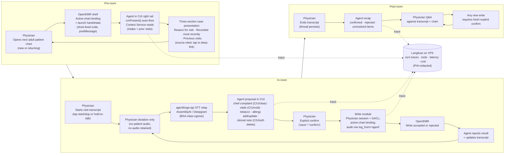

# Clinical Copilot — Users and Use Cases

> Built on OpenEMR. Developed during the Gauntlet AI AgentForge program. Stage 4 hard-gate deliverable.

> **Status:** Stage 4 hard-gate deliverable. This document defines the target user, workflow, and V1 use cases for the OpenEMR Clinical Copilot. Stage 5 architecture must trace every agent capability back to a use case in this file.

---

## 1. Purpose

The clinical copilot helps a primary care physician move through a patient visit with less chart friction and less manual data entry. V1 is not a general assistant for every physician workflow. It is a journey-shaped visit assistant for one recurring outpatient primary care flow with a deliberately narrow CRUD surface across three structured write families (reason for visit, vitals, clinical notes) plus tobacco status and allergy add/update:

1. **Pre-room:** present the patient case to the physician before entering the room — today's intake (front-desk + medical-assistant captures) plus linked prior-visit context.
2. **In-room:** maintain a physician-side visit transcript and propose narrow EMR writes from physician dictation. Each write is **proposed first, then explicitly confirmed**; supported targets are chief complaint (create/update/clear), vitals (create/update/void), tobacco status, allergy add/reaction/severity update, and clinical notes (create/update/soft-delete).
3. **Post-room:** keep the same visit thread available for follow-up questions, recap of confirmed/rejected/pending items, and continued physician-agent Q&A.

This document is the source of truth for:

- who the V1 agent serves;
- where the agent enters the user's day;
- which use cases are in scope;
- why a conversational interface is the right shape;
- what the agent may write only after explicit physician confirmation;
- what the agent must refuse or degrade gracefully;
- which Stage 3 audit constraints must shape Stage 5 architecture.

The governing audit is `[AUDIT.md](AUDIT.md)`. The most important constraints for this document are that adult PCP chart context is distributed across multiple source families, stock OpenEMR demo data needs supplementary seeding to exercise the persona, authorization behavior differs across UI/API/FHIR paths, and PHI-bearing transcripts, prompts, tool proposals, logs, and model/STT calls require explicit compliance decisions before real patient data is used.

---

## 2. Target User

### 2.1 Primary Persona

**Dr. Maya Reynolds**, an adult primary care physician in a family medicine or internal medicine outpatient clinic: the regular doctor's office a patient might visit every few months for checkups, simple acute concerns, and stable chronic-care follow-up.

Her typical clinic day includes 18-24 scheduled adult patients — a mix of new patients and returning patients she has seen for years. Returning charts contain old encounters, medications that were changed or stopped, problem-list entries with uneven status hygiene, vitals trends, lab results, allergy records, and notes written by different clinicians over time. New-patient charts contain whatever the front desk and medical assistant captured during today's intake.

The high-pressure workflow is the patient visit loop. Dr. Reynolds needs a fast case presentation before she enters the room, a lightweight way to capture visit facts while she is with the patient, and a post-room thread she can use to confirm what happened. In-room dictation often covers the same routine structured items as intake: **chief complaint / reason for visit**, **vitals** (including **pain score**, **height**, and **weight**), **tobacco smoking status**, **allergies**, and **clinical notes** (free-text physician observations). Each becomes an EMR write only after she explicitly confirms a proposed payload. She needs to know:

- who this patient is in the context of today's visit;
- what intake captured and what prior visits show (when they exist);
- what physician-dictated facts should become structured EMR data;
- which writes are proposed, pending, confirmed, or rejected;
- where the agent found each chart claim or transcript-derived proposal;
- how to correct or void an erroneously dictated entry without leaving the chat thread.

### 2.2 Patient Scope

V1 is for **new or returning adult patients** in non-emergent outpatient primary care. The case presentation adapts: for returning patients it draws on today's intake plus linked prior-visit context; for new patients it draws on today's intake alone (the only data available).

Supported visit types:

- annual physicals and routine preventive visits;
- simple acute visits such as flu symptoms, sore throat, earache, uncomplicated URI, or minor follow-up;
- stable chronic-disease follow-ups such as hypertension, type 2 diabetes, or hyperlipidemia when the visit is not an emergency or specialist-level management problem;
- new-patient establish-care visits where today's intake is the primary data source.

This scope intentionally covers the case-study workflow ("between patient rooms," intake-driven case presentation, structured visit-note capture) while avoiding higher-risk or more specialized clinical surfaces.

### 2.3 Anti-Persona

V1 is **not** for:

- specialists reviewing narrow subspecialty histories;
- surgeons preparing for operative or perioperative care;
- emergency department or urgent-care clinicians handling high-acuity intake;
- pediatric well-child visits, vaccine schedules, growth charts, or guardian/consent workflows;
- dentists, plastic surgeons, or other non-primary-care professionals;
- clinicians asking for autonomous diagnosis, prescribing, ordering, billing, or broad chart documentation.

Those users may become future personas, but including them in V1 would weaken the Stage 4 definition and expand Stage 5 architecture beyond the audit-supported scope.

---

## 3. Workflow Narrative

The diagram below traces a single adult-PCP visit across the three journey phases (pre-room / in-room / post-room), showing where the physician, the agent, and OpenEMR each act, and which architecture surfaces back the interaction. The ten V1 use cases (UC-A through UC-J) defined in §4 are organized by intent and CRUD operation rather than by phase alone — UC-A is the pre-room case presentation; UC-B / UC-C are read-shaped Q&A available across all phases; UC-D / UC-E / UC-F / UC-G are the in-room confirmed-write surfaces; UC-H is the refusal posture that holds across the others; UC-I / UC-J are the documentary cross-domain workflows (medication reconciliation and abnormal lab surfacing).

### 3.1 Pre-Room

The physician opens the next adult patient's chart in OpenEMR (new or returning). In the 60-90 seconds before entering the room, the agent auto-fires a deterministic case presentation: three sections — *Reason for visit* (today's chief complaint as captured at intake), *Recorded most recently* (vitals, intake-captured social history, and other today-stamped data), *Previous visits* (source-cited prior-visit summaries when the patient is returning; absent for new patients). Each clinical claim emits a `source_pack` whose `navigation_hint` deep-links into the chart through host-shell `postMessage`.

This is not a "what changed since last visit" delta comparison and not a daily schedule dashboard. It is an intake-driven, source-cited orientation that follows the physician into the visit thread. Follow-up Q&A against the same thread is supported in UC-B / UC-C.

### 3.2 In-Room

When the physician enters the room, she starts a **visit transcript session**. V1 captures **physician voice only** through physician-controlled dictation, such as push-to-talk or an explicit microphone control. It does not ambiently listen to the patient, does not capture patient audio, and does not retain an audio file. If patient speech is accidentally captured, it is treated as unsupported input and cannot trigger a write. The physician may repeat or summarize patient-provided facts into the transcript, but patient speech itself is not captured or used to trigger writes.

The persistent artifact is a text transcript of physician dictation, agent messages, tool proposals, confirmations, and write results. This transcript is an AgentForge session artifact, not signed clinical documentation and not the source of truth for clinical facts. A transcript-derived fact becomes chart data only after the agent proposes a specific structured write, the physician confirms it, and OpenEMR accepts the write.

As the physician speaks, the agent watches for narrow, high-value intents that map to **confirmed writes** (proposal first, then explicit confirm). The supported CRUD surface is:

- **Chief complaint / reason for visit** — create or update (e.g. "chief complaint: sore throat three days") and clear (e.g. "remove the reason for visit, that was wrong"). Create and update collapse to one tool because the encounter has a single chief-complaint field.
- **Vitals** — create or update (BP, HR, RR, temp, SpO2, plus **pain score** 0–10, **height**, **weight**) and **soft-delete / void** an erroneous row by UUID (e.g. "void the BP I just saved, those numbers were wrong"). Soft-delete sets `forms.activity = 0`, preserving the row for HIPAA-compliant audit.
- **Tobacco smoking status** — create or update only (e.g. "never smoker," "former smoker," "current daily smoker"), mapped to the EMR's HIS enum values.
- **Allergies** — add a new allergy or update reaction/severity only. V1 requires a substance plus reaction, or an explicit "reaction unknown" marker. **Allergy delete, resolve, and inactivate are intentionally NOT supported** in V1 — too high-risk for the MVP.
- **Clinical notes** — create new physician progress notes, update an existing note's body by UUID, or **soft-delete** a specific note by UUID. The server appends to a canonical physician progress-note row, leaving nursing/intake notes untouched. Cross-encounter edits are rejected.

Read-only prompts still apply, e.g. "show me the allergies on file" or "what's the most recent A1c?"

When the agent detects a possible write, it does not act immediately. It proposes a structured write card in the conversational UI. The physician must explicitly confirm by saying "save," saying "confirm," or clicking the card's confirmation control. Confirmation authorizes an attempted write; the agent must still report whether OpenEMR accepted or rejected it. **Immunizations and vaccines, orders, prescriptions, and billing codes are out of scope for V1** — too many fields, too much regulatory weight, or too far outside the case-presentation/dictation surface.

### 3.3 Post-Room

When the physician ends the visit transcript, the same thread remains available. The physician can ask what was captured, what proposals were confirmed, rejected, or failed, and whether any dictated item still needs review. The agent can answer against the transcript and the chart, but any additional EMR write still requires a fresh explicit confirmation.

This phase is not V1 note drafting. It is a lightweight continuation of the visit thread so the physician does not lose the context of what just happened.

---

## 4. V1 Use Cases

The following ten use cases define the Stage 5 capabilities for V1. They are organized by the actual CRUD surface the agent exposes (read tools + propose-write tools, mapped to physician intents) rather than by journey phase alone — but each use case still anchors to a phase. UC-A is the auto-fired case presentation. UC-B / UC-C are read-shaped Q&A. UC-D through UC-G are the four write surfaces (chief complaint, vitals, tobacco/allergy, clinical notes) with their CRUD operations. UC-H is the refusal posture that holds across the others. UC-I and UC-J are documentary cross-domain workflows (medication reconciliation and abnormal lab surfacing) that exercise the same read tools through clinically-named intents while strictly avoiding clinical recommendations.

### UC-A — Pre-room case presentation

- **Journey phase:** Pre-room.
- **Trigger:** Physician opens the next adult patient's chart (new or returning).
- **User need:** Orient to today's patient quickly, with sourced confidence in every claim.
- **Agent behavior:** Auto-fires `runPresent()` on chart open. Produces a deterministic three-section briefing — *Reason for visit*, *Recorded most recently*, *Previous visits* — each clinical claim carrying a clickable `source_pack` with a `navigation_hint` that deep-links into the chart via the OpenEMR shell.
- **Tool calls:** `get_identity`, `get_encounters`, `get_problems`, `get_meds`, `get_vitals`, `get_allergies`, `get_labs`, `get_clinical_notes`, `get_social_history`. Read-only.
- **Why agent (vs dashboard):** A dashboard shows raw fields. The case presentation answers the transition question — "what do I need to know before I open the door?" — in narrative form, with citations the physician can tap.
- **Required sources:** Demographics, encounters, problems, allergies, medications, vitals, labs, notes (intake + progress).
- **Audit constraints:** [`Architecture-2`](AUDIT.md#architecture-2-chart-data-for-the-v1-pcp-persona-is-distributed-across-clinical-tables-and-servicefhir-adapters), [`Performance-1`](AUDIT.md#performance-1-adult-pcp-chart-context-is-currently-a-multi-read-aggregation-not-a-single-low-latency-chart-summary), [`DataQuality-1`](AUDIT.md#dataquality-1-persona-viability--adult-pcp-returning-patient-demo-coverage).

### UC-B — Targeted single-domain chart Q&A

- **Journey phase:** Pre-room, in-room, post-room (whenever the physician asks).
- **Trigger:** Physician asks a specific question — "what's her latest A1c?", "what allergies are on file?", "any active opioids?".
- **User need:** Surface one chart fact without scanning multiple tabs.
- **Agent behavior:** Picks the single most relevant read tool (typically `get_labs`, `get_allergies`, `get_meds`, `get_vitals`, or `get_problems`). Answers in one short paragraph, cited. Negative claims are gated on an empty-query observation (verification §9.3).
- **Tool calls:** Single tool per turn, by intent.
- **Why agent (vs dashboard):** Faster than navigating tabs, and the answer is conversational — naturally followable.
- **Required sources:** The relevant read endpoint per question.
- **Audit constraints:** [`Architecture-2`](AUDIT.md#architecture-2-chart-data-for-the-v1-pcp-persona-is-distributed-across-clinical-tables-and-servicefhir-adapters), [`Performance-1`](AUDIT.md#performance-1-adult-pcp-chart-context-is-currently-a-multi-read-aggregation-not-a-single-low-latency-chart-summary).

### UC-C — Cross-domain reconciliation Q&A

- **Journey phase:** Pre-room, in-room, post-room.
- **Trigger:** Physician asks a question that spans two or more domains — "is she on anything for diabetes?" (meds × problems), "verify her allergy list before I order anything new" (allergies × meds), "what did the front desk capture vs what I have on file?" (intake notes × prior chart).
- **User need:** Get a synthesized cross-domain answer without manually correlating multiple chart screens.
- **Agent behavior:** Multi-tool turn under the orchestrator's `stepCountIs(12)` budget. Answers reconcile the rows, cite each, and surface conflicts (e.g. med-status warning when a chronic-use claim cites an inactive row).
- **Tool calls:** 2–4 read tools per turn, intent-driven.
- **Why agent (vs dashboard):** No dashboard shows allergies × meds × problems in one cross-referenced view. The conversational thread keeps the question-and-citation pair visible while the physician decides what to do.
- **Required sources:** Multiple read endpoints per turn.
- **Audit constraints:** [`DataQuality-2`](AUDIT.md#dataquality-2-adult-pcp-chart-facts-come-from-multiple-source-families-with-different-identifiers-statuses-and-freshness-semantics), [`DataQuality-4`](AUDIT.md#dataquality-4-fhir-helps-source-attribution-but-does-not-provide-sufficient-provenance-by-itself).

### UC-D — Confirmed chief-complaint write (CRUD: create / update / clear)

- **Journey phase:** In-room.
- **Trigger:** Physician dictates the reason for visit, or asks to clear an erroneously dictated one.
- **User need:** Capture or correct chief complaint without leaving the chat thread.
- **Agent behavior:** Proposes `propose_chief_complaint_write` for create/update (same tool — the encounter has one chief-complaint column) or `propose_chief_complaint_delete` for clear. Write is gated on explicit confirm. The audit row records `write_target=chief_complaint` or `chief_complaint_delete` distinctly.
- **Tool calls:** `propose_chief_complaint_write`, `propose_chief_complaint_delete`. Confirmed module write to `/write/chief_complaint.php` or `/write/chief_complaint_delete.php`.
- **Why agent (vs dashboard):** Dictation is conversational. The form alternative interrupts the visit; the chat alternative captures and confirms in one thread.
- **Required sources:** Active encounter, transcript dictation.
- **Audit constraints:** [`Security-1`](AUDIT.md#security-1-browser-ui-authentication-and-chart-context-are-sessionglobal-driven), [`Compliance-1`](AUDIT.md#compliance-1-openemr-has-configurable-audit-logging-but-agent-reads-need-their-own-traceability-model).

### UC-E — Confirmed vitals write (CRUD: create / update / void)

- **Journey phase:** In-room.
- **Trigger:** Physician dictates vitals (BP, HR, temp, pain, height, weight) or asks to void an erroneous row.
- **User need:** Capture vitals or correct an obvious mis-entry without re-opening forms.
- **Agent behavior:** Proposes `propose_vitals_write` for create/update (single row per encounter — the same tool overwrites) or `propose_vitals_delete` for soft-delete by UUID. Soft-delete sets `forms.activity = 0`, hiding the row from the chart but preserving it in the database for HIPAA-compliant audit. The deterministic vitals parser (PRD §9.4) reports `uncertain` rather than guess on ambiguous input.
- **Tool calls:** `propose_vitals_write`, `propose_vitals_delete`. Confirmed module write to `/write/vitals.php` or `/write/vitals_delete.php`.
- **Why agent (vs dashboard):** A vitals form is fast but interrupts the visit; an erroneous row in a form requires re-finding it. Conversation captures both create and void in the same flow.
- **Required sources:** Active encounter, transcript dictation, `get_vitals` for the row UUID when voiding.
- **Audit constraints:** [`Security-1`](AUDIT.md#security-1-browser-ui-authentication-and-chart-context-are-sessionglobal-driven), [`Compliance-1`](AUDIT.md#compliance-1-openemr-has-configurable-audit-logging-but-agent-reads-need-their-own-traceability-model).

### UC-F — Confirmed tobacco status and allergy add/update

- **Journey phase:** In-room.
- **Trigger:** Physician dictates tobacco status (e.g. "former smoker, quit 5 years ago") or a new allergy ("new allergy: sulfa, rash, mild") or an allergy reaction/severity update.
- **User need:** Capture social-history and allergy facts as structured EMR data, mapped to the EMR's HIS enum values.
- **Agent behavior:** Proposes `propose_tobacco_write` (HIS enum strict-mapped) or `propose_allergy_write` (action ∈ {add, update_reaction, update_severity}). Allergy delete / resolve / inactivate are intentionally NOT supported (audit too high-risk for V1).
- **Tool calls:** `propose_tobacco_write`, `propose_allergy_write`. Confirmed module writes to `/write/tobacco.php`, `/write/allergy.php`.
- **Why agent (vs dashboard):** Tobacco and allergy entry forms are notoriously fiddly (HIS enum picklists for tobacco, severity dropdowns for allergy). Dictation maps cleanly to the structured fields.
- **Required sources:** Transcript dictation, allergy UUID (for updates) from `get_allergies`.
- **Audit constraints:** [`Security-1`](AUDIT.md#security-1-browser-ui-authentication-and-chart-context-are-sessionglobal-driven), [`Compliance-1`](AUDIT.md#compliance-1-openemr-has-configurable-audit-logging-but-agent-reads-need-their-own-traceability-model).

### UC-G — Confirmed clinical-note write (CRUD: create / update / soft-delete)

- **Journey phase:** In-room (most common) and post-room.
- **Trigger:** Physician dictates a free-text observation, exam finding, history detail, or plan ("patient denies chest pain, lungs clear bilaterally"); or asks to revise / remove a specific note by UUID.
- **User need:** Capture narrative observations as structured progress-note text without typing into a form, and correct mistakes without leaving the chat thread.
- **Agent behavior:** Proposes `propose_clinical_note_write` (append to canonical physician progress-note row, creating it if missing — nursing/intake notes untouched), `propose_clinical_note_edit` with `action='update'` to revise an existing note's body by UUID, or `propose_clinical_note_edit` with `action='delete'` to soft-delete (sets `activity=0`, preserves audit). Cross-encounter edits are rejected.
- **Tool calls:** `propose_clinical_note_write`, `propose_clinical_note_edit`. Confirmed module writes to `/write/clinical_note.php` or `/write/clinical_note_edit.php` (the edit endpoint dispatches by `action`).
- **Why agent (vs dashboard):** Free-text dictation flowing directly into the progress note is the highest-leverage UC for time savings. The single-thread-per-visit shape means corrections happen in context, not in a separate forms screen.
- **Required sources:** Active encounter, transcript dictation, `get_clinical_notes` for the note UUID when revising / deleting.
- **Audit constraints:** [`Security-1`](AUDIT.md#security-1-browser-ui-authentication-and-chart-context-are-sessionglobal-driven), [`Compliance-1`](AUDIT.md#compliance-1-openemr-has-configurable-audit-logging-but-agent-reads-need-their-own-traceability-model), [`Security-4`](AUDIT.md#security-4-current-logging-surfaces-can-retain-phi-rich-request-sql-and-api-payload-details).

### UC-H — Refusal and graceful degradation across all surfaces

- **Journey phase:** All.
- **Trigger:** Physician asks for something out of scope (medical advice, diagnosis suggestion, prescription, order, billing code, allergy delete, immunization, ambient recording, etc.) or input is ambiguous (vitals parser returns `uncertain`, dictation could be historical context vs today, etc.) or a tool fails (context service unreachable, OpenEMR rejects the write).
- **User need:** A predictable, polite refusal or clarification — not a fabricated answer or silent failure.
- **Agent behavior:** Returns a refusal block with a typed reason and a correlation ID so the failure can be traced in Langfuse. For ambiguous input, asks back. For unsupported writes, returns `unsupported_write` (audited). For all-tools-failed scenarios, refuses rather than fabricating.
- **Tool calls:** None additional — this is the verification + post-LLM gate. See [`VERIFICATION.md`](VERIFICATION.md) for the four enforcement layers and [`EVALUATION.md`](EVALUATION.md) for the deterministic eval coverage of this UC.
- **Why agent (vs dashboard):** A dashboard cannot have a refusal posture. The agent's refusals are part of how it delivers safety — visible to the clinician in the same thread.
- **Required sources:** None — refusal logic is data-free.
- **Audit constraints:** [`Compliance-2`](AUDIT.md#compliance-2-external-llm-use-requires-a-phi-boundary-decision-before-any-real-chart-data-leaves-openemr), [`Compliance-5`](AUDIT.md#compliance-5-no-outbound-network-egress-controls-the-llm-call-would-be-the-first-phi-bearing-outbound).

### UC-I — Documentary medication reconciliation

- **Journey phase:** Pre-room or in-room.
- **Trigger:** Physician asks for a comparison of what the chart says vs what intake captured today — "reconcile her meds," "show me what she's on the chart vs what came in at intake," "any med discrepancies between today's intake and her active list?"
- **User need:** Surface the data needed to perform clinician-judged medication reconciliation, without performing the clinical reconciliation itself.
- **Agent behavior:** Calls `get_meds` for the chart's active medication list and `get_clinical_notes` filtered to today's intake (front-desk and medical-assistant captures). Returns both lists side-by-side with citations. Surfaces discrepancies as **observations** — what the data says, never what the physician should do about it. The agent does not propose drug changes, does not flag any row as "should be discontinued," and does not characterize a discrepancy as needing clinical action. The verification layer's `constraint_boundary_describes_vs_recommends` rule enforces this mechanically.
- **Tool calls:** `get_meds`, `get_clinical_notes` (intake-filtered). Read-only.
- **Why agent (vs dashboard):** No OpenEMR view shows the active med list and today's intake-captured meds side-by-side with citations the physician can tap to verify each row. The conversational thread keeps the question and the structured comparison paired in context.
- **Required sources:** `get_meds`, `get_clinical_notes` (today's intake notes only).
- **Scope discipline:** UC-I is **documentary**, not clinical. Identifying a discrepancy is data work; deciding what to do about a discrepancy is the physician's call. If the physician asks the agent to make that call ("should I stop the duplicate?"), the response is a UC-H refusal.
- **Audit constraints:** [`DataQuality-2`](AUDIT.md#dataquality-2-adult-pcp-chart-facts-come-from-multiple-source-families-with-different-identifiers-statuses-and-freshness-semantics), [`DataQuality-3`](AUDIT.md#dataquality-3-missing-empty-stale-and-conflicting-chart-states-are-normal-current-behavior-not-edge-cases).

### UC-J — Documentary abnormal lab surfacing

- **Journey phase:** Pre-room or in-room.
- **Trigger:** Physician asks which labs are flagged outside reference range — "any labs out of range?", "show me her abnormal labs from the last 90 days," "what's flagged on her latest lab panel?"
- **User need:** Surface the labs the chart marks as outside reference range, with values and ranges, so the physician can decide what (if anything) to act on.
- **Agent behavior:** Calls `get_labs`, filters by reference-range comparison where ranges are present in the lab data, returns flagged rows with their values, ranges, and dates. The agent reports what the chart shows — it does not characterize a result as needing follow-up, recommend repeat testing, or suggest treatment changes. The verification layer's `constraint_boundary_describes_vs_recommends` rule enforces this mechanically.
- **Tool calls:** `get_labs`. Read-only.
- **Why agent (vs dashboard):** A lab table shows everything chronologically. The agent surfaces only the abnormal subset, with reference ranges inline and source-cited rows the physician can tap. Faster orientation than scrolling the lab tab.
- **Required sources:** `get_labs` (with reference-range fields).
- **Scope discipline:** UC-J is **documentary**, not clinical. Flagging "outside reference range" is data work; deciding the clinical significance and what to do next is the physician's call. If the physician asks the agent to make that call ("should I order a repeat A1c?"), the response is a UC-H refusal.
- **Audit constraints:** [`DataQuality-2`](AUDIT.md#dataquality-2-adult-pcp-chart-facts-come-from-multiple-source-families-with-different-identifiers-statuses-and-freshness-semantics), [`DataQuality-3`](AUDIT.md#dataquality-3-missing-empty-stale-and-conflicting-chart-states-are-normal-current-behavior-not-edge-cases).

### Quick CRUD matrix

| Surface | C | R | U | D |
|---|---|---|---|---|
| **Reason for visit** (chief complaint) | UC-D (`propose_chief_complaint_write`) | UC-A / UC-B (via `get_encounters`) | UC-D (same tool — single field) | UC-D (`propose_chief_complaint_delete`) |
| **Vitals** | UC-E (`propose_vitals_write`) | UC-A / UC-B (`get_vitals`) | UC-E (same tool — single row per encounter) | UC-E (`propose_vitals_delete` — soft-delete via `forms.activity=0`) |
| **Clinical notes** | UC-G (`propose_clinical_note_write`) | UC-A / UC-B (`get_clinical_notes` full body, `get_notes_metadata`) | UC-G (`propose_clinical_note_edit`, action=update) | UC-G (`propose_clinical_note_edit`, action=delete; soft-delete) |
| **Tobacco status** | UC-F (`propose_tobacco_write`) | UC-A / UC-B (`get_social_history`) | UC-F (same tool) | Not supported (HIS enum has no "delete" — use `unknown` instead) |
| **Allergies** | UC-F (`propose_allergy_write`, action=add) | UC-A / UC-B (`get_allergies`) | UC-F (`propose_allergy_write`, update_reaction / update_severity) | **Intentionally NOT supported** in V1 (UC-H refuses) |

---

## 5. Sample Conversation Patterns

These examples show the intended interaction style. They are illustrative and synthetic, and they match the shape the shipped CUI actually delivers.

### UC-A — Pre-room case presentation (auto-fired on chart open)

*The physician clicks Olivia Tran from today's schedule. The chart opens; the rail mounts; the assistant turn lands automatically. No typing required.*

**Agent:**
> **Reason for visit**
> Sore throat and fever since yesterday morning, intake nurse note. *(source pack: today's encounter intake)*
>
> **Recorded most recently**
> BP 132/84, HR 78, Temp 98.6 °F (today, 9:14 a.m.). *(source pack: today's vitals row)*
> Tobacco status on file: former smoker. *(source pack: social history)*
> No allergies on file. *(empty-backed observation: get_allergies returned 0 rows.)*
>
> **Previous visits**
> Last visit 2026-02-14: routine f/u for hypertension; BP 128/82; metformin 1000 mg BID continued. *(source pack: encounter 2026-02-14, summary)*
> No prior visits before that. *(source pack: full encounter list — 1 prior result.)*
>
> Tap any line to deep-link into the chart.

### UC-B — Targeted single-domain Q&A

**Physician:** "What's her latest A1c?"

**Agent:** "Most recent A1c is 7.2% from 2026-02-12, in the labs panel. *(source pack: lab row uuid-a1c-2026-02-12.)* No A1c results since."

### UC-C — Cross-domain reconciliation Q&A

**Physician:** "Anything she's on that I should be cautious about before I add an antibiotic?"

**Agent:** "Two things to weigh. (1) On her active medication list: lisinopril 10 mg daily and metformin 1000 mg BID. *(source packs: meds-lisinopril-row, meds-metformin-row.)* (2) Allergy list is empty per the chart's empty-query observation. *(source pack: get_allergies empty observation.)* Lisinopril's documented interaction surface is not extensive; the antibiotic class you're considering will determine whether further checking is warranted. I am not recommending a specific drug — that is your call."

### UC-D — Confirmed chief-complaint write (create / clear)

**Physician:** "Chief complaint: sore throat and fever since yesterday."

**Agent (proposal card):** "Proposed reason for visit: *Sore throat and fever since yesterday.* Save to today's encounter?"

**Physician:** "Confirm."

**Agent:** "OpenEMR accepted the write. Chief complaint set."

*Later in the visit:*

**Physician:** "Actually clear that — the real reason is the rash on her arm."

**Agent (proposal card):** "Proposed: clear chief complaint on encounter #4231. Confirm?"

**Physician:** "Confirm."

**Agent:** "Cleared. You can dictate the corrected reason now if you want."

### UC-E — Confirmed vitals write + soft-delete (void erroneous row)

**Physician:** "Vitals: BP 132 over 84, heart rate 78, temp 98.6, pain 3 out of 10, weight 180, height 70 inches."

**Agent (proposal card):** "Proposed vitals: BP 132/84, HR 78, Temp 98.6 °F, pain 3/10, weight 180 lb, height 70 in. Save to today's encounter?"

**Physician:** "Confirm."

**Agent:** "OpenEMR accepted the write. Vitals saved."

*A minute later:*

**Physician:** "Wait, I read that BP wrong — void those vitals, I want to redo them."

**Agent (proposal card):** "Proposed: void today's vitals row (uuid-vit-2026…). Soft-delete sets `forms.activity = 0` — the row stays in the audit trail but won't render in the chart. Confirm?"

**Physician:** "Confirm."

**Agent:** "Voided. The row is hidden but preserved for audit. Ready when you are with the corrected vitals."

### UC-E — Ambiguous vitals trigger (degraded behavior)

**Physician:** "Last time his blood pressure was around 160 over 90, but today looks better."

**Agent:** "I heard a blood pressure value, but this sounds like historical context rather than today's vitals. I will not save it. If you want to record today's vitals, dictate them with the values you measured."

### UC-F — Confirmed tobacco / allergy writes

**Physician:** "Tobacco: she quit five years ago, about a pack a day before that."

**Agent (proposal card):** "Proposed smoking status: *Former smoker* (HIS enum: `former_smoker`). Confirm?"

**Physician:** "Confirm."

**Agent:** "OpenEMR accepted the write."

**Physician:** "New allergy: sulfa, rash, mild."

**Agent (proposal card):** "Proposed allergy add: substance *sulfa*, reaction *rash*, severity *mild*. Save?"

**Physician:** "Confirm."

**Agent:** "OpenEMR accepted the allergy add."

### UC-G — Confirmed clinical-note CRUD (write, then revise, then soft-delete)

**Physician:** "Patient denies chest pain, lungs clear bilaterally, abdomen soft and non-tender."

**Agent (proposal card):** "Proposed clinical note (encounter #4231): *Patient denies chest pain, lungs clear bilaterally, abdomen soft and non-tender.* Save to the physician progress note?"

**Physician:** "Confirm."

**Agent:** "OpenEMR accepted the write. Note appended."

*Later:*

**Physician:** "Update the lung exam — actually I heard scattered wheezes."

**Agent (proposal card):** "Proposed update to clinical note (uuid-note-9c2…): replace body with *Patient denies chest pain, lungs with scattered wheezes bilaterally, abdomen soft and non-tender.* Confirm?"

**Physician:** "Confirm."

**Agent:** "OpenEMR accepted the update."

*If a note was clearly mis-dictated:*

**Physician:** "Delete the note about asthma improving — that wasn't this visit."

**Agent (proposal card):** "Proposed soft-delete of clinical note (uuid-note-3a1…). The row is hidden via `forms.activity = 0` but preserved for audit. Confirm?"

**Physician:** "Confirm."

**Agent:** "Soft-deleted. The note is hidden from the chart; the audit trail is intact."

### UC-G — Cross-encounter edit rejected

**Physician:** "Update the note from yesterday's visit to add the allergy detail."

**Agent:** "I cannot update a note from yesterday's encounter — it does not belong to today's active encounter. Note edits are encounter-scoped. If you want to add the detail to today's note, dictate it and I will append."

### UC-H — Refusal: out of scope (medical advice)

**Physician:** "Given this A1c, what dose of metformin should I increase her to?"

**Agent:** "I am not an advice agent. I can pull data from this chart or help you save data to it. For dosing decisions, that is your judgment. If you would like to record what you decide, dictate the change and I will propose the structured write."

### UC-H — Refusal: write attempt without confirm

**Physician:** "Just save the vitals."

**Agent:** "I have a vitals proposal pending. I will not save without your explicit *confirm* — that is the safety gate. Reply *confirm* to save, or *cancel* to drop the proposal."

### UC-H — Confirmed write fails (graceful degradation)

**Physician:** "Confirm."

**Agent:** "I attempted the write, but OpenEMR rejected it (correlation_id `8a7c…`) because today's encounter context is missing. I did not save the value. The proposal remains unresolved in the transcript. Try saving the encounter form first, then say 'retry' here."

### UC-I — Documentary medication reconciliation

**Physician:** "Reconcile her meds — chart vs intake."

**Agent:**
> **Active medication list (chart):** *(source: `get_meds`)*
> - Lisinopril 10 mg daily
> - Metformin 1000 mg BID
> - Atorvastatin 40 mg daily
>
> **Captured at today's intake:** *(source: today's intake clinical note)*
> - Lisinopril 10 mg daily
> - Metformin 1000 mg BID
> - Atorvastatin 20 mg daily
> - Aspirin 81 mg daily
>
> **Discrepancies:**
> - Atorvastatin: chart 40 mg vs intake 20 mg.
> - Aspirin 81 mg appears in intake; not on the active list.

### UC-I — Refusal when asked for a clinical recommendation

**Physician:** "Should I stop the duplicate?"

**Agent:** "I'm not an advice agent. I can pull data from this chart or help you save data to it. For the clinical reconciliation, that's your judgment. If you decide to discontinue or update one of these, dictate the change and I'll propose the structured write."

### UC-J — Documentary abnormal lab surfacing

**Physician:** "Any labs out of range from the last 90 days?"

**Agent:**
> Two labs flagged outside reference range in the last 90 days: *(source: `get_labs`)*
> - A1c 7.2% on 2026-02-12 *(reference: <5.7% normal, 5.7–6.4% prediabetes, ≥6.5% diabetes)*
> - LDL 145 mg/dL on 2026-02-12 *(reference: <100 mg/dL desirable)*
>
> All other labs in this window are within their reference ranges.

### UC-J — Refusal when asked for a clinical recommendation

**Physician:** "Should I order a repeat A1c?"

**Agent:** "I'm not an advice agent. I can pull data from this chart or help you save data to it. For ordering decisions, that's your judgment."

### UC-C / UC-H — Post-room recap and continuation

**Physician:** "End transcript. What did we capture?"

**Agent:** "Transcript ended. **Confirmed writes this visit:** chief complaint set; vitals (BP, HR, temp, pain, weight, height) saved, then voided, then re-saved with corrected BP; tobacco status set to *Former smoker*; one allergy added (sulfa); one clinical note appended and revised. **Pending:** none. **Refused:** one out-of-scope dosing question. No further writes unless you confirm them."

---

## 6. Why a Conversational Agent

The strongest V1 reason for a conversational interface is that the visit itself becomes a thread: pre-room chart briefing, physician dictation, transcript entries, tool proposals, confirmations, write results, and post-room follow-up all live in one interaction.

A dashboard can show lists. A form can accept vitals or a chief complaint field. A transcript can store text. None of those alone gives the physician a single visit-centered flow where spoken intent becomes a proposed structured action — complaint, vitals block, tobacco, allergies — stays visible in context, and requires explicit confirmation before touching OpenEMR.

Per-use-case logic:

- **UC-A is agent-shaped** because the physician needs an intake-driven, source-cited case presentation with tap-to-deep-link citations, not a fixed panel of every possible chart field.
- **UC-B / UC-C are agent-shaped** because chart Q&A across one or several domains is conversational by nature — the question and the cited answer stay paired in the thread.
- **UC-D / UC-E / UC-F / UC-G are agent-shaped** because dictation is already conversational; the agent turns physician narration into structured proposals (single tool per intent) while keeping the physician in control. Voiding an erroneous row in the same thread is a category of correction that no form-based UI handles cleanly.
- **UC-H is agent-shaped** because refusals must be visible to the clinician in the same thread where the request was made — not silently dropped, not hidden in a separate error log.

A dashboard or normal OpenEMR screen is still better for:

- the daily schedule;
- static task queues;
- raw lab tables;
- full note review;
- billing, orders, prescriptions, and final encounter documentation;
- clinic-wide operational reporting.

---

## 7. Non-Goals, Refusals, and Degraded Behavior

### 7.1 V1 Scope Boundaries

V1 includes:

- pre-room intake-driven case presentation (auto-fired on chart open);
- targeted single-domain and cross-domain chart Q&A through the thread;
- physician-side visit transcript;
- physician-controlled capture mode (push-to-talk or explicit microphone start/stop);
- no retained audio file; no patient audio capture;
- intent detection over physician dictation;
- structured proposals for the V1 write surface, all gated on explicit confirm:
  - **chief complaint / reason for visit** — create / update / **clear**;
  - **vitals** (including **pain**, **height**, **weight**) — create / update / **soft-delete (void)** an erroneous row by UUID;
  - **tobacco smoking status** — create / update;
  - **allergy** — add / update reaction / update severity;
  - **clinical notes** (physician progress note text) — create / update by UUID / **soft-delete** by UUID;
- post-room Q&A against the transcript and chart.

V1 does **not** include:

- **immunizations or vaccines** — too many fields and workflow variants for V1;
- orders or prescriptions — clinically dangerous write surface needing deeper integration;
- diagnosis generation or general medical advice — see UC-H, this is the FDA-classification cliff;
- billing codes;
- patient messaging;
- free-text encounter-note **finalization or signing** (V1 supports authoring + revising progress-note text but does not finalize encounter documentation);
- ambient recording of the patient;
- autonomous writes of any kind — the explicit-confirm gate is the V1 safety contract;
- **allergy deletion, resolution, or inactivation** — explicitly out of scope (audit too high-risk for V1);
- broad chart dumps;
- pediatric, ED, urgent-care, surgical, specialist, dental, or mental-health-only workflows;
- external knowledge lookups (PubMed / drug interaction databases / general-medicine Q&A) — V2 candidate per [VERIFICATION.md §7](VERIFICATION.md).

### 7.2 Refusals

The agent must refuse or redirect when asked to:

- write without explicit physician confirmation;
- save a value from ambiguous transcript text;
- trigger a write from accidental patient speech;
- write outside the authenticated physician's permissions;
- place orders, prescriptions, diagnoses, or billing codes;
- treat a transcript as signed clinical documentation;
- delete, resolve, or inactivate allergies in V1;
- hide uncertainty, low confidence, or missing source evidence;
- retain audio or capture patient audio in V1;
- document immunizations or vaccines in V1.

### 7.3 Degraded Behavior

When transcript text is ambiguous or low-confidence, the agent should ask for clarification instead of proposing or saving a write.

Expected degraded responses include:

- "I heard a blood pressure value, but I am not sure whether it is today's vitals or historical context."
- "I can propose this allergy update, but it needs confirmation before it is saved."
- "I cannot save this because the patient, encounter, or authenticated user context is unclear."
- "OpenEMR rejected this write. I did not save the value; the proposal remains unresolved."
- "I can summarize the transcript, but I cannot turn it into a signed encounter note in V1."
- "This is demo/synthetic data only. Real-patient use requires a consent and PHI-handling review."

### 7.4 Consent and Demo Posture

V1 course work uses synthetic patient sessions. Because V1 captures physician voice only and stores transcript text only, it avoids patient audio and retained audio files. A real deployment would still require patient-notice/consent policy, transcript retention rules, audit logging, purge/export policy, and BAA review for any speech-to-text or LLM provider that receives PHI.

---

## 8. Audit Cross-Check

Stage 5 architecture must preserve the constraints below.

| Constraint Area                                                     | Audit Findings                                                                                                                                                                                                                                                                                                                                                                                                                                                                                                                | Impact on USERS.md                                                                                                                                                                                                                                |
| ------------------------------------------------------------------- | ----------------------------------------------------------------------------------------------------------------------------------------------------------------------------------------------------------------------------------------------------------------------------------------------------------------------------------------------------------------------------------------------------------------------------------------------------------------------------------------------------------------------------- | ------------------------------------------------------------------------------------------------------------------------------------------------------------------------------------------------------------------------------------------------- |
| Current demo data cannot validate the persona                       | `[DataQuality-1](AUDIT.md#dataquality-1-persona-viability--adult-pcp-returning-patient-demo-coverage)`, `[DataQuality-5](AUDIT.md#dataquality-5-eval-ground-truth-requires-hybrid-synthetic-plus-curated-augmentation)`                                                                                                                                                                                                                                                                                                       | V1 needs synthetic adult PCP visit sessions, including pre-room chart context, physician dictation, transcript entries, and confirmed write examples.                                                                                             |
| No single chart bundle exists                                       | `[Architecture-2](AUDIT.md#architecture-2-chart-data-for-the-v1-pcp-persona-is-distributed-across-clinical-tables-and-servicefhir-adapters)`, `[Performance-1](AUDIT.md#performance-1-adult-pcp-chart-context-is-currently-a-multi-read-aggregation-not-a-single-low-latency-chart-summary)`, `[Performance-7](AUDIT.md#performance-7-n1-query-patterns-and-select--survive-in-services)`                                                                                                                                     | UC-A and chart Q&A in UC-B/UC-C require bounded chart retrieval, not a generic "read the chart" tool.                                                                                                                                             |
| Authorization and session context are non-trivial                   | `[Security-1](AUDIT.md#security-1-browser-ui-authentication-and-chart-context-are-sessionglobal-driven)`, `[Security-2](AUDIT.md#security-2-restfhir-auth-is-oauth-scope-based-but-staff-job-roles-collapse-to-users)`, `[Security-3](AUDIT.md#security-3-fhir-patient-context-reads-and-staff-acl-reads-follow-different-enforcement-paths)`                                                                                                                                                                                 | Confirmed writes must use the authenticated physician's OpenEMR user/session/patient/encounter context and cannot rely on OAuth role labels alone.                                                                                                |
| Confirmed writes expand beyond the original read-only audit posture | `[Security-1](AUDIT.md#security-1-browser-ui-authentication-and-chart-context-are-sessionglobal-driven)`, `[Security-2](AUDIT.md#security-2-restfhir-auth-is-oauth-scope-based-but-staff-job-roles-collapse-to-users)`, `[Security-3](AUDIT.md#security-3-fhir-patient-context-reads-and-staff-acl-reads-follow-different-enforcement-paths)`, `[Compliance-1](AUDIT.md#compliance-1-openemr-has-configurable-audit-logging-but-agent-reads-need-their-own-traceability-model)`                                               | Stage 5 must prove authorization, validation, audit logging, and rollback/error behavior for each write target before implementation: chief complaint, vitals incl. pain/height/weight, tobacco status, and allergy add/reaction/severity update. |
| Transcripts, logs, and tool calls are PHI surfaces                  | `[Security-4](AUDIT.md#security-4-current-logging-surfaces-can-retain-phi-rich-request-sql-and-api-payload-details)`, `[Compliance-1](AUDIT.md#compliance-1-openemr-has-configurable-audit-logging-but-agent-reads-need-their-own-traceability-model)`, `[Compliance-2](AUDIT.md#compliance-2-external-llm-use-requires-a-phi-boundary-decision-before-any-real-chart-data-leaves-openemr)`, `[Compliance-5](AUDIT.md#compliance-5-no-outbound-network-egress-controls-the-llm-call-would-be-the-first-phi-bearing-outbound)` | Transcript text, STT payloads, tool proposals, write confirmations, prompts, and responses are PHI-bearing unless minimized and handled under explicit retention/BAA/egress policy.                                                               |
| Write-path coverage is narrow                                       | `[Architecture-2](AUDIT.md#architecture-2-chart-data-for-the-v1-pcp-persona-is-distributed-across-clinical-tables-and-servicefhir-adapters)`, `[Architecture-3](AUDIT.md#architecture-3-restfhir-apis-provide-the-cleanest-read-boundary-but-identifier-and-resource-coverage-are-uneven)`, `[Architecture-4](AUDIT.md#architecture-4-custom-modules-plus-event-hooks-are-the-most-plausible-in-repo-integration-path-for-a-v1-embedded-read-only-copilot)`                                                                  | Stage 5 must prove concrete write paths for chief complaint, vitals (incl. pain/height/weight), tobacco status, and allergy updates before claiming confirmed writeback. Immunizations stay out of V1.                                            |
| Source quality varies                                               | `[DataQuality-2](AUDIT.md#dataquality-2-adult-pcp-chart-facts-come-from-multiple-source-families-with-different-identifiers-statuses-and-freshness-semantics)`, `[DataQuality-3](AUDIT.md#dataquality-3-missing-empty-stale-and-conflicting-chart-states-are-normal-current-behavior-not-edge-cases)`, `[DataQuality-4](AUDIT.md#dataquality-4-fhir-helps-source-attribution-but-does-not-provide-sufficient-provenance-by-itself)`                                                                                           | Agent answers and write proposals must distinguish documented facts, transcript-derived claims, missing evidence, stale entries, conflicts, and inference.                                                                                        |

---

## 9. Stage 5 Traceability Requirement

Every Stage 5 capability maps to at least one V1 use case below. New capabilities must add a row here before being claimed in `ARCHITECTURE.md`.

| Capability | Use Cases | Tool / Endpoint |
| --- | --- | --- |
| Patient chart snapshot retrieval (multi-domain) | UC-A | `get_identity`, `get_encounters`, `get_problems`, `get_meds`, `get_vitals`, `get_allergies`, `get_labs`, `get_clinical_notes`, `get_social_history` |
| Targeted single-domain chart read | UC-B | one of the above per turn |
| Cross-domain reconciliation Q&A | UC-C | 2–4 read tools per turn under `stepCountIs(12)` budget |
| Documentary medication reconciliation (chart vs intake, side-by-side, observations only) | UC-I | `get_meds` + `get_clinical_notes` (intake-filtered) |
| Documentary abnormal lab surfacing (labs flagged outside reference range with values + ranges) | UC-J | `get_labs` |
| Auto-fired case presentation on chart open | UC-A | `runPresent()` orchestration of the chart-context bundle |
| Source citation and claim grounding | UC-A, UC-B, UC-C, UC-G | `source_pack` UUIDs minted server-side per tool result |
| Citation deep-link navigation | UC-A, UC-B, UC-C | `postMessage` `NAV_REQUEST` to host shell with `navigation_hint` |
| Physician-controlled dictation capture | UC-D, UC-E, UC-F, UC-G | tap-to-start / hold-to-talk; AssemblyAI BAA-class STT relay |
| Visit transcript capture and persistence | UC-D..UC-H | Postgres conversation/turn store, sessionStorage replay, 2-hour TTL |
| Intent detection over physician dictation | UC-D, UC-E, UC-F, UC-G | LLM tool selection (Vercel AI SDK) |
| Structured tool-call proposals | UC-D, UC-E, UC-F, UC-G | `propose_*` tools insert pending proposal in Postgres |
| Explicit confirmation gate (no silent writes) | UC-D, UC-E, UC-F, UC-G, UC-H | `confirmPendingProposal` POSTs to module write route only after clinician confirm |
| Confirmed CRUD: chief complaint create/update | UC-D | `propose_chief_complaint_write` → `/write/chief_complaint.php` |
| Confirmed CRUD: chief complaint clear | UC-D | `propose_chief_complaint_delete` → `/write/chief_complaint_delete.php` |
| Confirmed CRUD: vitals create/update | UC-E | `propose_vitals_write` → `/write/vitals.php` |
| Confirmed CRUD: vitals soft-delete (void) | UC-E | `propose_vitals_delete` → `/write/vitals_delete.php` (sets `forms.activity=0`) |
| Confirmed CRUD: tobacco status | UC-F | `propose_tobacco_write` → `/write/tobacco.php` |
| Confirmed CRUD: allergy add / update reaction / update severity | UC-F | `propose_allergy_write` → `/write/allergy.php` |
| Confirmed CRUD: clinical note create | UC-G | `propose_clinical_note_write` → `/write/clinical_note.php` |
| Confirmed CRUD: clinical note update | UC-G | `propose_clinical_note_edit` (action=update) → `/write/clinical_note_edit.php` |
| Confirmed CRUD: clinical note soft-delete | UC-G | `propose_clinical_note_edit` (action=delete) → `/write/clinical_note_edit.php` |
| Encounter-scoped binding for all writes | UC-D, UC-E, UC-G | active-chart binding + JWT `encounter_id` claim; cross-encounter rejected |
| Write failure handling (typed error + correlation_id) | UC-H | OpenEMR audit row `log_from='agent'`, refusal block in thread |
| Refusal: out-of-scope writes (orders, prescriptions, immunizations, allergy delete) | UC-H | runner check `unsupported_write_target_rejected` |
| Refusal: medical advice / recommendations | UC-H | runner check `constraint_boundary_describes_vs_recommends` |
| Refusal: ambiguous vitals (uncertain parser) | UC-E, UC-H | runner check `vitals_parser_uncertain_not_guess` |
| Refusal: unbacked negative claims | UC-A, UC-B, UC-H | runner check `negative_claim_requires_empty_query` |
| Refusal: cross-patient tool-args leak | UC-A..UC-H | runner check `cross_patient_blocked` |
| Refusal: prompt-injection internal disclosure | UC-H | runner check `internal_disclosure_blocked` |
| Resilience: all-domains-unavailable | UC-A, UC-H | runner check `all_domains_unavailable_refused` |
| Resilience: provider timeout (typed gateway error) | UC-A..UC-H | runner check `provider_timeout_typed_error` |
| Med-status conflict warning surfaces | UC-C, UC-H | runner check `conflicting_medication_records_warned` |
| Post-visit recap and pending-item review | UC-C | thread persistence + recap turn |
| Longitudinal "why was this decided" reasoning | Out of scope for V1 | — |
| Broad chronic trend summarization | Out of scope for V1 | — |
| Orders, prescriptions, billing, patient messaging | Out of scope for V1 | — |
| Allergy deletion / resolution / inactivation | Out of scope for V1 | — |
| Patient audio capture or retained audio files | Out of scope for V1 | — |
| Immunizations / vaccines | Out of scope for V1 | — |
| External evidence lookup (PubMed / NEJM / OpenEvidence) | Out of scope for V1; V2 candidate | See [VERIFICATION.md §7](VERIFICATION.md) and [v2-roadmap.md](Documentation/AgentForge/implementation/v2-roadmap.md) |

If a proposed Stage 5 capability does not map to this table, it is out of scope until `USERS.md` is revised.

---

## 10. Stage 4 Completion Checklist

- Defines exactly one V1 user persona (Dr. Maya Reynolds, adult primary care, new or returning patients).
- Defines the journey phases where the agent enters the physician's day (pre-room / in-room / post-room).
- Defines ten V1 use cases (UC-A through UC-J) covering the actual CRUD surface across reason for visit, vitals, tobacco, allergies, and clinical notes — plus refusal posture and two documentary cross-domain workflows (medication reconciliation, abnormal lab surfacing).
- Explains why a conversational agent is the right solution for each use case.
- Defines the V1 write scope: chief complaint (C/U/clear), vitals (C/U/void), tobacco status (C/U), allergy add/update reaction/update severity, clinical notes (C/U/soft-delete) — each only after explicit physician confirmation; immunizations, orders, prescriptions, billing, allergy delete, and external knowledge lookup all explicitly excluded.
- Excludes patient audio capture and audio retention from V1.
- Defines non-goals, refusals, and degraded behavior.
- Acknowledges synthetic-data and real-deployment consent/compliance requirements.
- Traces every UC and capability back to Stage 3 audit constraints (§8) and the implementing tool surface (§9).

