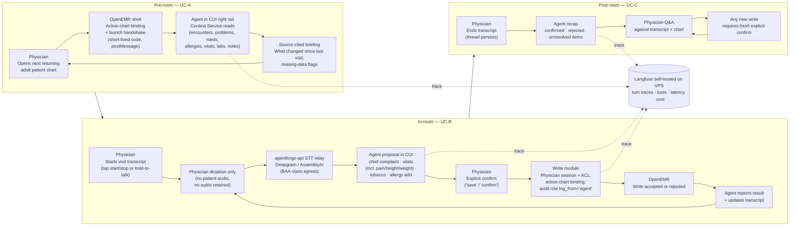

# AgentForge Stage 4 Users and Use Cases

> **Status:** Stage 4 hard-gate deliverable. This document defines the target user, workflow, and V1 use cases for the OpenEMR Clinical Co-Pilot. Stage 5 architecture must trace every agent capability back to a use case in this file.

---

## 1. Purpose

The clinical co-pilot helps a primary care physician move through a patient visit with less chart friction and less manual data entry. V1 is not a general assistant for every physician workflow. It is a journey-shaped visit assistant for one recurring outpatient primary care flow:

1. **Pre-room:** brief the physician before entering the room.
2. **In-room:** maintain a physician-side visit transcript and propose narrow EMR writes from physician dictation (chief complaint, vitals incl. pain/height/weight, tobacco status, allergies — confirm before save).
3. **Post-room:** keep the same visit thread available for follow-up questions and review.

This document is the source of truth for:

- who the V1 agent serves;
- where the agent enters the user's day;
- which use cases are in scope;
- why a conversational interface is the right shape;
- what the agent may write only after explicit physician confirmation;
- what the agent must refuse or degrade gracefully;
- which Stage 3 audit constraints must shape Stage 5 architecture.

The governing audit is `[AUDIT.md](AUDIT.md)`. The most important constraints for this document are that adult PCP chart context is distributed across multiple source families, stock OpenEMR demo data cannot validate the returning-patient persona, authorization behavior differs across UI/API/FHIR paths, and PHI-bearing transcripts, prompts, tool proposals, logs, and model/STT calls require explicit compliance decisions before real patient data is used.

---

## 2. Target User

### 2.1 Primary Persona

**Dr. Maya Reynolds**, an adult primary care physician in a family medicine or internal medicine outpatient clinic: the regular doctor's office a patient might visit every few months for checkups, simple acute concerns, and stable chronic-care follow-up.

Her typical clinic day includes 18-24 scheduled adult patients. Many patients have seen the practice for years. Their charts contain old encounters, medications that were changed or stopped, problem-list entries with uneven status hygiene, vitals trends, lab results, allergy records, and notes written by different clinicians over time.

The high-pressure workflow is the patient visit loop. Dr. Reynolds needs a fast briefing before she enters the room, a lightweight way to capture visit facts while she is with the patient, and a post-room thread she can use to confirm what happened. In-room dictation often covers the same routine structured items as intake: **chief complaint / reason for visit**, **vitals** (including **pain score**, **height**, and **weight**), **tobacco smoking status**, and **allergies**. Each becomes an EMR write only after she explicitly confirms a proposed payload. She needs to know:

- who this patient is in the context of today's visit;
- what changed since the last relevant visit;
- what physician-dictated facts should become structured EMR data;
- which writes are proposed, pending, confirmed, or rejected;
- where the agent found each chart claim or transcript-derived proposal.

### 2.2 Patient Scope

V1 is limited to **returning adult patients** in non-emergent outpatient primary care.

Supported visit types:

- annual physicals and routine preventive visits;
- simple acute visits such as flu symptoms, sore throat, earache, uncomplicated URI, or minor follow-up;
- stable chronic-disease follow-ups such as hypertension, type 2 diabetes, or hyperlipidemia when the visit is not an emergency or specialist-level management problem.

This scope intentionally preserves the case-study workflow ("between patient rooms," "what changed since the last visit," "dense EHR notes... lab results... medication lists") while avoiding higher-risk or more specialized clinical surfaces.

### 2.3 Anti-Persona

V1 is **not** for:

- specialists reviewing narrow subspecialty histories;
- surgeons preparing for operative or perioperative care;
- emergency department or urgent-care clinicians handling high-acuity intake;
- pediatric well-child visits, vaccine schedules, growth charts, or guardian/consent workflows;
- dentists, plastic surgeons, or other non-primary-care professionals;
- clinicians asking for autonomous diagnosis, prescribing, ordering, billing, or broad chart documentation.

Those users may become future personas, but including them in V1 would weaken the Stage 4 definition and expand Stage 5 architecture beyond the audit-supported scope.

---

## 3. Workflow Narrative

The diagram below traces a single returning-adult visit across UC-A pre-room, UC-B in-room, and UC-C post-room, showing where the physician, the agent, and OpenEMR each act, and which architecture surfaces back the interaction.

### 3.1 Pre-Room

The physician selects or opens the next returning adult patient's chart in OpenEMR. In the 60-90 seconds before entering the room, the agent provides a concise briefing: what changed since the last relevant visit, what is on file, and what needs attention today. This remains read-only and source-cited.

The output is not a daily schedule dashboard. It is a patient-specific briefing that follows the physician into the visit thread.

### 3.2 In-Room

When the physician enters the room, she starts a **visit transcript session**. V1 captures **physician voice only** through physician-controlled dictation, such as push-to-talk or an explicit microphone control. It does not ambiently listen to the patient, does not capture patient audio, and does not retain an audio file. If patient speech is accidentally captured, it is treated as unsupported input and cannot trigger a write. The physician may repeat or summarize patient-provided facts into the transcript, but patient speech itself is not captured or used to trigger writes.

The persistent artifact is a text transcript of physician dictation, agent messages, tool proposals, confirmations, and write results. This transcript is an AgentForge session artifact, not signed clinical documentation and not the source of truth for clinical facts. A transcript-derived fact becomes chart data only after the agent proposes a specific structured write, the physician confirms it, and OpenEMR accepts the write.

As the physician speaks, the agent watches for narrow, high-value intents that map to **confirmed writes** (proposal first, then explicit confirm):

- **Chief complaint / reason for visit** — e.g. "chief complaint: sore throat three days";
- **Vitals** — BP, HR, RR, temp, SpO2, plus **pain score** (0–10), **height**, and **weight** when dictated;
- **Tobacco smoking status** — e.g. "never smoker," "former smoker," "current daily smoker" mapped to the EMR's allowed values;
- **Allergies** — add a new allergy or update reaction/severity only. V1 requires a substance plus reaction, or an explicit "reaction unknown" marker. It does not delete, resolve, or inactivate allergies.

Read-only prompts still apply, e.g. "show me the allergies on file."

When the agent detects a possible write, it does not act immediately. It proposes a structured write in the conversational UI. The physician must explicitly confirm by saying "save," saying "confirm," or clicking a confirmation control. Confirmation authorizes an attempted write; the agent must still report whether OpenEMR accepted or rejected it. **Immunizations and vaccines are out of scope for V1** — too many fields and workflow variants for this MVP.

### 3.3 Post-Room

When the physician ends the visit transcript, the same thread remains available. The physician can ask what was captured, what proposals were confirmed, rejected, or failed, and whether any dictated item still needs review. The agent can answer against the transcript and the chart, but any additional EMR write still requires a fresh explicit confirmation.

This phase is not V1 note drafting. It is a lightweight continuation of the visit thread so the physician does not lose the context of what just happened.

---

## 4. V1 Use Cases

The following three use cases define the Stage 5 capabilities for V1. They are intentionally simple: one read-only pre-room use case, one in-room transcript/writeback use case, and one post-room continuation use case.

| ID   | Journey Phase | Trigger                                                                                | User Need                                                                                 | Agent Behavior                                                                                                                                                                                                   | Writes / Tool Calls                                                                                                                                                                                                                                                            | Why Agent Instead of Dashboard                                                                                                                                                                                                                                                                                            | Required Sources                                                                                                                                                    | Audit Constraints                                                                                                                                                                                                                                                                                                                                                                                                                                                               |
| ---- | ------------- | -------------------------------------------------------------------------------------- | ----------------------------------------------------------------------------------------- | ---------------------------------------------------------------------------------------------------------------------------------------------------------------------------------------------------------------- | ------------------------------------------------------------------------------------------------------------------------------------------------------------------------------------------------------------------------------------------------------------------------------ | ------------------------------------------------------------------------------------------------------------------------------------------------------------------------------------------------------------------------------------------------------------------------------------------------------------------------- | ------------------------------------------------------------------------------------------------------------------------------------------------------------------- | ------------------------------------------------------------------------------------------------------------------------------------------------------------------------------------------------------------------------------------------------------------------------------------------------------------------------------------------------------------------------------------------------------------------------------------------------------------------------------- |
| UC-A | Pre-room      | The physician opens the next returning adult patient's chart before entering the room. | Reorient to the patient and identify what changed since the last relevant visit.          | Produces a short, source-cited briefing with key changes, missing-data warnings, and suggested follow-up prompts.                                                                                                | Read-only chart retrieval. No writes.                                                                                                                                                                                                                                          | A schedule dashboard can show who is next, and chart tabs can show raw lists. Neither answers the transition question: "what do I need to remember before I open the door?" The physician needs a brief answer and immediate follow-up, not another screen to scan.                                                       | Demographics, encounters, problems, allergies, medications, vitals, labs, notes/documents.                                                                          | `[Architecture-2](AUDIT.md#architecture-2-chart-data-for-the-v1-pcp-persona-is-distributed-across-clinical-tables-and-servicefhir-adapters)`, `[Performance-1](AUDIT.md#performance-1-adult-pcp-chart-context-is-currently-a-multi-read-aggregation-not-a-single-low-latency-chart-summary)`, `[DataQuality-1](AUDIT.md#dataquality-1-persona-viability--adult-pcp-returning-patient-demo-coverage)`                                                                            |
| UC-B | In-room       | The physician starts a visit transcript session and dictates visit facts.              | Preserve physician-side visit context and reduce manual entry for narrow structured data. | Maintains a text transcript, detects physician-dictated write intents, shows structured proposals, asks clarifying questions when needed, waits for explicit confirmation, and reports write success or failure. | Confirmed writes only, after explicit confirm: **chief complaint / reason for visit**; **vitals** (including **pain**, **height**, **weight**); **tobacco smoking status**; **allergy** add/reaction/severity update only. Read-only Q&A during the session. No immunizations. | Forms are accurate but interrupt the visit. A dashboard cannot listen to physician dictation, preserve one visit thread, propose multiple small structured payloads (complaint, vitals block, tobacco, allergies), and wait for human confirmation on each. Conversation matches how physicians already narrate the room. | Transcript text, current encounter context; OpenEMR write paths for complaint, vitals (incl. pain/height/weight), tobacco, allergies; chart-read tools for context. | `[Security-1](AUDIT.md#security-1-browser-ui-authentication-and-chart-context-are-sessionglobal-driven)`, `[Security-2](AUDIT.md#security-2-restfhir-auth-is-oauth-scope-based-but-staff-job-roles-collapse-to-users)`, `[Security-3](AUDIT.md#security-3-fhir-patient-context-reads-and-staff-acl-reads-follow-different-enforcement-paths)`, `[Compliance-1](AUDIT.md#compliance-1-openemr-has-configurable-audit-logging-but-agent-reads-need-their-own-traceability-model)` |
| UC-C | Post-room     | The physician ends the transcript but remains in the same visit thread.                | Review what was captured and continue physician-agent Q&A before moving on.               | Summarizes confirmed writes, pending/rejected proposals, and transcript items that may need physician review. Answers follow-up questions against transcript plus chart.                                         | No automatic writes. Any additional write requires a new explicit confirmation.                                                                                                                                                                                                | A static transcript is searchable, but it does not answer "what did I capture?" or "what still needs review?" A dashboard cannot preserve the conversation context of the visit and the tool proposals together.                                                                                                          | Visit transcript, tool proposal log, confirmed write log, chart-read tools.                                                                                         | `[Security-4](AUDIT.md#security-4-current-logging-surfaces-can-retain-phi-rich-request-sql-and-api-payload-details)`, `[Compliance-2](AUDIT.md#compliance-2-external-llm-use-requires-a-phi-boundary-decision-before-any-real-chart-data-leaves-openemr)`, `[Compliance-5](AUDIT.md#compliance-5-no-outbound-network-egress-controls-the-llm-call-would-be-the-first-phi-bearing-outbound)`                                                                                     |

---

## 5. Sample Conversation Patterns

These examples show the intended interaction style. They are illustrative and synthetic.

### UC-A: Pre-Room Briefing

**Physician:** "Brief me before I go in. What changed since I last saw her?"

**Agent:** "Since the last signed visit on 2026-02-14, I found three relevant changes: (1) metformin appears increased from 500 mg BID to 1000 mg BID in the medication record; (2) the most recent A1c result is higher than the prior result; (3) blood pressure has been elevated in the last two recorded vitals. I do not see a recent note explaining the A1c change. Sources: last encounter note, medication list, lab results, vitals."

### UC-B: Dictation to confirmed writes (vitals, complaint, tobacco)

**Physician:** "Start visit transcript."

**Agent:** "Visit transcript started. Physician dictation only; no audio retained. I will propose writes for chief complaint, vitals including pain and height/weight, tobacco status, and allergies. Nothing saves without your explicit confirm."

**Physician:** "Chief complaint: sore throat and fever since yesterday."

**Agent:** "Proposed reason for visit: 'Sore throat and fever since yesterday.' Save to today's encounter?"

**Physician:** "Confirm."

**Agent:** "OpenEMR accepted the write. Chief complaint updated."

**Physician:** "Vitals: BP 132 over 84, heart rate 78, temp 98.6, pain 3 out of 10, weight 180 pounds, height 5 foot 10."

**Agent:** "Proposed vitals: BP 132/84, HR 78, Temp 98.6 F, pain 3/10, weight 180 lb, height 5'10. Save to today's encounter?"

**Physician:** "Confirm."

**Agent:** "OpenEMR accepted the write. Vitals saved and transcript updated."

**Physician:** "Tobacco: she quit five years ago, about a pack a day before that."

**Agent:** "Proposed smoking status: former smoker, quit ~5 years ago, prior ~1 PPD. Mapped to EMR value 'Former smoker' if available; confirm or correct?"

**Physician:** "Confirm."

**Agent:** "OpenEMR accepted the write. Smoking status saved."

**Physician:** "New allergy: sulfa, rash, mild."

**Agent:** "Proposed allergy update: add sulfa allergy, reaction rash, severity mild. Save to allergy list?"

**Physician:** "Confirm."

**Agent:** "OpenEMR accepted the allergy update. Transcript updated."

### UC-B: Ambiguous Trigger

**Physician:** "Last time his blood pressure was around 160 over 90, but today looks better."

**Agent:** "I heard a blood pressure value, but this sounds like historical context rather than today's vitals. I will not save it. If you want to record today's vitals, say 'vitals' and the values."

### UC-B: Confirmed Write Fails

**Physician:** "Confirm."

**Agent:** "I attempted the write, but OpenEMR rejected it because today's encounter context is missing. I did not save the value. The proposal remains in the transcript as unresolved."

### UC-C: Post-Room Continuation

**Physician:** "End transcript. What did we capture?"

**Agent:** "Transcript ended. Confirmed writes: chief complaint saved; vitals including pain and height/weight saved; tobacco status saved. No allergy updates in this session. I flagged one unresolved item: you mentioned home glucose readings but did not dictate a structured capture for V1. No further writes unless you confirm them."

---

## 6. Why a Conversational Agent

The strongest V1 reason for a conversational interface is that the visit itself becomes a thread: pre-room chart briefing, physician dictation, transcript entries, tool proposals, confirmations, write results, and post-room follow-up all live in one interaction.

A dashboard can show lists. A form can accept vitals or a chief complaint field. A transcript can store text. None of those alone gives the physician a single visit-centered flow where spoken intent becomes a proposed structured action — complaint, vitals block, tobacco, allergies — stays visible in context, and requires explicit confirmation before touching OpenEMR.

Per-use-case logic:

- **UC-A is agent-shaped** because the physician needs a patient-specific briefing with follow-up questions, not a fixed panel of every possible chart field.
- **UC-B is agent-shaped** because dictation is already conversational; the agent can turn physician narration into structured proposals while keeping the physician in control.
- **UC-C is agent-shaped** because the transcript, chart context, and tool history remain available for immediate review in the same thread.

A dashboard or normal OpenEMR screen is still better for:

- the daily schedule;
- static task queues;
- raw lab tables;
- full note review;
- billing, orders, prescriptions, and final encounter documentation;
- clinic-wide operational reporting.

---

## 7. Non-Goals, Refusals, and Degraded Behavior

### 7.1 V1 Scope Boundaries

V1 includes:

- pre-room patient briefing;
- physician-side visit transcript;
- physician-controlled capture mode, such as push-to-talk or explicit microphone start/stop;
- no retained audio file;
- no patient audio capture;
- intent detection over physician dictation;
- structured proposals for: **chief complaint / reason for visit**; **vitals** (including **pain**, **height**, **weight**); **tobacco smoking status**; **allergy** add/reaction/severity update;
- explicit physician confirmation before any write;
- post-room Q&A against the transcript and chart.

V1 does **not** include:

- **immunizations or vaccines**;
- orders or prescriptions;
- diagnosis generation;
- billing;
- patient messaging;
- free-text encounter-note drafting or finalization;
- ambient recording of the patient;
- autonomous writes;
- allergy deletion, resolution, or inactivation;
- broad chart dumps;
- pediatric, ED, urgent-care, surgical, specialist, dental, or mental-health-only workflows.

### 7.2 Refusals

The agent must refuse or redirect when asked to:

- write without explicit physician confirmation;
- save a value from ambiguous transcript text;
- trigger a write from accidental patient speech;
- write outside the authenticated physician's permissions;
- place orders, prescriptions, diagnoses, or billing codes;
- treat a transcript as signed clinical documentation;
- delete, resolve, or inactivate allergies in V1;
- hide uncertainty, low confidence, or missing source evidence;
- retain audio or capture patient audio in V1;
- document immunizations or vaccines in V1.

### 7.3 Degraded Behavior

When transcript text is ambiguous or low-confidence, the agent should ask for clarification instead of proposing or saving a write.

Expected degraded responses include:

- "I heard a blood pressure value, but I am not sure whether it is today's vitals or historical context."
- "I can propose this allergy update, but it needs confirmation before it is saved."
- "I cannot save this because the patient, encounter, or authenticated user context is unclear."
- "OpenEMR rejected this write. I did not save the value; the proposal remains unresolved."
- "I can summarize the transcript, but I cannot turn it into a signed encounter note in V1."
- "This is demo/synthetic data only. Real-patient use requires a consent and PHI-handling review."

### 7.4 Consent and Demo Posture

V1 course work uses synthetic patient sessions. Because V1 captures physician voice only and stores transcript text only, it avoids patient audio and retained audio files. A real deployment would still require patient-notice/consent policy, transcript retention rules, audit logging, purge/export policy, and BAA review for any speech-to-text or LLM provider that receives PHI.

---

## 8. Audit Cross-Check

Stage 5 architecture must preserve the constraints below.

| Constraint Area                                                     | Audit Findings                                                                                                                                                                                                                                                                                                                                                                                                                                                                                                                | Impact on USERS.md                                                                                                                                                                                                                                |
| ------------------------------------------------------------------- | ----------------------------------------------------------------------------------------------------------------------------------------------------------------------------------------------------------------------------------------------------------------------------------------------------------------------------------------------------------------------------------------------------------------------------------------------------------------------------------------------------------------------------- | ------------------------------------------------------------------------------------------------------------------------------------------------------------------------------------------------------------------------------------------------- |
| Current demo data cannot validate the persona                       | `[DataQuality-1](AUDIT.md#dataquality-1-persona-viability--adult-pcp-returning-patient-demo-coverage)`, `[DataQuality-5](AUDIT.md#dataquality-5-eval-ground-truth-requires-hybrid-synthetic-plus-curated-augmentation)`                                                                                                                                                                                                                                                                                                       | V1 needs synthetic adult PCP visit sessions, including pre-room chart context, physician dictation, transcript entries, and confirmed write examples.                                                                                             |
| No single chart bundle exists                                       | `[Architecture-2](AUDIT.md#architecture-2-chart-data-for-the-v1-pcp-persona-is-distributed-across-clinical-tables-and-servicefhir-adapters)`, `[Performance-1](AUDIT.md#performance-1-adult-pcp-chart-context-is-currently-a-multi-read-aggregation-not-a-single-low-latency-chart-summary)`, `[Performance-7](AUDIT.md#performance-7-n1-query-patterns-and-select--survive-in-services)`                                                                                                                                     | UC-A and chart Q&A in UC-B/UC-C require bounded chart retrieval, not a generic "read the chart" tool.                                                                                                                                             |
| Authorization and session context are non-trivial                   | `[Security-1](AUDIT.md#security-1-browser-ui-authentication-and-chart-context-are-sessionglobal-driven)`, `[Security-2](AUDIT.md#security-2-restfhir-auth-is-oauth-scope-based-but-staff-job-roles-collapse-to-users)`, `[Security-3](AUDIT.md#security-3-fhir-patient-context-reads-and-staff-acl-reads-follow-different-enforcement-paths)`                                                                                                                                                                                 | Confirmed writes must use the authenticated physician's OpenEMR user/session/patient/encounter context and cannot rely on OAuth role labels alone.                                                                                                |
| Confirmed writes expand beyond the original read-only audit posture | `[Security-1](AUDIT.md#security-1-browser-ui-authentication-and-chart-context-are-sessionglobal-driven)`, `[Security-2](AUDIT.md#security-2-restfhir-auth-is-oauth-scope-based-but-staff-job-roles-collapse-to-users)`, `[Security-3](AUDIT.md#security-3-fhir-patient-context-reads-and-staff-acl-reads-follow-different-enforcement-paths)`, `[Compliance-1](AUDIT.md#compliance-1-openemr-has-configurable-audit-logging-but-agent-reads-need-their-own-traceability-model)`                                               | Stage 5 must prove authorization, validation, audit logging, and rollback/error behavior for each write target before implementation: chief complaint, vitals incl. pain/height/weight, tobacco status, and allergy add/reaction/severity update. |
| Transcripts, logs, and tool calls are PHI surfaces                  | `[Security-4](AUDIT.md#security-4-current-logging-surfaces-can-retain-phi-rich-request-sql-and-api-payload-details)`, `[Compliance-1](AUDIT.md#compliance-1-openemr-has-configurable-audit-logging-but-agent-reads-need-their-own-traceability-model)`, `[Compliance-2](AUDIT.md#compliance-2-external-llm-use-requires-a-phi-boundary-decision-before-any-real-chart-data-leaves-openemr)`, `[Compliance-5](AUDIT.md#compliance-5-no-outbound-network-egress-controls-the-llm-call-would-be-the-first-phi-bearing-outbound)` | Transcript text, STT payloads, tool proposals, write confirmations, prompts, and responses are PHI-bearing unless minimized and handled under explicit retention/BAA/egress policy.                                                               |
| Write-path coverage is narrow                                       | `[Architecture-2](AUDIT.md#architecture-2-chart-data-for-the-v1-pcp-persona-is-distributed-across-clinical-tables-and-servicefhir-adapters)`, `[Architecture-3](AUDIT.md#architecture-3-restfhir-apis-provide-the-cleanest-read-boundary-but-identifier-and-resource-coverage-are-uneven)`, `[Architecture-4](AUDIT.md#architecture-4-custom-modules-plus-event-hooks-are-the-most-plausible-in-repo-integration-path-for-a-v1-embedded-read-only-co-pilot)`                                                                  | Stage 5 must prove concrete write paths for chief complaint, vitals (incl. pain/height/weight), tobacco status, and allergy updates before claiming confirmed writeback. Immunizations stay out of V1.                                            |
| Source quality varies                                               | `[DataQuality-2](AUDIT.md#dataquality-2-adult-pcp-chart-facts-come-from-multiple-source-families-with-different-identifiers-statuses-and-freshness-semantics)`, `[DataQuality-3](AUDIT.md#dataquality-3-missing-empty-stale-and-conflicting-chart-states-are-normal-current-behavior-not-edge-cases)`, `[DataQuality-4](AUDIT.md#dataquality-4-fhir-helps-source-attribution-but-does-not-provide-sufficient-provenance-by-itself)`                                                                                           | Agent answers and write proposals must distinguish documented facts, transcript-derived claims, missing evidence, stale entries, conflicts, and inference.                                                                                        |

---

## 9. Stage 5 Traceability Requirement

Every Stage 5 capability should map to at least one V1 use case:

| Future Capability                                                    | Required Use Case Link |
| -------------------------------------------------------------------- | ---------------------- |
| Patient chart snapshot retrieval                                     | UC-A, UC-B, UC-C       |
| Source citation and claim grounding                                  | UC-A, UC-B, UC-C       |
| "What changed since last visit" briefing                             | UC-A                   |
| Physician-controlled capture mode                                    | UC-B                   |
| Visit transcript capture and persistence                             | UC-B, UC-C             |
| Transcript artifact lifecycle                                        | UC-B, UC-C             |
| Keyword/intent detection on physician transcript                     | UC-B                   |
| Structured tool-call proposals                                       | UC-B                   |
| Explicit confirmation gate                                           | UC-B, UC-C             |
| Write-path discovery for chief complaint, vitals, tobacco, allergies | UC-B                   |
| Confirmed writeback for vitals (incl. pain, height, weight)          | UC-B                   |
| Confirmed writeback for chief complaint / reason for visit           | UC-B                   |
| Confirmed writeback for tobacco smoking status                       | UC-B                   |
| Confirmed writeback for allergy add/reaction/severity updates        | UC-B                   |
| Write failure handling                                               | UC-B, UC-C             |
| Read-only Q&A against transcript and chart                           | UC-B, UC-C             |
| Transcript recap and pending-item review                             | UC-C                   |
| Longitudinal "why was this decided" reasoning                        | Out of scope for V1    |
| Broad chronic trend summarization                                    | Out of scope for V1    |
| Orders, prescriptions, notes, billing, patient messaging             | Out of scope for V1    |
| Patient audio capture or retained audio files                        | Out of scope for V1    |
| Immunizations / vaccines                                             | Out of scope for V1    |

If a proposed Stage 5 capability does not map to this table, it is out of scope until `USERS.md` is revised.

---

## 10. Stage 4 Completion Checklist

- Defines exactly one V1 user persona.
- Defines the journey phases where the agent enters the physician's day.
- Includes specific use cases for pre-room, in-room, and post-room workflow.
- Explains why a conversational agent is the right solution for each use case.
- Defines the V1 write scope: chief complaint, vitals (incl. pain, height, weight), tobacco smoking status, and allergy updates — each only after explicit physician confirmation; immunizations excluded.
- Excludes patient audio capture and audio retention from V1.
- Defines non-goals, refusals, and degraded behavior.
- Acknowledges synthetic-data and real-deployment consent/compliance requirements.
- Traces user/use-case decisions back to Stage 3 audit constraints.

